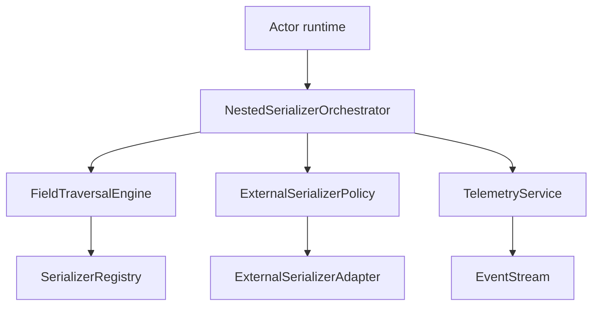
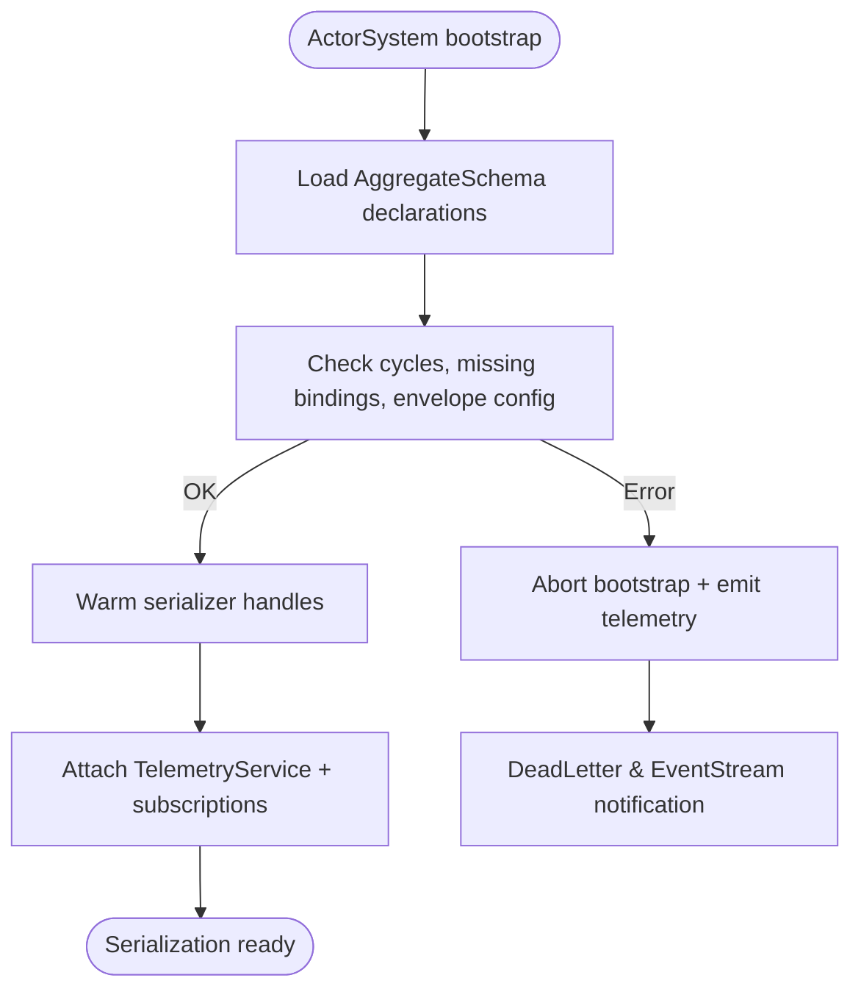
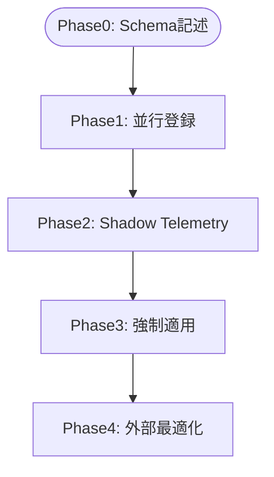

# デザインドキュメント

## 概要
セルアクターの既存シリアライザは型ごとの単純なバインディングしか持たず、Pekko 互換エンベロープやネストフィールド検証をカバーしていない。本設計では `NestedSerializerOrchestrator` と拡張された `SerializerRegistry` を導入し、すべてのフィールドをランタイム側で再帰的に巡回して親エンベロープへ組み込み、`external_serializer_allowed` が明示された末端だけ外部実装に委譲できるようにする。また Telemetry Service を増強し、レイテンシやフォールバックを EventStream／メトリクス経由で公開することで運用時に挙動を観測できるようにする。

利用者は `actor-core` / `actor-std` を実装するランタイム開発者と、Typed Actor を用いて複合メッセージを定義するアプリケーション開発者である。設計は no_std 前提、`RuntimeToolbox` 経由の同期・時間抽象、protoactor-go / Pekko の参照挙動との互換を最優先にしている。

### 目的
- ネストフィールドを含む集約型をランタイムが決定的にシリアライズ／デシリアライズし、Pekko 参照テストと一致するエンベロープを提供する。
- Serializer Registry でフィールド宣言と `external_serializer_allowed` を必須化し、起動時に循環や欠落バインディングを検証する。
- Telemetry Service がレイテンシ・フォールバック・外部委譲統計・デバッグトレースを EventStream とメトリクスで可視化する。

### 非対象
- serde / postcard など外部シリアライザ実装の最適化や API 仕様。
- EventStream 全般のカテゴリ整理や LoggerSubscriber の刷新（Serialization 専用イベント追加の範囲に限定）。
- ワイヤフォーマット互換テーブルのバージョニング計画（現行 Pekko 互換に焦点）。

## 制約と定数
- `MAX_FIELD_PATH_DEPTH = 32`: 32 階層までサポート（Pekko 参照ケース + 制御平面設計で十分）。
- `MAX_FIELDS_PER_AGGREGATE = 128`: 1 集約あたり 128 フィールド。`heapless::Vec` で 2KB 未満のスタック使用に収まる。
- `MAX_FIELD_PATH_BYTES = 96`: Telemetry/監視向けに `FieldPathDisplay` を `ArrayVec<u8, 96>` で保持。UTF-8 のみ許容し、超過時は登録エラー。
- `LATENCY_THRESHOLD_US = 250`: デフォルトで 250µs を超えたシリアライズ処理のみ Telemetry Event を発行。クレート機能 `serializer-latency-threshold` で上書き可能。
- `ValueType::Pure`: `Copy + 'static` かつ `Drop`/内部可変性/外部リソースハンドルを持たない値型の集合。`external_serializer_allowed` はこの分類に属する末端フィールドだけに付与でき、AggregateSchemaBuilder が静的検証する。

## アーキテクチャ

### 既存アーキテクチャ分析
- `SerializerRegistry`（`modules/actor-core/src/serialization/registry.rs`）は `TypeId`→`SerializerHandle` と manifest のみ保持。ネスト構造や外部委譲メタデータが存在しない。
- `Serialization<TB>` 拡張は bincode シリアライザを 1 件登録し、`SerializedPayload(serializer_id, manifest, bytes)` の作成のみ担う。親エンベロープ統合や FieldPath 概念がない。
- 観測系は `EventStreamEvent` が Lifecycle/DeadLetter/Log/Mailbox/UnhandledMessage/AdapterFailure だけを提供し、シリアライズ専用のイベントが欠落している。

### ハイレベルアーキテクチャ


### アーキテクチャ統合
- `NestedSerializerOrchestrator` は `Serialization<TB>` 拡張の内部構成として組み込み、既存の `serialize`/`deserialize` シグネチャは据え置く。
- Registry に `AggregateSchema` / `AggregateSchemaBuilder` / `ExternalSerializerPolicy` を追加し、同一 Mutex ファミリを利用して no_std 互換性を維持。
- Telemetry Service は `EventStreamEvent::Serialization` を新設し、既存サブスクライバが `match` で無視できるバックワード互換な API を提供。

### 技術整合性
- 依存ライブラリは既存（`serde`, `erased_serde`, `hashbrown`, `cellactor_utils_core_rs`, `heapless`）のみ。`FieldPathHash` は `cellactor_utils_core_rs::hash::StableHasher`（no_std 対応予定）で 128bit ハッシュを算出。
- `RuntimeToolbox` が提供する Mutex / TimeProvider / BufferPool を全コンポーネントが利用し、std / embedded の共通パスを確保。
- `Bytes` は `modules/actor-core/src/serialization/bytes.rs` に定義済みの所有バッファを指し、追加コピーを避ける設計とする。

### 重要な設計判断
- **FieldEnvelopeBuilder で親エンベロープを一元構築**
  - 子シリアライザが返すのは生バイト列 (`FieldPayload::raw_bytes`) のみとし、manifest と serializer_id は親側で制御。再ラップを禁止する要件 (R1.AC3) を型で保証する。
- **AggregateSchemaBuilder で登録時検証を実行**
  - `TypeId` グラフと `FieldPath` を生成し、サイクル・欠落・`external_serializer_allowed` 違反を起動前に遮断。実行時チェックを最小化。
- **Telemetry Service に閾値・モード設定を持たせる**
  - `TelemetryConfig` を `SerializationExtension` 起動時に注入し、レイテンシ閾値・デバッグトレースモード・監視 API エンドポイントを動的に切り替え可能にする。

## システムフロー

### フロー S1: ネスト集約のシリアライズ
```mermaid
sequenceDiagram
  participant Caller
  participant Orchestrator
  participant Walker
  participant Registry
  participant Serializer
  participant Policy
  participant Telemetry
  participant EventStream

  Caller->>Orchestrator: serialize(A)
  Orchestrator->>Walker: build_plan(A)
  Walker->>Registry: resolve_binding(A)
  Registry-->>Walker: AggregateSchema
  Walker-->>Orchestrator: FieldPayload(raw_bytes, metadata)
  Orchestrator->>Policy: enforce_external(field)
  alt 外部許可済み
    Policy-->>Orchestrator: Delegate
  else 禁止/未登録
    Policy-->>Orchestrator: Error
    Orchestrator->>Telemetry: emit_binding_error
    Telemetry->>EventStream: publish SerializationError
    return
  end
  Orchestrator->>Telemetry: record_latency(field_path, duration)
  Telemetry->>EventStream: publish SerializationLatency(optional)
```

### フロー S2: 起動時バインディング検証・監査


## 要件トレーサビリティ
| 要件 | 概要 | コンポーネント | インターフェース | フロー |
| --- | --- | --- | --- | --- |
| R1.AC1-3 | ネスト再帰・親エンベロープ統合・再ラップ禁止 | NestedSerializerOrchestrator, FieldTraversalEngine, FieldEnvelopeBuilder | `serialize_aggregate`, `FieldTraversalPlan::next`, `FieldEnvelopeBuilder::finalize` | S1 |
| R1.AC4-7 | Pekko 順序維持、外部委譲判定、禁止時エラー | FieldEnvelopeBuilder, ExternalSerializerPolicy, SerializerRegistry | `FieldEnvelopeBuilder::append_child`, `ExternalSerializerPolicy::enforce` | S1 |
| R2.AC1-6 | バインディング宣言必須、循環検出、Serializable 割当 | AggregateSchemaBuilder, SerializerRegistry, RegistryAuditor | `register_aggregate_schema`, `validate_all`, `assign_default_serializer` | S2 |
| R3.AC1-6 | レイテンシ通知、フォールバック、計測、監視 API | TelemetryService, SerializationEvent, MetricsSink | `TelemetryService::record_latency`, `TelemetryService::publish`, `TelemetryConfig::threshold_us` | S1, S2 |

## コンポーネントとインターフェース

### Serialization 層
#### NestedSerializerOrchestrator
- **責務**: `Serialization<TB>` 拡張の公開 API (`serialize`, `deserialize`, `deserialize_payload`) を実装し、`FieldTraversalEngine` から受け取った `FieldPayload` を親エンベロープへ統合。`SerializerContext` によって Telemetry 設定や Pekko 互換モードを参照する。
- **主要 API**:
  - `fn serialize_aggregate<T>(&self, value: &T, ctx: &SerializerContext) -> Result<SerializedPayload, SerializationError>`
  - `fn deserialize_aggregate<T>(&self, payload: &SerializedPayload, ctx: &SerializerContext) -> Result<T, SerializationError>`
- **再ラップ禁止**: 子シリアライザは `FieldPayload { raw_bytes: Bytes, child_manifest: String, child_serializer_id: u32 }` を返し、親側の `FieldEnvelopeBuilder` にのみ `SerializedPayload` を生成する権限を与える。ジェネリクスで `FieldPayload` 以外を受け付けないことで R1.AC3 を保証する。
- **並行性**: `heapless::Vec<FieldNode, MAX_FIELDS_PER_AGGREGATE>` と `ArrayVec<FieldPathSegment, MAX_FIELD_PATH_DEPTH>` をスタック上で確保。1 呼び出しあたり 3KB 未満のスタックを消費し、`RuntimeToolbox` のスタック制約内に収まる。
- **Telemetry 計測フック**: `serialize_aggregate` 開始時に `TelemetryService::start_timer` を呼び、子フィールドごとの `record_latency/record_success/record_failure` を実行。`ctx.telemetry_config.latency_threshold_us` を超えない場合はカウンタ更新のみ行う。

#### SerializerContext
- `SerializerContext` は `ArcShared<SerializerRegistry<TB>>`, `TelemetryService`, `TelemetryConfig`, `PekkoCompatibilityMode` を含む不変構造体。ActorSystem 起動時に構築し、`serialize` 呼び出し毎に `&SerializerContext` を受け渡す。
- `TelemetryConfig` には `latency_threshold_us`, `debug_trace_enabled`, `monitoring_endpoint` を含め、`RuntimeToolbox` の設定 API からホットリロード可能にする。

#### FieldTraversalEngine
- **責務**: `AggregateSchema` を元に DFS のトラバーサルプランを生成（デフォルト）。BFS を要求する特殊な型は `TraversalPolicy::BreadthFirst` を `AggregateSchema` に記述しオーバーライドできる。
- **API**:
  - `fn build_plan(schema: &AggregateSchema, policy: TraversalPolicy) -> FieldTraversalPlan`
  - `fn resolve_binding(&self, path: &FieldPath) -> Result<FieldNode, SerializationError>`
- **循環検知**: `AggregateSchemaBuilder` が DFS で `VisitState` を保持し、循環検出時には `SerializationError::InvalidManifest` に `a.b -> b.c -> ... -> a` の文字列を格納する。

#### FieldEnvelopeBuilder
- **責務**: 親エンベロープ内で子フィールドの順序、`serializer_id`, manifest を Pekko 参照順に整列。`append_child` は `TraversalPlan` で定義された順序のみ受け付け、`FieldEnvelopeBuilderState<N>` を使用して型システム上で順番の逸脱を防ぐ。
- **API**:
  - `fn start(root_serializer_id: u32, root_manifest: &str) -> Self`
  - `fn append_child<const INDEX: usize>(&mut self, payload: &FieldPayload)`
  - `fn finalize(self) -> SerializedPayload`
- **親エンベロープ整合検証**: `ExternalSerializerPolicy` が `parent_envelope_mode` を `AggregateSchema` から参照し、互換モードでなければ build を拒否する。

### Registry 層
#### AggregateSchema / Builder
- **構造**: `AggregateSchema` は `root_type: TypeId`, `fields: heapless::Vec<FieldNode, MAX_FIELDS_PER_AGGREGATE>`, `version: u32`, `traversal_policy: TraversalPolicy` を保持。
- **Builder API**:
  - `fn builder<A>() -> AggregateSchemaBuilder<A>`
  - `fn add_field<B>(&mut self, path: FieldPath, serializer: SerializerHandle, external_allowed: bool, parent_envelope_mode: EnvelopeMode)`
  - `fn finish(self) -> Result<AggregateSchema, SerializationError>`
- **外部委譲検証**: `external_allowed` が true のフィールドは `FieldDescriptor::kind == ValueType::Pure` を確認し、親 `EnvelopeMode` が `PreserveOrder` であることも同時に検証。違反時は `SerializationError::InvalidManifest("external serializer requires preserve order")`。

#### SerializerRegistry 拡張
- **追加ストレージ**:
  - `aggregate_schemas: ToolboxMutex<HashMap<TypeId, ArcShared<AggregateSchema>>, TB>`
  - `field_policies: ToolboxMutex<HashMap<FieldPathHash, ExternalPolicyEntry>, TB>`
- **API 拡張**:
  - `fn register_aggregate_schema(&self, schema: AggregateSchema) -> Result<(), SerializationError>`
  - `fn load_schema<T>(&self) -> Result<ArcShared<AggregateSchema>, SerializationError>`
  - `fn assign_default_serializer<T>(&self)`：`PekkoSerializable` マーカー（`trait PekkoSerializable {}` を `actor-core` で定義）を実装する型に対し、参照実装と同じ serializer_id を自動割り当て。
  - `fn audit(&self) -> RegistryAuditReport`：最新検証結果を Telemetry へ送出。

#### ExternalSerializerPolicy
- **責務**: `external_serializer_allowed` と `EnvelopeMode` を突合し、禁止フィールドで外部委譲が発生しそうな場合は即座に `SerializationError::SerializationFailed` を返す。
- **API**: `fn enforce(&self, field: &FieldNode, ctx: &SerializerContext) -> Result<(), SerializationError>`。
- **診断**: 失敗時は Telemetry に `SerializationEvent::Fallback { reason: ExternalNotAllowed, field_path_hash }` を送出。

### Telemetry 層
#### TelemetryService
- **機能**:
  - レイテンシ計測: `record_latency` は処理時間が `TelemetryConfig.latency_threshold_us` を超える場合のみイベントを生成。閾値は設定ファイルまたは API で変更可能。
  - フォールバック通知: 禁止フィールドで外部委譲が発生した場合やシリアライザ未登録時に `SerializationEvent::Fallback` を発行。
  - デバッグトレース: `TelemetryConfig.debug_trace_enabled` が true のときに `SerializationEvent::DebugTrace` を送出。モード切替 API は `TelemetryService::set_debug_trace(bool)`。
  - 監視 API 連携: `monitoring_endpoint` へ gRPC / RTT で通知しつつ EventStream にも同じイベントを投げる。

#### SerializationEvent / EventStream 拡張
- `EventStreamEvent` に `Serialization(SerializationEvent)` を追加。サブスクライバは既存イベントと同等の方法で購読可能。
- `SerializationEvent` バリアント: `Latency`, `Fallback`, `BindingError`, `DebugTrace`, `SuccessCounter`, `FailureCounter`。

### ExternalSerializerAdapter
- **責務**: `external_serializer_allowed` な末端フィールドに対して登録済み外部シリアライザ（serde 等）を呼び出し、得られたバイト列を `FieldEnvelopeBuilder` へ渡す。
- **API**: `fn serialize_with_external(&self, field: &FieldNode, value: &dyn erased_serde::Serialize) -> Result<FieldPayload, SerializationError>`。
- **安全策**: Policy で許可されていない場合は即座に Err を返し、Telemetry にフォールバック理由を送出。成功時は `TelemetryCounters.external_success` を更新し、親エンベロープのヘッダを保護する。

## データモデル
- **Bytes**: `modules/actor-core/src/serialization/bytes.rs` にある所有バッファ。`FieldPayload` や `SerializedPayload` で共有し追加コピーを避ける。
- **FieldPath**: `ArrayVec<FieldPathSegment, MAX_FIELD_PATH_DEPTH>` を `segments` として保持し、内部的に数値インデックスのみでトラバース順序を管理する。
- **FieldPathDisplay**: `ArrayVec<u8, MAX_FIELD_PATH_BYTES>` に UTF-8 のフィールド名を格納し、Telemetry/監視向けに `FieldPath` とペアで登録。`FieldPathDisplay` が上限を超える場合は schema 登録を失敗させる。
- **FieldPathHash**: `u128`。`FieldPath` の `segments` と `FieldPathDisplay` の UTF-8 を結合し `StableHasher` でハッシュ化した結果。Telemetry で識別子として使用し、実際のフィールド名を露出しない。
- **FieldPayload**: `{ raw_bytes: Bytes, child_manifest: String, child_serializer_id: u32, field_path_hash: FieldPathHash }`。
- **SerializerContext**: `{ registry: ArcShared<SerializerRegistry<TB>>, telemetry: ArcShared<TelemetryService>, telemetry_config: TelemetryConfig, pekko_mode: PekkoCompatibilityMode }`。
- **TelemetryCounters**: `success_total`, `failure_total`, `external_success`, `external_failure` の各 `AtomicU64`。

## エラーハンドリング
- **バインディング欠落**: `SerializerRegistry::find_binding_by_type` が失敗した場合、`SerializationError::NoSerializerForType` に型名を含め、Telemetry で `BindingError` を発行。
- **循環検知**: `AggregateSchemaBuilder` は `Circular dependency detected: A -> B -> C -> A at field path a.b.c` の形式でエラー文字列を生成。
- **外部委譲違反**: `ExternalSerializerPolicy` が `SerializationError::SerializationFailed("external serializer not allowed for field foo.bar")` を返し、DeadLetter と EventStream に同時通知。
- **レイテンシ閾値超過**: `TelemetryService::record_latency` は閾値超過時のみ `SerializationEvent::Latency { field_path_hash, micros }` を生成し、閾値未満はカウンタ更新のみ行う。

## モニタリング
- `TelemetryConfig.latency_threshold_us`、`TelemetryConfig.debug_trace_enabled`、`TelemetryConfig.monitoring_endpoint` を `RuntimeToolbox` の設定 API でホットリロード可能。
- `SerializationEvent` を DeadLetter とは別チャネルで EventStream に流し、LoggerSubscriber は WARN 以上のみログ出力する設定を推奨。
- メトリクス: `success_total`, `failure_total`, `external_success`, `external_failure`, `latency_histogram` (p50/p95/p99)。

## テスト戦略
- **ユニットテスト**
  1. `FieldTraversalEngine` が DFS 既定順序を保持し、BFS 指定で順序が変わることを検証。
  2. `ExternalSerializerPolicy::enforce` が `external_serializer_allowed` + `EnvelopeMode::PreserveOrder` の組を通過させる、その他を拒否する。
  3. `FieldEnvelopeBuilder::finalize` が Pekko 参照ベクタのバイト列と一致することを fixture で確認。
  4. `PekkoSerializable` を実装した型にデフォルト serializer_id/manifest が自動割当され、重複時にエラーが返ることをテスト。
- **統合テスト**
  1. `AggregateSchema` を登録した ActorSystem で `serialize`→`deserialize` の往復を行い、`FieldPathHash` と Telemetry イベントを検証。
  2. 循環を含む schema で ActorSystem 起動が失敗し、Telemetry/DeadLetter にイベントが発行されることを確認。
  3. `external_serializer_allowed` な末端フィールドを serde で処理した際、外部成功カウンタが増加し、親エンベロープが保持されることを確認。
- **性能テスト**
  1. 深さ 16／32 の集約を 100µs/400µs 以内でシリアライズできるか測定。
  2. 1 秒あたり 10,000 メッセージを処理しても Telemetry ヒストグラムが飽和せず、`latency_threshold_us` 境界でイベント有無が正しく切り替わることを確認。
  3. `FieldPathHash` 生成が 200ns 以内で完了し、`FieldPathDisplay` が上限を超えた場合に登録エラーとなることを確認。

## セキュリティ
- `external_serializer_allowed` は `ValueType::Pure`（Copy, `'static`, 副作用なし）のみ許可し、外部ライブラリへ渡るデータを限定。
- Manifest は Registry 登録時に正規化し、空文字や制御文字を拒否。
- Telemetry で送出するフィールド名は `FieldPathHash` のみとし、必要に応じて監視 API 内でオフライン辞書を使って解決。

## パフォーマンスとスケーラビリティ
- `FieldTraversalPlan` は `ArcShared` でキャッシュし、LRU を `heapless::LinearMap` で実装してホットパスの再構築を避ける。
- `FieldEnvelopeBuilder` の内部バッファは `RuntimeToolbox::buffer_pool` から借用し、`SerializedPayload::bytes` へムーブするまでコピーなしで扱う。
- Telemetry は lock-free カウンタ (`portable-atomic`) を使用し、多数のメッセージでもボトルネックにならないようにする。

## マイグレーション戦略

- **Phase0 完了条件**: 主要 50 型以上で `AggregateSchema` が作成され、CI で静的検証が通過。
- **Phase1 完了条件**: 旧シリアライザと新実装の出力 diff が 1% 未満、CI で比較テストが 1 週間成功。
- **Phase2 完了条件**: Telemetry イベント（Latency/Fallback）が 72 時間連続で閾値内、監視ダッシュボードに異常なし。
- **Phase3 完了条件**: `external_serializer_allowed` 違反が 0 件になるまで監視し、DeadLetter 統計が安定。
- **Phase4 完了条件**: 外部シリアライザ経路の成功率 99% 以上、レイテンシ p95 < 200µs を維持。

- **フォールバック比較コスト緩和**: Phase1 では全メッセージ比較ではなくサンプリング（1%）も設定可能。設定は `TelemetryConfig.shadow_sampling_rate` で指定。

---
この設計により、要件で示されたネストフィールドシリアライゼーション、Registry 検証、観測性強化をそれぞれ具現化し、実装フェーズでの曖昧さを最小化する。
