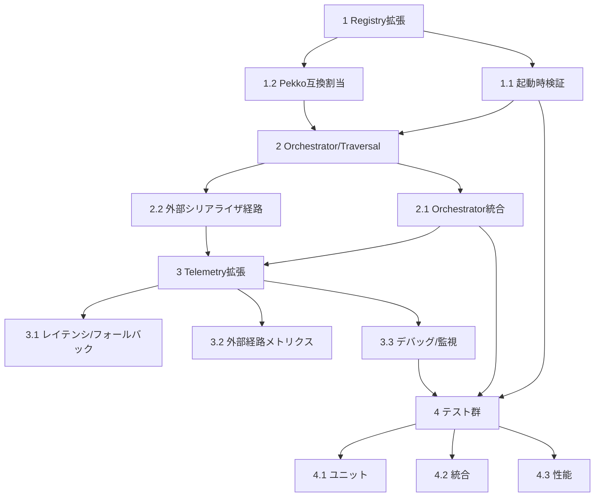

# Implementation Plan

## タスク依存関係

- [ ] 1. Serializer Registry とスキーマ宣言の拡張
  - TypeId ごとの `AggregateSchema` と `FieldPath`/`FieldPathDisplay`/`FieldPathHash` メタデータを保持できるようにし、登録 API で全フィールド宣言と `external_serializer_allowed` フラグを必須化する。
  - `AggregateSchemaBuilder` で純粋値型・親エンベロープモード・`FieldPathDisplay` 長さを静的検証し、ValidationError を明示する。
  - `ExternalSerializerPolicy` とフィールドポリシーキャッシュをレジストリに統合し、実行時のポリシー判定を O(1) で行えるようにする。
  - 完了条件: Schema 登録 API と Policy 判定 API に対するユニットテストが追加され、CI で clippy/fmt/テストが合格する。
  - _Requirements: R2.AC1, R2.AC3_

- [ ] 1.1 起動時検証と監査イベントの実装
  - ActorSystem ブートストラップ時に全 `AggregateSchema` を走査し、循環・欠落・manifest 衝突・`FieldPathDisplay` 上限超過を検出して起動を停止するフローを追加する。
  - 監査フラグが有効なときに EventStream/Telemetry/DeadLetter/監視 API へ検証レポートを発行し、失敗経路を観測できるようにする。
  - 完了条件: 起動時検証をカバーする統合テストが追加され、エラー時のイベント内容がアサートされる。
  - 依存関係: タスク1 完了後に着手。
  - _Requirements: R2.AC2, R2.AC4, R2.AC5_

- [ ] 1.2 Pekko `Serializable` 互換型のデフォルト割当
  - `PekkoSerializable` マーカー trait を導入し、互換型が登録された際に参照実装と同じ serializer_id/manifest を割り当てるロジックを追加する。
  - 重複検知とエラーハンドリングを実装し、割当結果を Telemetry で追跡できるようにする。
  - 完了条件: trait 実装で自動割当が行われるユニットテストと、衝突時にエラーを返すテストが追加される。
  - 依存関係: タスク1 完了後に着手。
  - _Requirements: R2.AC6_

- [ ] 2. ネストシリアライズ Orchestrator とトラバーサル
  - `FieldTraversalEngine` を実装し、`AggregateSchema` から DFS/BFS 方針に沿ったプランを生成して各フィールドの `SerializerHandle` とメタデータを引き渡す。
  - `FieldEnvelopeBuilder` で親エンベロープを一元的に構築し、子フィールドが `SerializedPayload` を再生成できないよう型で抑制する。
  - Telemetry タイマー開始/終了ポイントを Orchestrator に追加し、各フィールド処理で `record_latency/record_success/record_failure` を呼び出す。
  - 完了条件: Orchestrator を通じた round-trip シナリオが動作し、Telemetry の計測フックにダミー実装でイベントが届く統合テストが追加される。
  - 依存関係: タスク1.1 完了後に着手。
  - _Requirements: R1.AC1, R1.AC2, R1.AC3, R1.AC5_

- [ ] 2.1 Orchestrator と外部シリアライザポリシーの統合
  - 既存 `Serialization` 拡張に Orchestrator を統合し、バインディング欠落時のエラーを Telemetry/DeadLetter に伝播する。
  - `ExternalSerializerPolicy` を適用し、禁止フィールドでの外部呼び出しは即座に失敗・イベント発行する。
  - 完了条件: 禁止フィールドで `SerializationError::SerializationFailed` が返り、対応する Telemetry イベントが生成されることをテストで確認する。
  - 依存関係: タスク2 完了後に着手。
  - _Requirements: R1.AC4, R1.AC7_

- [ ] 2.2 外部シリアライザ経路の実装
  - `ExternalSerializerAdapter` を実装し、`external_serializer_allowed` な末端のみ外部シリアライザ（serde など）を呼び出して `FieldPayload` を生成する。
  - 成功/失敗を TelemetryCounters へ反映し、親エンベロープのヘッダを保持したまま統合するフローを構築する。
  - 完了条件: 外部許可フィールドで serde 経由のシリアライズが成功し、禁止フィールドで即時失敗する統合テストが追加される。
  - 依存関係: タスク2.1 完了後に着手。
  - _Requirements: R1.AC6_

- [ ] 3. Telemetry / EventStream 拡張
  - Telemetry Service にレイテンシ計測・閾値判定・フォールバック通知・外部委譲統計・デバッグトレース・監視 API 通知の各経路を追加し、`EventStreamEvent::Serialization` を新設する。
  - FieldPathHash を使って機密情報を隠しつつ、DeadLetter や監視エンドポイントへ対象フィールドを追跡できるようにする。
  - 完了条件: TelemetryService の新イベントが EventStream/監視 API に流れ、閾値以下の処理ではイベントが抑制されるテストが追加される。
  - 依存関係: タスク2.2 完了後に着手。
  - _Requirements: R3.AC1, R3.AC2, R3.AC3, R3.AC4, R3.AC5, R3.AC6_

- [ ] 3.1 レイテンシとフォールバックイベントの配信
  - TelemetryConfig に `latency_threshold_us` を導入し、閾値を超えたシリアライズのみ `SerializationEvent::Latency` を発行するロジックを実装する。
  - 禁止フィールドやシリアライザ未登録時に `SerializationEvent::Fallback` / DeadLetter 通知を送るフローを追加する。
  - 完了条件: 閾値境界をまたぐテストでイベント発火の有無が確認され、フォールバックイベントが DeadLetter/監視 API で観測できる。
  - _Requirements: R3.AC1, R3.AC2_

- [ ] 3.2 許可済み外部経路と成功/失敗カウンタの公開
  - `TelemetryCounters` に成功/失敗および `external_serializer_allowed` 経路の内訳を保持し、メトリクスエンドポイントで参照できるようにする。
  - 許可済み末端フィールドで外部シリアライザを利用した場合の呼び出し回数と処理時間をヒストグラムへ反映する。
  - 完了条件: メトリクスの成功/失敗カウンタが統合テストで検証され、Grafana 等の既存収集系で可視化できる。
  - _Requirements: R3.AC3, R3.AC6_

- [ ] 3.3 デバッグトレースモードと監視 API 連携
  - TelemetryConfig にデバッグトレースのオン/オフを追加し、有効時のみ各ネストフィールドのサイズやバインディング名をイベントとして出力する。
  - バインディングエラー発生時に直近メッセージとフィールドパスを監視 API へ通知するハンドラを追加し、EventStream と同期させる。
  - 完了条件: デバッグモード切替テストが追加され、監視 API でバインディングエラーの詳細が確認できる。
  - _Requirements: R3.AC4, R3.AC5_

- [ ] 4. テスト・検証・性能確認
  - Registry/Traversal/Envelope/Telemetry 各層でユニットテストを作成し、Pekko 参照ベクタとの比較や `external_serializer_allowed` の制約を自動化する。
  - ActorSystem 起動～Telemetry 連携までの統合テストを用意し、循環検知・DeadLetter/Telemetry イベント・外部委譲許可/拒否シナリオをカバーする。
  - 最大深さや 10k msg/s 負荷など性能試験を追加し、レイテンシ閾値やカウンタ飽和が要件内に収まることを確認し、CI スイートでの自動実行を追加する。
  - 完了条件: 新規テスト群が CI の標準ターゲット（fmt/clippy/test）とパフォーマンスジョブでグリーンになる。
  - _Requirements: R1.AC1-R1.AC7, R2.AC1-R2.AC6, R3.AC1-R3.AC6_

- [ ] 4.1 ユニットテスト整備
  - FieldTraversalEngine が DFS/BFS 指定に応じて順序を切り替え、各ノードが期待する Serializer/manifest を返すか検証する。
  - ExternalSerializerPolicy・AggregateSchemaBuilder が純粋値型判定や循環検知を適切に行うかテストし、`PekkoSerializable` 割当と衝突エラーを確認する。
  - FieldEnvelopeBuilder が Pekko ベクタとバイト列一致すること、`FieldPayload` 以外を受け取らないことを確認する。
  - _Requirements: R1.AC1-R1.AC5, R2.AC1-R2.AC4, R2.AC6_

- [ ] 4.2 統合・観測テスト
  - Schema 登録済み ActorSystem で serialize→deserialize を往復し、Telemetry イベントと DeadLetter 通知をアサートする統合テストを作成する。
  - Bootstrap 失敗シナリオ（循環、欠落、禁止外部委譲）が Telemetry/監視 API に流れることを確認し、外部委譲許可シナリオで成功イベントが増えることを検証する。
  - _Requirements: R1.AC4-R1.AC7, R2.AC2-R2.AC5, R3.AC2-R3.AC5_

- [ ] 4.3 パフォーマンスと安定性テスト
  - 深さ 16/32 の集約を対象にシリアライズ時間を計測し、`latency_threshold_us` 設定と Telemetry メトリクスが期待値を超えないことを検証する。
  - 1 秒あたり 10k メッセージ相当の負荷で Telemetry カウンタとヒストグラムが飽和しないこと、`FieldPathDisplay` が上限を超えた場合に登録エラーが返ることを確認する。
  - _Requirements: R3.AC1, R3.AC3, R3.AC6_
