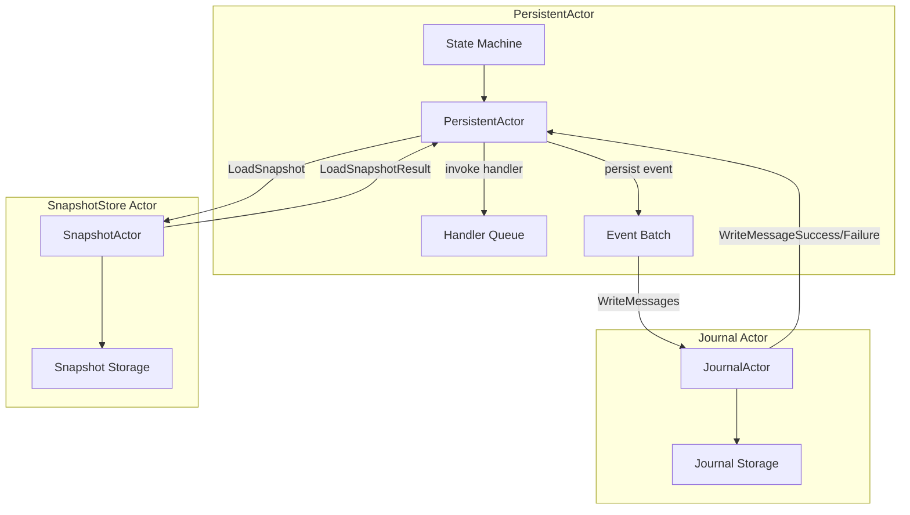
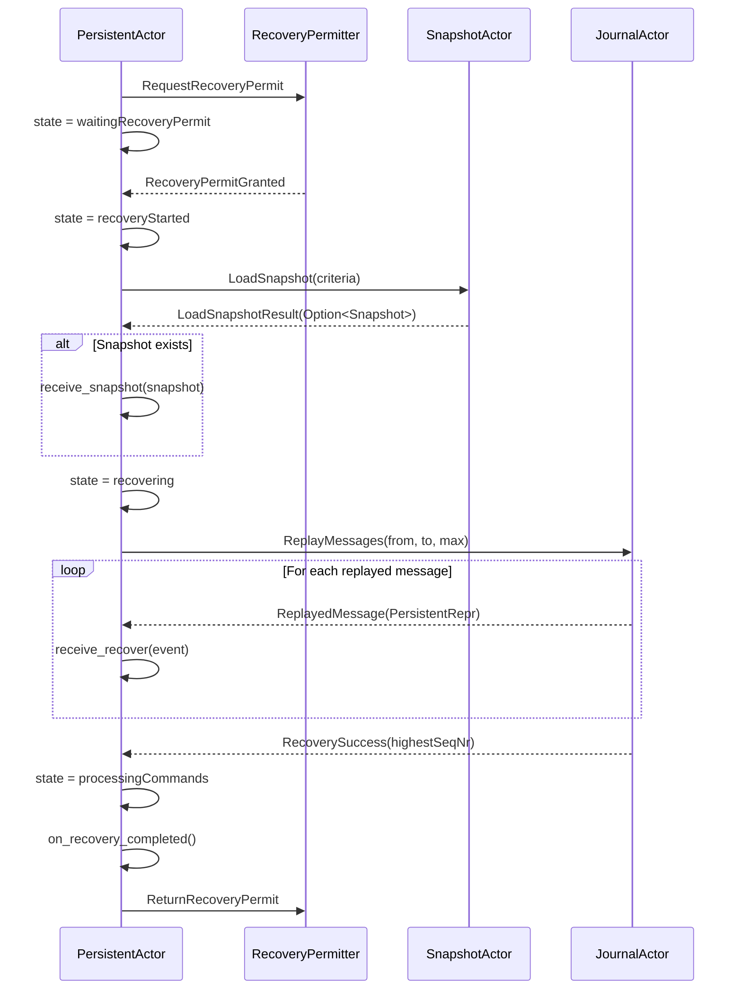
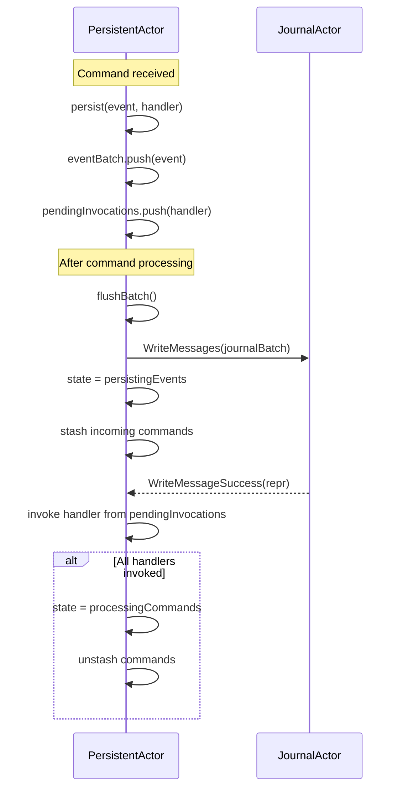
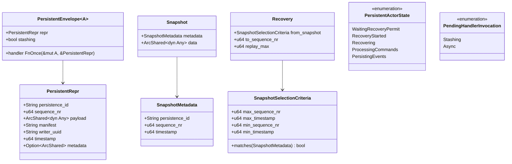

# 設計ドキュメント: untyped-persistence

## 概要

**目的**: fraktor-persistence-rs クレートの Untyped 永続化モジュールを、Pekko 互換のメッセージパッシングアーキテクチャで実装する。

**利用者**: イベントソーシングパターンを採用する Rust 開発者が、no_std 環境（組み込みシステム）からホスト環境まで一貫した永続化 API を使用する。

**影響**: 既存の `modules/persistence/src` を全削除し、メッセージパッシングベースの新設計で置き換える。

### 目標

- **Pekko 互換のメッセージパッシングアーキテクチャ**: PersistentActor は Journal/SnapshotStore と直接 API を呼び出さず、メッセージで通信する
- **Future 駆動の責務分離**: Journal/SnapshotStore の Future は JournalActor/SnapshotActor が完了まで駆動し、PersistentActor は Future を直接 poll しない
- **非ブロッキング駆動**: JournalActor/SnapshotActor は Future を保持し、自分自身へのメッセージで再ポーリングをスケジュールする。`drive_ready` などの同期ユーティリティや Dispatcher の直接呼び出しに依存しない
- **内部状態マシン**: Pekko の Eventsourced と同様の状態遷移（recovering → processingCommands → persistingEvents）
- **GATsパターンによる no_std 対応の Journal / SnapshotStore trait 設計**
- **イベントのバッチ処理とハンドラキューイング**

### 非目標

- std 向け拡張（Tokio ベースの非同期ストレージ実装など）
- 実際の外部ストレージバックエンド実装（DynamoDB, PostgreSQL 等）
- Typed PersistentActor API（将来の別 spec で対応）
- PersistentActor からの同期ポーリングによる永続化（poll_ready/drive_ready 等のユーティリティ前提の設計）

### 設計上の制約

- PersistentActor/Eventsourced は Journal/SnapshotStore trait を直接保持せず、JournalActor/SnapshotActor への ActorRef を保持する
- 永続化操作の結果は JournalResponse/SnapshotResponse でのみ扱い、Future を直接 poll しない
- `core::future::Ready<T>` を用いた同期実装でも、Future の駆動は JournalActor/SnapshotActor の責務とする
- JournalActor/SnapshotActor は in-flight Future（コントローラ）を内部に保持し、`Poll::Pending` は正常系として自己メッセージで再ポーリングをスケジュールする（スレッドをブロックしない、Dispatcher を直接呼び出さない）

## アーキテクチャ

### Pekko アーキテクチャ分析

Pekko の `Eventsourced.scala` を分析した結果、以下の設計パターンが判明:

1. **メッセージパッシングによる永続化**:
   ```scala
   // Pekko: Journal への書き込みはメッセージ送信
   journal ! WriteMessages(journalBatch, self, instanceId)

   // Pekko: 結果もメッセージで受信
   case WriteMessageSuccess(p, id) => ...
   case WriteMessageFailure(p, cause, id) => ...
   ```

2. **バッチ処理**:
   - `eventBatch`: イベントを一時的に蓄積
   - `journalBatch`: 実際に Journal に送信するバッチ
   - `flushBatch()`: バッチを Journal に送信

3. **ハンドラキューイング**:
   - `pendingInvocations`: 永続化完了後に呼び出すハンドラのキュー
   - `StashingHandlerInvocation`: 通常の persist（コマンドをスタッシュ）
   - `AsyncHandlerInvocation`: persistAsync（コマンドをスタッシュしない）

4. **内部状態マシン**:
   - `waitingRecoveryPermit`: リカバリ許可待ち
   - `recoveryStarted`: スナップショット読み込み
   - `recovering`: イベント再生中
   - `processingCommands`: 通常のコマンド処理
   - `persistingEvents`: イベント永続化中（コマンドをスタッシュ）

### 新アーキテクチャ



### 技術スタック

| レイヤ | 選定 | 役割 | 備考 |
|-------|------|------|------|
| ランタイム | no_std + alloc | 基本実行環境 | std 依存なし |
| アクターランタイム | fraktor-actor-rs | メッセージパッシング基盤 | ActorContext, ActorRef |
| データ構造 | `BTreeMap` / `Vec` | InMemory ストレージ | alloc クレート |
| 型消去 | `ArcShared<dyn Any + Send + Sync>` | ペイロード | fraktor-utils-rs |

## システムフロー

### リカバリフロー（Pekko 互換）



### リカバリフロー（Recovery::none）

Recovery を無効化した場合は、イベント再生を行わずに最高シーケンス番号のみ取得する。

1. `Recovery::none()` を検出
2. `JournalMessage::GetHighestSequenceNr` を送信
3. `JournalResponse::HighestSequenceNr` を受信
4. `last_sequence_nr` を更新して `ProcessingCommands` に遷移

### 永続化フロー（Pekko 互換）



## コンポーネントとインターフェイス

### Journal Protocol（メッセージ定義）

```rust
/// Journal に送信するメッセージ。
pub enum JournalMessage {
    /// メッセージを書き込む。
    WriteMessages {
        persistence_id: String,
        /// バッチ内の最大シーケンス番号。
        to_sequence_nr: u64,
        messages: Vec<PersistentRepr>,
        sender: ActorRefGeneric<TB>,
        instance_id: u32,
    },
    /// メッセージを再生する。
    ReplayMessages {
        persistence_id: String,
        from_sequence_nr: u64,
        to_sequence_nr: u64,
        max: u64,
        sender: ActorRefGeneric<TB>,
    },
    /// メッセージを削除する。
    DeleteMessagesTo {
        persistence_id: String,
        to_sequence_nr: u64,
        sender: ActorRefGeneric<TB>,
    },
    /// 最大シーケンス番号を取得する。
    GetHighestSequenceNr {
        persistence_id: String,
        from_sequence_nr: u64,
        sender: ActorRefGeneric<TB>,
    },
}

/// Journal から受信するレスポンス。
pub enum JournalResponse {
    /// 書き込み成功（個別イベント）。
    WriteMessageSuccess {
        repr: PersistentRepr,
        instance_id: u32,
    },
    /// 書き込み失敗。
    WriteMessageFailure {
        repr: PersistentRepr,
        cause: JournalError,
        instance_id: u32,
    },
    /// 書き込み拒否。
    WriteMessageRejected {
        repr: PersistentRepr,
        cause: JournalError,
        instance_id: u32,
    },
    /// バッチ書き込み完了。
    WriteMessagesSuccessful,
    /// バッチ書き込み失敗。
    WriteMessagesFailed {
        cause: JournalError,
        write_count: usize,
    },
    /// 再生メッセージ。
    ReplayedMessage(PersistentRepr),
    /// リカバリ成功。
    RecoverySuccess {
        highest_sequence_nr: u64,
    },
    /// 最大シーケンス番号取得結果。
    HighestSequenceNr {
        persistence_id: String,
        sequence_nr: u64,
    },
    /// 再生失敗。
    ReplayMessagesFailure(JournalError),
    /// 削除成功。
    DeleteMessagesSuccess {
        to_sequence_nr: u64,
    },
    /// 削除失敗。
    DeleteMessagesFailure {
        cause: JournalError,
        to_sequence_nr: u64,
    },
}
```

JournalMessage はすべて `persistence_id` とシーケンス番号情報（単一の `sequence_nr` または範囲）を持ち、送信者の `ActorRef` を含む。

### SnapshotStore Protocol（メッセージ定義）

```rust
/// SnapshotStore に送信するメッセージ。
pub enum SnapshotMessage {
    /// スナップショットを読み込む。
    LoadSnapshot {
        persistence_id: String,
        criteria: SnapshotSelectionCriteria,
        sender: ActorRefGeneric<TB>,
    },
    /// スナップショットを保存する。
    SaveSnapshot {
        metadata: SnapshotMetadata,
        snapshot: ArcShared<dyn Any + Send + Sync>,
        sender: ActorRefGeneric<TB>,
    },
    /// スナップショットを削除する。
    DeleteSnapshot {
        metadata: SnapshotMetadata,
        sender: ActorRefGeneric<TB>,
    },
    /// 条件に一致するスナップショットを削除する。
    DeleteSnapshots {
        persistence_id: String,
        criteria: SnapshotSelectionCriteria,
        sender: ActorRefGeneric<TB>,
    },
}

/// SnapshotStore から受信するレスポンス。
pub enum SnapshotResponse {
    /// 読み込み結果。
    LoadSnapshotResult {
        snapshot: Option<Snapshot>,
        to_sequence_nr: u64,
    },
    /// 読み込み失敗。
    LoadSnapshotFailed(SnapshotError),
    /// 保存成功。
    SaveSnapshotSuccess(SnapshotMetadata),
    /// 保存失敗。
    SaveSnapshotFailure {
        metadata: SnapshotMetadata,
        cause: SnapshotError,
    },
    /// 削除成功。
    DeleteSnapshotSuccess(SnapshotMetadata),
    /// 削除失敗。
    DeleteSnapshotFailure {
        metadata: SnapshotMetadata,
        cause: SnapshotError,
    },
    /// 複数削除成功。
    DeleteSnapshotsSuccess(SnapshotSelectionCriteria),
    /// 複数削除失敗。
    DeleteSnapshotsFailure {
        criteria: SnapshotSelectionCriteria,
        cause: SnapshotError,
    },
}
```

### PersistentActor 内部状態

```rust
/// PersistentActor の内部状態。
enum PersistentActorState {
    /// リカバリ許可待ち。
    WaitingRecoveryPermit,
    /// リカバリ開始（スナップショット読み込み）。
    RecoveryStarted,
    /// イベント再生中。
    Recovering,
    /// 通常のコマンド処理。
    ProcessingCommands,
    /// イベント永続化中（コマンドをスタッシュ）。
    PersistingEvents,
}

/// 保留中のハンドラ呼び出し。
enum PendingHandlerInvocation<A> {
    /// 通常の persist（コマンドをスタッシュ）。
    Stashing {
        repr: PersistentRepr,
        handler: Box<dyn FnOnce(&mut A, &PersistentRepr) + Send>,
    },
    /// persistAsync（コマンドをスタッシュしない）。
    Async {
        repr: PersistentRepr,
        handler: Box<dyn FnOnce(&mut A, &PersistentRepr) + Send>,
    },
}
```

### Eventsourced trait

```rust
/// イベントソーシングアクターの基盤 trait。
///
/// Pekko の Eventsourced と同等のメッセージパッシングセマンティクスを提供する。
/// PersistentActor は内部でこの trait を使用して永続化操作を行う。
pub trait Eventsourced<TB: RuntimeToolbox>: Send {
    /// 永続化 ID を返す。
    fn persistence_id(&self) -> &str;

    /// Journal アクターへの参照を返す。
    fn journal_actor_ref(&self) -> &ActorRefGeneric<TB>;

    /// SnapshotStore アクターへの参照を返す。
    fn snapshot_actor_ref(&self) -> &ActorRefGeneric<TB>;

    /// リカバリ設定を返す。
    fn recovery(&self) -> Recovery {
        Recovery::default()
    }

    /// 永続化されたイベントのリカバリ時に呼び出される。
    fn receive_recover(&mut self, event: &PersistentRepr);

    /// スナップショットのリカバリ時に呼び出される。
    fn receive_snapshot(&mut self, snapshot: &dyn Any);

    /// 通常コマンドを処理する。
    fn receive_command(
        &mut self,
        ctx: &mut ActorContextGeneric<'_, TB>,
        message: AnyMessageViewGeneric<'_, TB>,
    ) -> Result<(), ActorError>;

    /// リカバリ完了時に呼び出される。
    fn on_recovery_completed(&mut self) {}

    /// 永続化失敗時に呼び出される。
    fn on_persist_failure(&mut self, cause: &JournalError, repr: &PersistentRepr) {}

    /// 永続化拒否時に呼び出される。
    fn on_persist_rejected(&mut self, cause: &JournalError, repr: &PersistentRepr) {}

    /// リカバリ失敗時に呼び出される。
    fn on_recovery_failure(&mut self, cause: &PersistenceError) {}

    /// スナップショット操作失敗時に呼び出される。
    fn on_snapshot_failure(&mut self, cause: &SnapshotError) {}

    /// 現在のシーケンス番号を返す。
    fn last_sequence_nr(&self) -> u64;
}
```

### PersistentActor trait

```rust
/// 永続化アクター trait。
///
/// Pekko の PersistentActor と同等のメッセージパッシングセマンティクスを提供する。
/// persist/persistAsync/saveSnapshot などのメソッドは、内部でメッセージを送信し、
/// 結果はメッセージとして受信する。
/// Journal/SnapshotStore の Future を直接 poll しない。
pub trait PersistentActor<TB: RuntimeToolbox>: Eventsourced<TB> + Sized {
    /// PersistentActorBase への参照を返す。
    fn base(&self) -> &PersistentActorBase<Self, TB>;

    /// PersistentActorBase への可変参照を返す。
    fn base_mut(&mut self) -> &mut PersistentActorBase<Self, TB>;

    /// イベントを永続化する。
    ///
    /// イベントは内部バッチに追加され、コマンド処理完了後に
    /// Journal にメッセージとして送信される。
    /// 永続化完了後、handler が呼び出される。
    /// handler が呼び出されるまで、新しいコマンドはスタッシュされる。
    fn persist<E: Any + Send + Sync + 'static>(
        &mut self,
        ctx: &mut ActorContextGeneric<'_, TB>,
        event: E,
        handler: impl FnOnce(&mut Self, &E) + Send + 'static,
    );

    /// イベントを非同期で永続化する（コマンドをスタッシュしない）。
    fn persist_async<E: Any + Send + Sync + 'static>(
        &mut self,
        ctx: &mut ActorContextGeneric<'_, TB>,
        event: E,
        handler: impl FnOnce(&mut Self, &E) + Send + 'static,
    );

    /// 複数イベントを永続化する。
    fn persist_all<E: Any + Send + Sync + Clone + 'static>(
        &mut self,
        ctx: &mut ActorContextGeneric<'_, TB>,
        events: Vec<E>,
        handler: impl FnMut(&mut Self, &E) + Send + 'static,
    );

    /// スナップショットを保存する。
    fn save_snapshot(
        &mut self,
        ctx: &mut ActorContextGeneric<'_, TB>,
        snapshot: ArcShared<dyn Any + Send + Sync>,
    );

    /// 指定シーケンス番号以下のメッセージを削除する。
    fn delete_messages(
        &mut self,
        ctx: &mut ActorContextGeneric<'_, TB>,
        to_sequence_nr: u64,
    );

    /// 条件に一致するスナップショットを削除する。
    fn delete_snapshots(
        &mut self,
        ctx: &mut ActorContextGeneric<'_, TB>,
        criteria: SnapshotSelectionCriteria,
    );

    /// リカバリ開始を委譲する。
    fn start_recovery(&mut self, ctx: &mut ActorContextGeneric<'_, TB>);

    /// JournalResponse を処理する。
    fn handle_journal_response(&mut self, response: &JournalResponse);

    /// SnapshotResponse を処理する。
    fn handle_snapshot_response(
        &mut self,
        response: &SnapshotResponse,
        ctx: &mut ActorContextGeneric<'_, TB>,
    );
}
```

PersistentActor 実装では `receive_command` の処理後に `base_mut().flush_batch(ctx.self_ref())` を呼び出し、
JournalActor への WriteMessages 送信を確定させる。

### JournalActor

```rust
/// Journal を内包するアクター。
///
/// Journal trait の実装を内部に持ち、メッセージプロトコルで
/// 永続化操作を提供する。
///
/// Journal が返す Future を in-flight として保持し、自己メッセージで再ポーリングしながら完了まで駆動する。
/// Poll::Pending は正常系であり、スレッドをブロックしない。
pub struct JournalActor<J: Journal, TB: RuntimeToolbox> {
    journal: J,
    _marker: PhantomData<TB>,
}

impl<J: Journal, TB: RuntimeToolbox> JournalActor<J, TB> {
    /// 新しい JournalActor を作成する。
    pub fn new(journal: J) -> Self {
        Self {
            journal,
            _marker: PhantomData,
        }
    }
}

impl<J: Journal, TB: RuntimeToolbox> Actor<TB> for JournalActor<J, TB> {
    fn receive(
        &mut self,
        ctx: &mut ActorContextGeneric<'_, TB>,
        message: AnyMessageViewGeneric<'_, TB>,
    ) {
        if let Some(msg) = message.downcast_ref::<JournalMessage>() {
            match msg {
                JournalMessage::WriteMessages { messages, sender, instance_id } => {
                    // in-flight に Future と sender を登録し、再ポーリングで結果を返す
                }
                JournalMessage::ReplayMessages { .. } => {
                    // in-flight に Future を登録し、再ポーリングでイベントを返す
                }
                JournalMessage::DeleteMessagesTo { .. } => {
                    // in-flight に Future を登録し、再ポーリングで結果を返す
                }
                JournalMessage::GetHighestSequenceNr { .. } => {
                    // in-flight に Future を登録し、再ポーリングで結果を返す
                }
            }
        }
    }
}
```

#### JournalActor の Future 駆動フロー

- 受信した JournalMessage から in-flight エントリ（sender + リクエスト情報 + Future）を生成して保持する
- 再ポーリングは自己メッセージで行い、`Poll::Pending` は正常系として次のポーリングをスケジュールする（Dispatcher を直接呼び出さない）
- `Poll::Ready` が返った時点で JournalResponse を送信し、in-flight から除去する
- `drive_ready` のような同期完了ユーティリティは使用しない

### SnapshotActor

```rust
/// SnapshotStore を内包するアクター。
pub struct SnapshotActor<S: SnapshotStore, TB: RuntimeToolbox> {
    snapshot_store: S,
    _marker: PhantomData<TB>,
}

impl<S: SnapshotStore, TB: RuntimeToolbox> Actor<TB> for SnapshotActor<S, TB> {
    fn receive(
        &mut self,
        ctx: &mut ActorContextGeneric<'_, TB>,
        message: AnyMessageViewGeneric<'_, TB>,
    ) {
        // SnapshotStore の Future を in-flight として保持し、再ポーリングで結果を返す
    }
}
```

SnapshotActor も JournalActor と同じポリシーで Future を駆動し、自己メッセージで再ポーリングを行う。

### Journal trait（ストレージ抽象化）

Journal trait 自体は GATs パターンを維持。JournalActor がこれをラップしてメッセージパッシングを提供する。

```rust
/// GATsパターンによるイベントジャーナル trait。
///
/// この trait は低レベルのストレージ抽象化を提供する。
/// PersistentActor は直接この trait を使用せず、
/// JournalActor 経由でメッセージパッシングを行う。
pub trait Journal: Send + Sync + 'static {
    /// 書き込み操作の Future 型。
    type WriteFuture<'a>: Future<Output = Result<(), JournalError>> + Send + 'a
    where
        Self: 'a;

    /// 再生操作の Future 型。
    type ReplayFuture<'a>: Future<Output = Result<Vec<PersistentRepr>, JournalError>> + Send + 'a
    where
        Self: 'a;

    /// 削除操作の Future 型。
    type DeleteFuture<'a>: Future<Output = Result<(), JournalError>> + Send + 'a
    where
        Self: 'a;

    /// 最大シーケンス番号取得の Future 型。
    type HighestSeqNrFuture<'a>: Future<Output = Result<u64, JournalError>> + Send + 'a
    where
        Self: 'a;

    /// メッセージを書き込む。
    fn write_messages<'a>(&'a mut self, messages: &'a [PersistentRepr]) -> Self::WriteFuture<'a>;

    /// メッセージを再生する。
    fn replay_messages<'a>(
        &'a self,
        persistence_id: &'a str,
        from_sequence_nr: u64,
        to_sequence_nr: u64,
        max: u64,
    ) -> Self::ReplayFuture<'a>;

    /// 指定シーケンス番号以下のメッセージを削除する。
    fn delete_messages_to<'a>(
        &'a mut self,
        persistence_id: &'a str,
        to_sequence_nr: u64,
    ) -> Self::DeleteFuture<'a>;

    /// 最大シーケンス番号を取得する。
    fn highest_sequence_nr<'a>(&'a self, persistence_id: &'a str) -> Self::HighestSeqNrFuture<'a>;
}
```

### SnapshotStore trait（ストレージ抽象化）

```rust
/// GATsパターンによるスナップショットストア trait。
///
/// この trait は低レベルのストレージ抽象化を提供する。
/// PersistentActor は直接この trait を使用せず、
/// SnapshotActor 経由でメッセージパッシングを行う。
pub trait SnapshotStore: Send + Sync + 'static {
    /// 保存操作の Future 型。
    type SaveFuture<'a>: Future<Output = Result<(), SnapshotError>> + Send + 'a
    where
        Self: 'a;

    /// 読み込み操作の Future 型。
    type LoadFuture<'a>: Future<Output = Result<Option<Snapshot>, SnapshotError>> + Send + 'a
    where
        Self: 'a;

    /// 単一削除操作の Future 型。
    type DeleteOneFuture<'a>: Future<Output = Result<(), SnapshotError>> + Send + 'a
    where
        Self: 'a;

    /// 複数削除操作の Future 型。
    type DeleteManyFuture<'a>: Future<Output = Result<(), SnapshotError>> + Send + 'a
    where
        Self: 'a;

    /// スナップショットを保存する。
    fn save_snapshot<'a>(
        &'a mut self,
        metadata: SnapshotMetadata,
        snapshot: ArcShared<dyn core::any::Any + Send + Sync>,
    ) -> Self::SaveFuture<'a>;

    /// スナップショットを読み込む。
    fn load_snapshot<'a>(
        &'a self,
        persistence_id: &'a str,
        criteria: SnapshotSelectionCriteria,
    ) -> Self::LoadFuture<'a>;

    /// 指定メタデータのスナップショットを削除する。
    fn delete_snapshot<'a>(&'a mut self, metadata: &'a SnapshotMetadata) -> Self::DeleteOneFuture<'a>;

    /// 条件に一致するスナップショットを削除する。
    fn delete_snapshots<'a>(
        &'a mut self,
        persistence_id: &'a str,
        criteria: SnapshotSelectionCriteria,
    ) -> Self::DeleteManyFuture<'a>;
}
```

### PersistentActorBase（基盤実装）

```rust
/// PersistentActor の基盤実装。
///
/// メッセージパッシングによる永続化の共通ロジックを提供する。
/// ユーザーはこの構造体を内包して PersistentActor を実装する。
pub struct PersistentActorBase<A, TB: RuntimeToolbox> {
    persistence_id: String,
    state: PersistentActorState,
    pending_invocations: VecDeque<PendingHandlerInvocation<A>>,
    event_batch: Vec<PersistentEnvelope<A>>,
    journal_batch: Vec<PersistentEnvelope<A>>,
    journal_actor_ref: ActorRefGeneric<TB>,
    snapshot_actor_ref: ActorRefGeneric<TB>,
    current_sequence_nr: u64,
    last_sequence_nr: u64,
    recovery: Recovery,
    instance_id: u32,
}

impl<A, TB: RuntimeToolbox> PersistentActorBase<A, TB> {
    /// 新しい PersistentActorBase を作成する。
    pub fn new(
        persistence_id: String,
        journal_actor_ref: ActorRefGeneric<TB>,
        snapshot_actor_ref: ActorRefGeneric<TB>,
    ) -> Self;

    /// イベントをバッチへ追加する。
    pub fn add_to_event_batch<E: Any + Send + Sync + 'static>(
        &mut self,
        event: E,
        stashing: bool,
        handler: Box<dyn FnOnce(&mut A, &PersistentRepr) + Send>,
    );

    /// バッチをフラッシュして Journal に送信する。
    pub fn flush_batch(&mut self, sender: ActorRefGeneric<TB>);

    /// JournalResponse を処理する。
    pub fn handle_journal_response(&mut self, actor: &mut A, response: &JournalResponse);

    /// SnapshotResponse を処理する。
    pub fn handle_snapshot_response(
        &mut self,
        actor: &mut A,
        response: &SnapshotResponse,
        sender: ActorRefGeneric<TB>,
    );

    /// リカバリを開始する。
    pub fn start_recovery(&mut self, actor: &mut A, sender: ActorRefGeneric<TB>);
}
```

### AtLeastOnceDelivery の設計

AtLeastOnceDelivery は no_std 環境でも動作するよう、再配信のトリガーを `RedeliveryTick` メッセージで扱う。

- **状態**
  - `delivery_seq_nr`: 次の配信ID
  - `unconfirmed: VecDeque<UnconfirmedDelivery>`: 未確認配信
  - `redelivery_interval`: 再配信間隔
  - `max_unconfirmed`: 最大未確認数
- **deliver**
  - `delivery_seq_nr` を採番し、`UnconfirmedDelivery` を `unconfirmed` に追加
  - `max_unconfirmed` 超過時はエラーを返す
  - 送信対象へメッセージを送達
- **confirm_delivery**
  - `delivery_id` が一致するエントリを `unconfirmed` から削除
- **redelivery**
  - `RedeliveryTick` を受信したら `unconfirmed` を走査し再送
  - `Scheduler` / `TickDriver` により一定間隔で `RedeliveryTick` を自分宛に送信
- **スナップショット**
  - `AtLeastOnceDeliverySnapshot` に `delivery_seq_nr` と `unconfirmed` を保存
  - `set_delivery_snapshot` は内部状態を復元

## 要件トレーサビリティ

| 要件 | 概要 | 対応コンポーネント | インターフェイス | フロー |
|------|------|--------------------|------------------|--------|
| 1 | GATsパターンによるtrait設計 | Journal, SnapshotStore | GATs Future型 | ストレージ操作 |
| 2 | メッセージパッシングアーキテクチャ | JournalActor, SnapshotActor, PersistentActorBase | JournalMessage, SnapshotMessage | 永続化フロー |
| 3 | 内部状態マシン | PersistentActorBase | PersistentActorState | 状態遷移 |
| 4 | Journal trait | Journal | write/replay/delete/highest | ストレージ抽象化 |
| 5 | SnapshotStore trait | SnapshotStore | save/load/delete | ストレージ抽象化 |
| 6 | PersistentRepr | PersistentRepr | new/downcast_ref/with_* | データ表現 |
| 7 | SnapshotMetadata / Criteria | SnapshotMetadata, SnapshotSelectionCriteria | new/matches/limit | スナップショット選択 |
| 8 | Recovery 設定 | Recovery | default/none/from_snapshot | リカバリ制御 |
| 9 | Eventsourced trait | Eventsourced | receive_recover/receive_snapshot | リカバリコールバック |
| 10 | PersistentActor trait | PersistentActor | persist/save_snapshot/delete_* | アクター操作 |
| 11 | AtLeastOnceDelivery | AtLeastOnceDelivery | deliver/confirm/get_snapshot | 配信保証 |
| 12 | PersistenceExtension | PersistenceExtension | journal_actor/snapshot_actor | 拡張管理 |
| 13-14 | InMemory 実装 | InMemoryJournal, InMemorySnapshotStore | Journal/SnapshotStore impl | テスト用 |
| 15 | Pekko互換性 | 全コンポーネント | メッセージプロトコル | セマンティクス |

## データモデル

### ドメインモデル



## エラーハンドリング

### 方針

- すべてのエラーは `Result<T, E>` で伝播
- 永続化エラーはメッセージ（WriteMessageFailure 等）として通知
- 致命的エラー（リカバリ失敗等）はアクター停止

### エラー分類と応答

**入力系**
- シーケンス番号不連続 → `WriteMessageRejected`
- 空の persistence_id → パニック（プログラミングエラー）

**システム系**
- ストレージ障害 → `WriteMessageFailure` / `SaveSnapshotFailure`
- 読み込み障害 → `LoadSnapshotFailed` / `ReplayMessagesFailure`

**ビジネス系**
- リカバリ中の persist → パニック（プログラミングエラー）
- リカバリタイムアウト → `on_recovery_failure` 呼び出し後アクター停止

## ファイル構造

```
modules/persistence/src/
├── lib.rs                           # クレートルート
├── core.rs                          # core モジュールエントリ
└── core/
    ├── journal.rs                   # Journal trait
    ├── journal/
    │   └── tests.rs                 # Journal テスト
    ├── journal_error.rs             # JournalError
    ├── journal_message.rs           # JournalMessage enum
    ├── journal_response.rs          # JournalResponse enum
    ├── journal_actor.rs             # JournalActor
    ├── journal_actor/
    │   └── tests.rs                 # JournalActor テスト
    ├── snapshot_store.rs            # SnapshotStore trait
    ├── snapshot_store/
    │   └── tests.rs                 # SnapshotStore テスト
    ├── snapshot_error.rs            # SnapshotError
    ├── snapshot_message.rs          # SnapshotMessage enum
    ├── snapshot_response.rs         # SnapshotResponse enum
    ├── snapshot_actor.rs            # SnapshotActor
    ├── snapshot_actor/
    │   └── tests.rs                 # SnapshotActor テスト
    ├── snapshot.rs                  # Snapshot 型
    ├── snapshot_metadata.rs         # SnapshotMetadata
    ├── snapshot_metadata/
    │   └── tests.rs                 # SnapshotMetadata テスト
    ├── snapshot_selection_criteria.rs # SnapshotSelectionCriteria
    ├── snapshot_selection_criteria/
    │   └── tests.rs                 # SnapshotSelectionCriteria テスト
    ├── persistent_repr.rs           # PersistentRepr
    ├── persistent_repr/
    │   └── tests.rs                 # PersistentRepr テスト
    ├── persistent_envelope.rs       # PersistentEnvelope
    ├── recovery.rs                  # Recovery
    ├── recovery/
    │   └── tests.rs                 # Recovery テスト
    ├── persistent_actor_state.rs    # PersistentActorState enum
    ├── pending_handler_invocation.rs # PendingHandlerInvocation enum
    ├── eventsourced.rs              # Eventsourced trait
    ├── persistent_actor.rs          # PersistentActor trait
    ├── persistent_actor_base.rs     # PersistentActorBase 構造体
    ├── persistent_actor_base/
    │   └── tests.rs                 # PersistentActorBase テスト
    ├── at_least_once_delivery.rs    # AtLeastOnceDeliveryGeneric 構造体
    ├── at_least_once_delivery/
    │   └── tests.rs                 # AtLeastOnceDelivery テスト
    ├── at_least_once_delivery_config.rs # AtLeastOnceDeliveryConfig
    ├── at_least_once_delivery_snapshot.rs # AtLeastOnceDeliverySnapshot
    ├── unconfirmed_delivery.rs      # UnconfirmedDelivery
    ├── redelivery_tick.rs           # RedeliveryTick
    ├── persistence_extension.rs     # PersistenceExtension
    ├── persistence_extension/
    │   └── tests.rs                 # PersistenceExtension テスト
    ├── persistence_error.rs         # PersistenceError
    ├── in_memory_journal.rs         # InMemoryJournal
    ├── in_memory_journal/
    │   └── tests.rs                 # InMemoryJournal テスト
    ├── in_memory_snapshot_store.rs  # InMemorySnapshotStore
    ├── in_memory_snapshot_store/
    │   └── tests.rs                 # InMemorySnapshotStore テスト
```

※ 公開 API は `core.rs` で再エクスポートする

## Supporting References

### Pekko 参照実装

- `references/pekko/persistence/src/main/scala/org/apache/pekko/persistence/PersistentActor.scala`
- `references/pekko/persistence/src/main/scala/org/apache/pekko/persistence/Eventsourced.scala`
- `references/pekko/persistence/src/main/scala/org/apache/pekko/persistence/journal/AsyncWriteJournal.scala`
- `references/pekko/persistence/src/main/scala/org/apache/pekko/persistence/snapshot/SnapshotStore.scala`

### 既存 GATsパターン実装

- `modules/cluster/src/core/activation_executor.rs`
- `modules/cluster/src/core/activation_storage.rs`

### プロジェクト規約

- `docs/guides/shared_vs_handle.md` - 共有ラッパー設計ガイド
