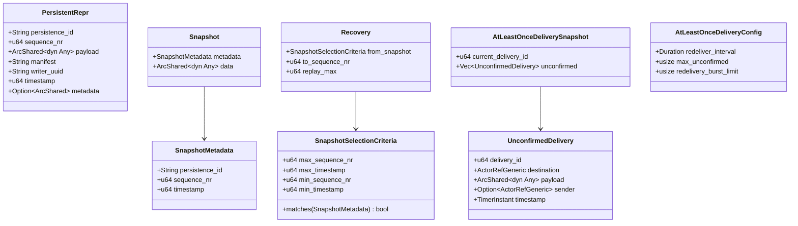

# 設計ドキュメント: untyped-persistence

## 概要

**目的**: fraktor-persistence-rs クレートの Untyped 永続化モジュールを、GATsパターンと `core::future::Ready<T>` を使用した no_std 専用設計で完全再構築する。

**利用者**: イベントソーシングパターンを採用する Rust 開発者が、no_std 環境（組み込みシステム）からホスト環境まで一貫した永続化 API を使用する。

**影響**: 既存の `modules/persistence/src` を全削除し、GATsパターンによる新設計で置き換える。

### 目標

- GATsパターンによる no_std 対応の Journal / SnapshotStore trait 設計
- `core::future::Ready<T>` による同期実装（InMemory）の効率的な提供
- Pekko 互換のイベントソーシングセマンティクス

### 非目標

- std 向け拡張（Tokio ベースの非同期ストレージ実装など）
- 実際の外部ストレージバックエンド実装（DynamoDB, PostgreSQL 等）
- Typed PersistentActor API（将来の別 spec で対応）
- cluster モジュールへの横展開（将来の別 spec `cluster-ready-integration` で対応）

## アーキテクチャ

### 既存アーキテクチャ分析

現在の `modules/persistence/src` は以下の問題を持つ:
- 同期的な trait 設計で非同期バックエンドに対応不可
- GATsパターン未使用で、cluster モジュールとの一貫性がない
- `core::future::Ready<T>` 未使用で同期実装が非効率

### パターンと境界マップ


**アーキテクチャ統合**
- **選択パターン**: GATsパターン + `core::future::Ready<T>`（cluster モジュールと同一）
- **境界の切り方**: trait は `core` モジュール、実装は同じく `core` 内（no_std 専用）
- **既存パターンの維持**: `ActivationStorage`, `ActivationExecutor` と同じ GATs 設計
- **新規コンポーネント**: `Journal`, `SnapshotStore`, `PersistentActor` trait の再設計
- **ステアリング適合**: no_std ファースト、1ファイル1型、`mod.rs` 禁止

### 技術スタック

| レイヤ | 選定 | 役割 | 備考 |
|-------|------|------|------|
| ランタイム | no_std + alloc | 基本実行環境 | std 依存なし |
| 同期実装 | `core::future::Ready<T>` | 同期操作の Future 化 | 即時完了 Future |
| データ構造 | `BTreeMap` / `Vec` | InMemory ストレージ | alloc クレート |
| 型消去 | `ArcShared<dyn Any + Send + Sync>` | スナップショットペイロード | fraktor-utils-rs |

## システムフロー

### リカバリフロー

```mermaid
sequenceDiagram
    participant PA as PersistentActor
    participant SS as SnapshotStore
    participant J as Journal

    PA->>PA: perform_recovery()
    PA->>SS: load_snapshot(criteria)
    SS-->>PA: Option<Snapshot>

    alt Snapshot exists
        PA->>PA: receive_snapshot(snapshot)
    end

    PA->>J: highest_sequence_nr()
    J-->>PA: highest_seq_nr
    PA->>J: replay_messages(from, to, max)

    loop For each replayed message
        J-->>PA: PersistentRepr
        PA->>PA: receive_recover(event)
    end

    PA->>PA: on_recovery_completed()
```



### 永続化フロー


## 要件トレーサビリティ

| 要件 | 概要 | 対応コンポーネント | インターフェイス | フロー |
|------|------|--------------------|------------------|--------|
| 1 | GATsパターンによるtrait設計 | Journal, SnapshotStore | GATs Future型 | 全操作 |
| 2 | `core::future::Ready<T>`同期実装 | InMemoryJournal, InMemorySnapshotStore | Ready<Result<T, E>> | 即時完了 |
| 3 | 他モジュールへの横展開 | cluster モジュール | - | - |
| 4 | Journal trait | Journal | write/replay/delete/highest | 永続化フロー |
| 5 | SnapshotStore trait | SnapshotStore | save/load/delete | リカバリフロー |
| 6 | PersistentRepr | PersistentRepr | new/downcast_ref/with_* | データ表現 |
| 7 | SnapshotMetadata / Criteria | SnapshotMetadata, SnapshotSelectionCriteria | new/matches/limit | スナップショット選択 |
| 8 | Recovery 設定 | Recovery | default/none/from_snapshot | リカバリ制御 |
| 9 | PersistentActor trait | PersistentActor | persist/save_snapshot/delete_* | アクター操作 |
| 10 | AtLeastOnceDelivery | AtLeastOnceDelivery | deliver/confirm/get_snapshot | 配信保証 |
| 11 | PersistenceExtension | PersistenceExtension | new/journal/snapshot_store | 拡張管理 |
| 12-13 | InMemory 実装 | InMemoryJournal, InMemorySnapshotStore | Journal/SnapshotStore impl | テスト用 |
| 14 | 単体テスト | 各コンポーネント/tests.rs | - | 検証 |
| 15 | 使用例 | examples/ | - | ドキュメント |
| 16 | Pekko互換性 | 全コンポーネント | - | セマンティクス |
| 17 | no_std 動作保証 | 全コンポーネント | - | ビルド |
| 18 | エラーハンドリング | JournalError, SnapshotError, PersistenceError | - | エラー伝播 |
| 19 | モジュール構造 | 全ファイル | - | 規約遵守 |

## コンポーネントとインターフェイス

| コンポーネント | ドメイン/層 | 目的 | 要件対応 | 主要依存 | 契約 |
|---------------|------------|------|----------|---------|------|
| Journal | Core | イベントジャーナル抽象化 | 1, 4 | JournalError, PersistentRepr | Service |
| JournalShared | Core | Journal共有ラッパー | 1, 4, 11 | Journal, ToolboxMutex | Service |
| SnapshotStore | Core | スナップショット抽象化 | 1, 5 | SnapshotError, SnapshotMetadata | Service |
| SnapshotStoreShared | Core | SnapshotStore共有ラッパー | 1, 5, 11 | SnapshotStore, ToolboxMutex | Service |
| PersistentRepr | Core | 永続化イベント表現 | 6 | - | State |
| SnapshotMetadata | Core | スナップショットメタデータ | 7 | - | State |
| SnapshotSelectionCriteria | Core | スナップショット選択条件 | 7 | SnapshotMetadata | State |
| Recovery | Core | リカバリ設定 | 8 | SnapshotSelectionCriteria | State |
| PersistentActor | Core | 永続化アクター抽象化 | 9 | Journal, SnapshotStore, Recovery | Service |
| AtLeastOnceDeliveryGeneric | Core | 配信保証（Pekko互換） | 10 | Scheduler, ActorContext | Service |
| AtLeastOnceDeliveryConfig | Core | 配信設定 | 10 | - | State |
| AtLeastOnceDeliverySnapshot | Core | 配信状態スナップショット | 10 | UnconfirmedDelivery | State |
| UnconfirmedDelivery | Core | 未確認配信 | 10 | - | State |
| PersistenceExtension | Core | 拡張管理 | 11 | JournalShared, SnapshotStoreShared | Service |
| InMemoryJournal | Core | テスト用Journal | 2, 12 | Journal | Service |
| InMemorySnapshotStore | Core | テスト用SnapshotStore | 2, 13 | SnapshotStore | Service |
| JournalError | Core | Journalエラー | 18 | - | State |
| SnapshotError | Core | Snapshotエラー | 18 | - | State |
| PersistenceError | Core | 統合エラー | 18 | JournalError, SnapshotError | State |

### Core 層

#### Journal

| 項目 | 内容 |
|------|------|
| 目的 | GATsパターンによるイベントジャーナルの抽象化 |
| 対応要件 | 1, 4 |

**責務と制約**
- イベントの永続化、再生、削除を抽象化
- シーケンス番号の一貫性保証
- 不変条件: シーケンス番号は persistence_id ごとに単調増加
- no_std 専用

**依存関係**
- Outbound: JournalError（エラー型）, PersistentRepr（イベント表現）

**契約**: Service [x]

##### サービスインターフェイス

```rust
use alloc::string::String;
use alloc::vec::Vec;
use core::future::Future;

use crate::core::{JournalError, PersistentRepr};

/// GATsパターンによるイベントジャーナル trait。
pub trait Journal: Send + Sync + 'static {
    /// 書き込み操作の Future 型。
    type WriteFuture<'a>: Future<Output = Result<(), JournalError>> + Send + 'a
    where
        Self: 'a;

    /// 再生操作の Future 型。
    type ReplayFuture<'a>: Future<Output = Result<Vec<PersistentRepr>, JournalError>> + Send + 'a
    where
        Self: 'a;

    /// 削除操作の Future 型。
    type DeleteFuture<'a>: Future<Output = Result<(), JournalError>> + Send + 'a
    where
        Self: 'a;

    /// 最大シーケンス番号取得の Future 型。
    type HighestSeqNrFuture<'a>: Future<Output = Result<u64, JournalError>> + Send + 'a
    where
        Self: 'a;

    /// メッセージを書き込む。
    fn write_messages<'a>(&'a mut self, messages: &'a [PersistentRepr]) -> Self::WriteFuture<'a>;

    /// メッセージを再生する。
    fn replay_messages<'a>(
        &'a self,
        persistence_id: &'a str,
        from_sequence_nr: u64,
        to_sequence_nr: u64,
        max: u64,
    ) -> Self::ReplayFuture<'a>;

    /// 指定シーケンス番号以下のメッセージを削除する。
    fn delete_messages_to<'a>(
        &'a mut self,
        persistence_id: &'a str,
        to_sequence_nr: u64,
    ) -> Self::DeleteFuture<'a>;

    /// 最大シーケンス番号を取得する。
    fn highest_sequence_nr<'a>(&'a self, persistence_id: &'a str) -> Self::HighestSeqNrFuture<'a>;
}
```

- 前提条件: messages 内のシーケンス番号は連続している
- 事後条件: 書き込み成功後、replay_messages で取得可能
- 不変条件: highest_sequence_nr は削除後も減少しない

##### 実装ノート

- `write_messages` は Pekko の `asyncWriteMessages` と同等のシーケンス番号検証を行う
- シーケンス番号不連続時は `JournalError::SequenceMismatch` を返す

#### JournalShared

| 項目 | 内容 |
|------|------|
| 目的 | Journal の共有ラッパー |
| 対応要件 | 1, 4, 11 |

**責務と制約**
- `&mut self` メソッドを持つ Journal を複数箇所で共有可能にする
- `ArcShared<ToolboxMutex<J>>` パターンによる内部可変性
- `docs/guides/shared_vs_handle.md` ガイドラインに準拠

**契約**: Service [x]

##### サービスインターフェイス

```rust
use fraktor_utils_rs::core::{
    runtime_toolbox::RuntimeToolbox,
    sync::{ArcShared, SharedAccess, ToolboxMutex},
};

use crate::core::Journal;

/// Journal の共有ラッパー。
///
/// `&mut self` メソッドを持つ Journal を複数箇所で共有する場合に使用する。
/// `SharedAccess<J>` を実装し、プロジェクト全体の共有ラッパーパターンと一貫性を保つ。
pub struct JournalShared<J: Journal, TB: RuntimeToolbox> {
    inner: ArcShared<ToolboxMutex<J, TB>>,
}

impl<J: Journal, TB: RuntimeToolbox> JournalShared<J, TB> {
    /// 新しい JournalShared を作成する。
    pub fn new(journal: J, toolbox: &TB) -> Self {
        Self {
            inner: ArcShared::new(ToolboxMutex::new(journal, toolbox)),
        }
    }
}

impl<J: Journal, TB: RuntimeToolbox> SharedAccess<J> for JournalShared<J, TB> {
    fn with_read<R>(&self, f: impl FnOnce(&J) -> R) -> R {
        self.inner.with_read(f)
    }

    fn with_write<R>(&self, f: impl FnOnce(&mut J) -> R) -> R {
        self.inner.with_write(f)
    }
}

impl<J: Journal, TB: RuntimeToolbox> Clone for JournalShared<J, TB> {
    fn clone(&self) -> Self {
        Self { inner: self.inner.clone() }
    }
}
```

#### SnapshotStore

| 項目 | 内容 |
|------|------|
| 目的 | GATsパターンによるスナップショットストアの抽象化 |
| 対応要件 | 1, 5 |

**責務と制約**
- スナップショットの保存、読み込み、削除を抽象化
- 条件に基づくスナップショット選択
- no_std 専用

**依存関係**
- Outbound: SnapshotError, SnapshotMetadata, SnapshotSelectionCriteria, Snapshot

**契約**: Service [x]

##### サービスインターフェイス

```rust
use alloc::string::String;
use core::future::Future;

use fraktor_utils_rs::core::sync::ArcShared;

use crate::core::{Snapshot, SnapshotError, SnapshotMetadata, SnapshotSelectionCriteria};

/// GATsパターンによるスナップショットストア trait。
pub trait SnapshotStore: Send + Sync + 'static {
    /// 保存操作の Future 型。
    type SaveFuture<'a>: Future<Output = Result<(), SnapshotError>> + Send + 'a
    where
        Self: 'a;

    /// 読み込み操作の Future 型。
    type LoadFuture<'a>: Future<Output = Result<Option<Snapshot>, SnapshotError>> + Send + 'a
    where
        Self: 'a;

    /// 単一削除操作の Future 型。
    type DeleteOneFuture<'a>: Future<Output = Result<(), SnapshotError>> + Send + 'a
    where
        Self: 'a;

    /// 複数削除操作の Future 型。
    type DeleteManyFuture<'a>: Future<Output = Result<(), SnapshotError>> + Send + 'a
    where
        Self: 'a;

    /// スナップショットを保存する。
    fn save_snapshot<'a>(
        &'a mut self,
        metadata: SnapshotMetadata,
        snapshot: ArcShared<dyn core::any::Any + Send + Sync>,
    ) -> Self::SaveFuture<'a>;

    /// スナップショットを読み込む。
    fn load_snapshot<'a>(
        &'a self,
        persistence_id: &'a str,
        criteria: SnapshotSelectionCriteria,
    ) -> Self::LoadFuture<'a>;

    /// 指定メタデータのスナップショットを削除する。
    fn delete_snapshot<'a>(&'a mut self, metadata: &'a SnapshotMetadata) -> Self::DeleteOneFuture<'a>;

    /// 条件に一致するスナップショットを削除する。
    fn delete_snapshots<'a>(
        &'a mut self,
        persistence_id: &'a str,
        criteria: SnapshotSelectionCriteria,
    ) -> Self::DeleteManyFuture<'a>;
}
```

- 前提条件: persistence_id は空でない
- 事後条件: load_snapshot は条件に一致する最新のスナップショットを返す
- 不変条件: 同一 persistence_id, sequence_nr のスナップショットは一意

#### SnapshotStoreShared

| 項目 | 内容 |
|------|------|
| 目的 | SnapshotStore の共有ラッパー |
| 対応要件 | 1, 5, 11 |

**責務と制約**
- `&mut self` メソッドを持つ SnapshotStore を複数箇所で共有可能にする
- `ArcShared<ToolboxMutex<S>>` パターンによる内部可変性
- `docs/guides/shared_vs_handle.md` ガイドラインに準拠

**契約**: Service [x]

##### サービスインターフェイス

```rust
use fraktor_utils_rs::core::{
    runtime_toolbox::RuntimeToolbox,
    sync::{ArcShared, SharedAccess, ToolboxMutex},
};

use crate::core::SnapshotStore;

/// SnapshotStore の共有ラッパー。
///
/// `&mut self` メソッドを持つ SnapshotStore を複数箇所で共有する場合に使用する。
/// `SharedAccess<S>` を実装し、プロジェクト全体の共有ラッパーパターンと一貫性を保つ。
pub struct SnapshotStoreShared<S: SnapshotStore, TB: RuntimeToolbox> {
    inner: ArcShared<ToolboxMutex<S, TB>>,
}

impl<S: SnapshotStore, TB: RuntimeToolbox> SnapshotStoreShared<S, TB> {
    /// 新しい SnapshotStoreShared を作成する。
    pub fn new(store: S, toolbox: &TB) -> Self {
        Self {
            inner: ArcShared::new(ToolboxMutex::new(store, toolbox)),
        }
    }
}

impl<S: SnapshotStore, TB: RuntimeToolbox> SharedAccess<S> for SnapshotStoreShared<S, TB> {
    fn with_read<R>(&self, f: impl FnOnce(&S) -> R) -> R {
        self.inner.with_read(f)
    }

    fn with_write<R>(&self, f: impl FnOnce(&mut S) -> R) -> R {
        self.inner.with_write(f)
    }
}

impl<S: SnapshotStore, TB: RuntimeToolbox> Clone for SnapshotStoreShared<S, TB> {
    fn clone(&self) -> Self {
        Self { inner: self.inner.clone() }
    }
}
```

#### PersistentRepr

| 項目 | 内容 |
|------|------|
| 目的 | 永続化イベントの型安全な表現 |
| 対応要件 | 6 |

**責務と制約**
- persistence_id, sequence_nr, payload の保持
- 型安全なダウンキャスト
- manifest と metadata のサポート
- Clone 必須

**契約**: State [x]

##### 状態管理

```rust
use alloc::string::String;
use core::any::Any;

use fraktor_utils_rs::core::sync::ArcShared;

/// 永続化イベント表現。
#[derive(Clone)]
pub struct PersistentRepr {
    persistence_id: String,
    sequence_nr: u64,
    payload: ArcShared<dyn Any + Send + Sync>,
    manifest: String,
    writer_uuid: String,
    timestamp: u64,
    metadata: Option<ArcShared<dyn Any + Send + Sync>>,
}

impl PersistentRepr {
    /// 新しい PersistentRepr を作成する。
    pub fn new(
        persistence_id: String,
        sequence_nr: u64,
        payload: ArcShared<dyn Any + Send + Sync>,
    ) -> Self;

    /// persistence_id を取得する。
    pub fn persistence_id(&self) -> &str;

    /// sequence_nr を取得する。
    pub fn sequence_nr(&self) -> u64;

    /// ペイロードをダウンキャストして取得する。
    pub fn downcast_ref<T: Any>(&self) -> Option<&T>;

    /// manifest を設定した新しいインスタンスを返す。
    pub fn with_manifest(self, manifest: String) -> Self;

    /// metadata を設定した新しいインスタンスを返す。
    pub fn with_metadata(self, metadata: ArcShared<dyn Any + Send + Sync>) -> Self;

    /// timestamp を設定した新しいインスタンスを返す。
    pub fn with_timestamp(self, timestamp: u64) -> Self;

    /// writer_uuid を設定した新しいインスタンスを返す。
    pub fn with_writer_uuid(self, writer_uuid: String) -> Self;
}
```

- 永続化: メモリ内保持、シリアライズは呼び出し側の責務
- 整合性: sequence_nr は一意、不変

#### SnapshotMetadata

| 項目 | 内容 |
|------|------|
| 目的 | スナップショットのメタデータ管理 |
| 対応要件 | 7 |

**契約**: State [x]

##### 状態管理

```rust
use alloc::string::String;

/// スナップショットメタデータ。
#[derive(Clone, Debug, PartialEq, Eq, PartialOrd, Ord)]
pub struct SnapshotMetadata {
    persistence_id: String,
    sequence_nr: u64,
    timestamp: u64,
}

impl SnapshotMetadata {
    /// 新しい SnapshotMetadata を作成する。
    pub fn new(persistence_id: String, sequence_nr: u64, timestamp: u64) -> Self;

    /// persistence_id を取得する。
    pub fn persistence_id(&self) -> &str;

    /// sequence_nr を取得する。
    pub fn sequence_nr(&self) -> u64;

    /// timestamp を取得する。
    pub fn timestamp(&self) -> u64;
}
```

- 等価性: persistence_id, sequence_nr, timestamp が全て一致で等価

#### SnapshotSelectionCriteria

| 項目 | 内容 |
|------|------|
| 目的 | スナップショット選択条件の定義 |
| 対応要件 | 7 |

**契約**: State [x]

##### 状態管理

```rust
/// スナップショット選択条件。
#[derive(Clone, Debug, Default)]
pub struct SnapshotSelectionCriteria {
    max_sequence_nr: u64,
    max_timestamp: u64,
    min_sequence_nr: u64,
    min_timestamp: u64,
}

impl SnapshotSelectionCriteria {
    /// 最新のスナップショットにマッチする条件を返す。
    pub fn latest() -> Self;

    /// どのスナップショットにもマッチしない条件を返す。
    pub fn none() -> Self;

    /// メタデータが条件にマッチするか判定する。
    pub fn matches(&self, metadata: &SnapshotMetadata) -> bool;

    /// max_sequence_nr を制限した新しい条件を返す。
    pub fn limit(&self, to_sequence_nr: u64) -> Self;
}
```

#### Recovery

| 項目 | 内容 |
|------|------|
| 目的 | リカバリ動作の設定 |
| 対応要件 | 8 |

**契約**: State [x]

##### 状態管理

```rust
/// リカバリ設定。
#[derive(Clone, Debug)]
pub struct Recovery {
    from_snapshot: SnapshotSelectionCriteria,
    to_sequence_nr: u64,
    replay_max: u64,
}

impl Recovery {
    /// デフォルトリカバリ設定（最新スナップショットから全イベント再生）。
    pub fn default() -> Self;

    /// リカバリをスキップする設定（highest_sequence_nr のみ取得）。
    pub fn none() -> Self;

    /// カスタムリカバリ設定を作成する。
    pub fn new(
        from_snapshot: SnapshotSelectionCriteria,
        to_sequence_nr: u64,
        replay_max: u64,
    ) -> Self;

    /// スナップショット選択条件を指定してリカバリ設定を作成する。
    pub fn from_snapshot(criteria: SnapshotSelectionCriteria) -> Self;
}
```

#### Snapshot

| 項目 | 内容 |
|------|------|
| 目的 | スナップショットデータの表現 |
| 対応要件 | 5 |

**契約**: State [x]

##### 状態管理

```rust
use core::any::Any;

use fraktor_utils_rs::core::sync::ArcShared;

/// スナップショット。
pub struct Snapshot {
    metadata: SnapshotMetadata,
    data: ArcShared<dyn Any + Send + Sync>,
}

impl Snapshot {
    /// 新しい Snapshot を作成する。
    pub fn new(metadata: SnapshotMetadata, data: ArcShared<dyn Any + Send + Sync>) -> Self;

    /// メタデータを取得する。
    pub fn metadata(&self) -> &SnapshotMetadata;

    /// データをダウンキャストして取得する。
    pub fn downcast_ref<T: Any>(&self) -> Option<&T>;
}
```

#### PersistentActor

| 項目 | 内容 |
|------|------|
| 目的 | Pekko 互換の永続化アクター抽象化 |
| 対応要件 | 9 |

**責務と制約**
- リカバリの実行とイベント再生
- persist / persist_all によるイベント永続化
- スナップショットの保存と削除
- no_std 専用

**依存関係**
- Outbound: Journal(P0), SnapshotStore(P0), Recovery(P0), PersistentRepr(P0)

**契約**: Service [x]

##### Journal/SnapshotStore 統合パターン

実装者は Journal と SnapshotStore を構造体フィールドとして保持し、コンストラクタで注入するパターンを採用する。これにより:

- アクター固有のストレージインスタンスを持つことができる
- Pekko のパターンと一貫性がある
- no_std 環境でもシンプルに実装できる

```rust
// 実装例
struct MyPersistentActor<J: Journal, S: SnapshotStore> {
    persistence_id: String,
    sequence_nr: u64,
    journal: J,
    snapshot_store: S,
    state: MyState,
}

impl<J: Journal, S: SnapshotStore> MyPersistentActor<J, S> {
    pub fn new(
        persistence_id: String,
        journal: J,
        snapshot_store: S
    ) -> Self {
        Self {
            persistence_id,
            sequence_nr: 0,
            journal,
            snapshot_store,
            state: MyState::default(),
        }
    }
}
```

##### サービスインターフェイス

```rust
use alloc::string::String;
use alloc::vec::Vec;
use core::any::Any;

use fraktor_utils_rs::core::sync::ArcShared;

use crate::core::{Journal, PersistentRepr, Recovery, SnapshotMetadata, SnapshotSelectionCriteria, SnapshotStore};

/// 永続化アクター trait。
pub trait PersistentActor: Send {
    /// 使用する Journal 型。
    type Journal: Journal;

    /// 使用する SnapshotStore 型。
    type SnapshotStore: SnapshotStore;

    /// このアクターの永続化 ID。
    fn persistence_id(&self) -> &str;

    /// Journal への参照を返す。
    fn journal(&self) -> &Self::Journal;

    /// Journal への可変参照を返す。
    fn journal_mut(&mut self) -> &mut Self::Journal;

    /// SnapshotStore への参照を返す。
    fn snapshot_store(&self) -> &Self::SnapshotStore;

    /// SnapshotStore への可変参照を返す。
    fn snapshot_store_mut(&mut self) -> &mut Self::SnapshotStore;

    /// リカバリ設定を返す。
    fn recovery(&self) -> Recovery {
        Recovery::default()
    }

    /// 永続化されたイベントのリカバリ時に呼び出される。
    fn receive_recover(&mut self, event: &PersistentRepr);

    /// スナップショットのリカバリ時に呼び出される。
    fn receive_snapshot(&mut self, snapshot: &dyn Any);

    /// リカバリ完了時に呼び出される。
    fn on_recovery_completed(&mut self) {}

    /// 現在のシーケンス番号を返す。
    fn last_sequence_nr(&self) -> u64;

    /// イベントを永続化する。
    fn persist<E: Any + Send + Sync + 'static>(
        &mut self,
        event: E,
        handler: impl FnOnce(&mut Self, &E),
    );

    /// 複数イベントを永続化する。
    fn persist_all<E: Any + Send + Sync + Clone + 'static>(
        &mut self,
        events: Vec<E>,
        handler: impl FnMut(&mut Self, &E),
    );

    /// スナップショットを保存する。
    fn save_snapshot(&mut self, snapshot: ArcShared<dyn Any + Send + Sync>);

    /// 指定シーケンス番号以下のメッセージを削除する。
    fn delete_messages(&mut self, to_sequence_nr: u64);

    /// 条件に一致するスナップショットを削除する。
    fn delete_snapshots(&mut self, criteria: SnapshotSelectionCriteria);
}
```

- 前提条件: persistence_id は空でない一意の識別子
- 事後条件: persist 後、sequence_nr が増加
- 不変条件: リカバリ中は persist 不可

##### 実装ノート

- リカバリ中の persist 呼び出しはパニックまたはエラー
- Pekko の `Eventsourced` と同等のセマンティクス

###### no_std での Future 完了待ち戦略

`persist`, `save_snapshot` 等の同期シグネチャメソッドは、内部で Journal/SnapshotStore の GATs Future を呼び出す。no_std 環境での Future 完了待ちは以下の戦略を採用する:

1. **`core::future::Ready<T>` の即時完了特性を活用**
   - InMemory 実装は `core::future::Ready<T>` を返すため、最初の poll で即座に `Poll::Ready` となる
   - blocking poll は不要で、単純な `poll` 一回で完了

2. **実装パターン**
   ```rust
   use core::future::Future;
   use core::pin::Pin;
   use core::task::{Context, Poll, RawWaker, RawWakerVTable, Waker};

   /// Ready<T> を即座に完了させるヘルパー。
   fn poll_ready<T>(future: impl Future<Output = T>) -> T {
       // no-op waker (Ready は waker を使用しない)
       fn noop_clone(_: *const ()) -> RawWaker { RawWaker::new(core::ptr::null(), &VTABLE) }
       fn noop(_: *const ()) {}
       static VTABLE: RawWakerVTable = RawWakerVTable::new(noop_clone, noop, noop, noop);
       let waker = unsafe { Waker::from_raw(RawWaker::new(core::ptr::null(), &VTABLE)) };
       let mut cx = Context::from_waker(&waker);

       let mut pinned = core::pin::pin!(future);
       match pinned.as_mut().poll(&mut cx) {
           Poll::Ready(value) => value,
           Poll::Pending => panic!("Expected Ready<T> to complete immediately"),
       }
   }
   ```

3. **非同期バックエンド対応（将来拡張）**
   - std 環境で非同期バックエンドを使用する場合は、別途 `async fn` シグネチャの trait を提供
   - 本 spec は no_std + `core::future::Ready<T>` に限定

#### AtLeastOnceDeliveryGeneric

| 項目 | 内容 |
|------|------|
| 目的 | 少なくとも1回の配信保証（Pekko 互換） |
| 対応要件 | 10 |

**責務と制約**
- 未確認メッセージの追跡
- 再配信間隔の管理
- 配信状態のスナップショット
- Scheduler 経由の自動再配信（内部 RedeliveryTick メッセージ）

**契約**: Service [x]

##### Pekko 互換の再配信機構

Pekko と同様に、Scheduler を使用して内部的に `RedeliveryTick` メッセージを自身に送信し、`handle_message()` で傍受して再配信を行う。外部からの `tick()` 呼び出しは不要。

```
┌─────────────────────────────────────────────────────────────┐
│ AtLeastOnceDeliveryGeneric                                  │
│                                                             │
│   deliver() ─→ unconfirmed に追加 + 即座に送信              │
│            └→ ensure_redelivery_scheduled() で Scheduler 登録│
│                                                             │
│   handle_message() ─→ RedeliveryTick を傍受                 │
│                    └→ redeliver() で期限切れを再送信        │
│                                                             │
│   confirm_delivery() ─→ unconfirmed から削除                │
│                      └→ 空なら Scheduler をキャンセル       │
└─────────────────────────────────────────────────────────────┘
```

##### サービスインターフェイス

```rust
use alloc::vec::Vec;
use core::any::Any;
use core::marker::PhantomData;
use core::time::Duration;

use fraktor_actor_rs::core::{
    actor::ActorContextGeneric,
    actor::actor_ref::ActorRefGeneric,
    error::ActorError,
    messaging::AnyMessageViewGeneric,
    scheduler::SchedulerHandle,
};
use fraktor_utils_rs::core::{
    runtime_toolbox::RuntimeToolbox,
    sync::ArcShared,
};

use crate::core::{
    AtLeastOnceDeliveryConfig,
    AtLeastOnceDeliverySnapshot,
    UnconfirmedDelivery,
};

/// 少なくとも1回配信保証ヘルパー（Pekko 互換）。
///
/// Scheduler 経由で内部的に RedeliveryTick を送信し、
/// handle_message() で傍受して再配信を行う。
pub struct AtLeastOnceDeliveryGeneric<TB: RuntimeToolbox + 'static> {
    config: AtLeastOnceDeliveryConfig,
    next_delivery_id: u64,
    unconfirmed: Vec<UnconfirmedDelivery<TB>>,
    redelivery_handle: Option<SchedulerHandle>,
    _marker: PhantomData<TB>,
}

impl<TB: RuntimeToolbox + 'static> AtLeastOnceDeliveryGeneric<TB> {
    /// 設定を指定して新しいヘルパーを作成する。
    pub const fn new(config: AtLeastOnceDeliveryConfig) -> Self;

    /// 現在の配信 ID を返す。
    pub const fn current_delivery_id(&self) -> u64;

    /// 未確認配信の数を返す。
    pub const fn number_of_unconfirmed(&self) -> usize;

    /// メッセージを少なくとも1回配信セマンティクスで送信する。
    ///
    /// 内部で Scheduler に RedeliveryTick を登録する。
    pub fn deliver<M, F>(
        &mut self,
        ctx: &mut ActorContextGeneric<'_, TB>,
        destination: ActorRefGeneric<TB>,
        make_message: F,
    ) -> Result<u64, ActorError>
    where
        M: Any + Send + Sync + 'static,
        F: FnOnce(u64) -> M;

    /// 配信を確認し、再配信追跡をキャンセルする。
    pub fn confirm_delivery(
        &mut self,
        ctx: &mut ActorContextGeneric<'_, TB>,
        delivery_id: u64,
    ) -> bool;

    /// 配信状態のスナップショットを取得する。
    pub fn get_delivery_snapshot(&self) -> AtLeastOnceDeliverySnapshot<TB>;

    /// スナップショットから配信状態を復元する。
    pub fn set_delivery_snapshot(
        &mut self,
        ctx: &mut ActorContextGeneric<'_, TB>,
        snapshot: AtLeastOnceDeliverySnapshot<TB>,
    );

    /// 内部再配信メッセージを処理する。
    ///
    /// RedeliveryTick を傍受した場合 true を返す。
    /// アクターの receive ハンドラ内で呼び出すこと。
    pub fn handle_message(
        &mut self,
        ctx: &mut ActorContextGeneric<'_, TB>,
        message: &AnyMessageViewGeneric<'_, TB>,
    ) -> Result<bool, ActorError>;
}
```

##### 使用例

```rust
// PersistentActor 内での使用
impl<TB: RuntimeToolbox> Actor<TB> for MyPersistentActor<TB> {
    fn receive(&mut self, ctx: &mut ActorContextGeneric<'_, TB>, message: AnyMessageViewGeneric<'_, TB>) {
        // AtLeastOnceDelivery の内部メッセージを処理
        if self.delivery.handle_message(ctx, &message).unwrap_or(false) {
            return; // RedeliveryTick を処理済み
        }

        // 通常のメッセージ処理
        if let Some(cmd) = message.downcast_ref::<MyCommand>() {
            // deliver で送信（Scheduler が自動的に再配信を管理）
            let _ = self.delivery.deliver(ctx, target, |id| Response { id, data });
        }

        if let Some(ack) = message.downcast_ref::<Ack>() {
            // 確認で再配信をキャンセル
            self.delivery.confirm_delivery(ctx, ack.delivery_id);
        }
    }
}
```

#### PersistenceExtension

| 項目 | 内容 |
|------|------|
| 目的 | ActorSystem への永続化機能拡張 |
| 対応要件 | 11 |

**責務と制約**
- Journal と SnapshotStore の共有インスタンスを管理
- `JournalShared` / `SnapshotStoreShared` ラッパーを使用
- `docs/guides/shared_vs_handle.md` ガイドラインに準拠

**契約**: Service [x]

##### サービスインターフェイス

```rust
use fraktor_utils_rs::core::runtime_toolbox::RuntimeToolbox;

use crate::core::{Journal, JournalShared, SnapshotStore, SnapshotStoreShared};

/// 永続化拡張。
///
/// JournalShared / SnapshotStoreShared を使用して、
/// &mut self メソッドを持つ Journal / SnapshotStore を安全に共有する。
pub struct PersistenceExtension<J, S, TB>
where
    J: Journal,
    S: SnapshotStore,
    TB: RuntimeToolbox,
{
    journal: JournalShared<J, TB>,
    snapshot_store: SnapshotStoreShared<S, TB>,
}

impl<J, S, TB> PersistenceExtension<J, S, TB>
where
    J: Journal,
    S: SnapshotStore,
    TB: RuntimeToolbox,
{
    /// 新しい PersistenceExtension を作成する。
    pub fn new(journal: J, snapshot_store: S, toolbox: &TB) -> Self {
        Self {
            journal: JournalShared::new(journal, toolbox),
            snapshot_store: SnapshotStoreShared::new(snapshot_store, toolbox),
        }
    }

    /// JournalShared への参照を返す。
    pub fn journal(&self) -> &JournalShared<J, TB> {
        &self.journal
    }

    /// SnapshotStoreShared への参照を返す。
    pub fn snapshot_store(&self) -> &SnapshotStoreShared<S, TB> {
        &self.snapshot_store
    }
}

impl<J, S, TB> Clone for PersistenceExtension<J, S, TB>
where
    J: Journal,
    S: SnapshotStore,
    TB: RuntimeToolbox,
{
    fn clone(&self) -> Self {
        Self {
            journal: self.journal.clone(),
            snapshot_store: self.snapshot_store.clone(),
        }
    }
}
```

#### InMemoryJournal

| 項目 | 内容 |
|------|------|
| 目的 | テスト用 Journal 実装 |
| 対応要件 | 2, 12 |

**責務と制約**
- メモリ上でのイベント保存
- `core::future::Ready<T>` による即時完了
- no_std 専用

**契約**: Service [x]

##### サービスインターフェイス

```rust
use alloc::collections::BTreeMap;
use alloc::string::String;
use alloc::vec::Vec;
use core::future::Ready;

use crate::core::{Journal, JournalError, PersistentRepr};

/// インメモリ Journal 実装。
pub struct InMemoryJournal {
    messages: BTreeMap<String, Vec<PersistentRepr>>,
    highest_sequence_nrs: BTreeMap<String, u64>,
}

impl InMemoryJournal {
    /// 空の InMemoryJournal を作成する。
    pub fn new() -> Self;
}

impl Journal for InMemoryJournal {
    type WriteFuture<'a> = Ready<Result<(), JournalError>>;
    type ReplayFuture<'a> = Ready<Result<Vec<PersistentRepr>, JournalError>>;
    type DeleteFuture<'a> = Ready<Result<(), JournalError>>;
    type HighestSeqNrFuture<'a> = Ready<Result<u64, JournalError>>;

    // 実装は core::future::ready() を使用
}
```

#### InMemorySnapshotStore

| 項目 | 内容 |
|------|------|
| 目的 | テスト用 SnapshotStore 実装 |
| 対応要件 | 2, 13 |

**契約**: Service [x]

##### サービスインターフェイス

```rust
use alloc::collections::BTreeMap;
use alloc::string::String;
use alloc::vec::Vec;
use core::any::Any;
use core::future::Ready;

use fraktor_utils_rs::core::sync::ArcShared;

use crate::core::{Snapshot, SnapshotError, SnapshotMetadata, SnapshotSelectionCriteria, SnapshotStore};

/// インメモリ SnapshotStore 実装。
pub struct InMemorySnapshotStore {
    snapshots: BTreeMap<String, Vec<(SnapshotMetadata, ArcShared<dyn Any + Send + Sync>)>>,
}

impl InMemorySnapshotStore {
    /// 空の InMemorySnapshotStore を作成する。
    pub fn new() -> Self;
}

impl SnapshotStore for InMemorySnapshotStore {
    type SaveFuture<'a> = Ready<Result<(), SnapshotError>>;
    type LoadFuture<'a> = Ready<Result<Option<Snapshot>, SnapshotError>>;
    type DeleteOneFuture<'a> = Ready<Result<(), SnapshotError>>;
    type DeleteManyFuture<'a> = Ready<Result<(), SnapshotError>>;

    // 実装は core::future::ready() を使用
}
```

### エラー型

#### JournalError

```rust
use alloc::string::String;
use core::fmt;

/// Journal 操作エラー。
#[derive(Debug, Clone)]
pub enum JournalError {
    /// シーケンス番号の不整合。
    SequenceMismatch { expected: u64, actual: u64 },
    /// 書き込み失敗。
    WriteFailed(String),
    /// 読み込み失敗。
    ReadFailed(String),
    /// 削除失敗。
    DeleteFailed(String),
}

impl fmt::Display for JournalError {
    fn fmt(&self, f: &mut fmt::Formatter<'_>) -> fmt::Result;
}
```

#### SnapshotError

```rust
use alloc::string::String;
use core::fmt;

/// SnapshotStore 操作エラー。
#[derive(Debug, Clone)]
pub enum SnapshotError {
    /// 保存失敗。
    SaveFailed(String),
    /// 読み込み失敗。
    LoadFailed(String),
    /// 削除失敗。
    DeleteFailed(String),
}

impl fmt::Display for SnapshotError {
    fn fmt(&self, f: &mut fmt::Formatter<'_>) -> fmt::Result;
}
```

#### PersistenceError

```rust
use alloc::string::String;
use core::fmt;

use crate::core::{JournalError, SnapshotError};

/// 永続化操作の統合エラー。
#[derive(Debug, Clone)]
pub enum PersistenceError {
    /// Journal エラー。
    Journal(JournalError),
    /// Snapshot エラー。
    Snapshot(SnapshotError),
    /// リカバリエラー。
    RecoveryFailed(String),
    /// リカバリ中の不正操作。
    InvalidOperationDuringRecovery,
}

impl fmt::Display for PersistenceError {
    fn fmt(&self, f: &mut fmt::Formatter<'_>) -> fmt::Result;
}

impl From<JournalError> for PersistenceError {
    fn from(e: JournalError) -> Self;
}

impl From<SnapshotError> for PersistenceError {
    fn from(e: SnapshotError) -> Self;
}
```

### スコープ外: Cluster モジュール横展開

Cluster モジュールへの `core::future::Ready<T>` パターン横展開は **本 spec のスコープ外** とし、別 spec で対応する。

#### 理由

1. **段階的検証**: persistence モジュールで `core::future::Ready<T>` パターンを検証後、cluster に適用すべき
2. **スコープの明確化**: 本 spec は persistence モジュールの GATs 化に集中
3. **既存コードへの影響最小化**: cluster モジュールは独立した変更として管理

#### 将来の別 spec (cluster-ready-integration)

本 spec 完了後、以下の別 spec で cluster モジュールへの横展開を実施:

```yaml
spec: cluster-ready-integration
scope:
  - modules/cluster/src/core/in_memory_activation_storage.rs 新規追加
  - modules/cluster/src/core/noop_activation_executor.rs 新規追加
  - modules/cluster/src/core/in_memory_placement_lock.rs 新規追加
prerequisites:
  - untyped-persistence spec 完了
  - core::future::Ready<T> パターンの検証完了
```

#### 既存 cluster モジュールとの関係

- 既存の GATs trait 定義（ActivationStorage, ActivationExecutor, PlacementLock）は変更不要
- 既存の std example（BoxFuture 使用）は変更不要
- 本 spec で導入する `core::future::Ready<T>` パターンを将来の cluster 実装で活用

## データモデル

### ドメインモデル



### 論理データモデル

**Journal ストレージ構造**
- キー: `(persistence_id, sequence_nr)`
- 値: `PersistentRepr`
- インデックス: persistence_id ごとの highest_sequence_nr

**SnapshotStore ストレージ構造**
- キー: `(persistence_id, sequence_nr, timestamp)`
- 値: `(SnapshotMetadata, snapshot_data)`
- インデックス: persistence_id ごとの最新スナップショット

## エラーハンドリング

### 方針

- すべてのエラーは `Result<T, E>` で伝播
- 回復可能: 一時的な IO エラー（リトライ可能）
- 致命的: シーケンス番号不整合（状態破損の可能性）

### エラー分類と応答

**入力系**
- シーケンス番号不連続 → `JournalError::SequenceMismatch`
- 空の persistence_id → パニック（プログラミングエラー）

**システム系**
- ストレージ障害 → `WriteFailed` / `SaveFailed`
- 読み込み障害 → `ReadFailed` / `LoadFailed`

**ビジネス系**
- リカバリ中の persist → `PersistenceError::InvalidOperationDuringRecovery`

## 移行戦略

### 既存実装との関係

本 spec の設計は、既存の `modules/persistence/src/core/at_least_once_delivery.rs` 実装と**完全に互換性がある**。既存実装はすでに Pekko パターンに準拠しており、以下の点で一致している:

1. **handle_message() パターン**: 既存実装の `handle_message()` メソッドは、本設計の Pekko 互換パターンと同一
2. **Scheduler 統合**: 既存実装はすでに `SchedulerHandle` を使用した内部 RedeliveryTick 管理を実装済み
3. **AtLeastOnceDeliveryConfig**: 既存実装で使用中

### 移行方針

#### Phase 1: Journal / SnapshotStore trait の追加（破壊的変更なし）

新規ファイルを追加し、既存コードに影響を与えない:
- `journal.rs`, `snapshot_store.rs`: GATsパターンの新しい trait
- `in_memory_journal.rs`, `in_memory_snapshot_store.rs`: `core::future::Ready<T>` 実装
- `persistent_actor.rs`: Associated types を持つ新しい trait

#### Phase 2: 既存コードの段階的統合

1. **AtLeastOnceDelivery 系**: 変更不要（既存実装が設計に準拠）
2. **PersistenceExtension**: 新しい Journal/SnapshotStore trait を使用するよう更新
3. **エラー型**: 既存のエラー型があれば統合、なければ新規追加

#### Phase 3: 検証とドキュメント

1. 全テストパス確認
2. examples/ への使用例追加
3. no_std ビルド検証

### 破壊的変更

本 spec は以下の破壊的変更を含む可能性がある:

| 対象 | 変更内容 | 影響範囲 |
|------|---------|---------|
| Journal trait | 新規追加（同名の既存 trait がある場合は置換） | persistence モジュール内 |
| SnapshotStore trait | 新規追加（同名の既存 trait がある場合は置換） | persistence モジュール内 |
| PersistentActor trait | 新規追加（同名の既存 trait がある場合は置換） | persistence モジュール内 |

### 後方互換性

CLAUDE.md に記載の通り、後方互換性は不要。最適な設計を優先し、必要に応じて破壊的変更を行う。

### 将来の std 拡張戦略

本 spec は no_std + `core::future::Ready<T>` に限定しているが、将来的に std 環境で非同期バックエンド（DynamoDB, PostgreSQL 等）をサポートする場合の拡張戦略を以下に示す:

#### 推奨アプローチ: 別 trait による拡張

```rust
// 将来の std 向け非同期 trait（本 spec のスコープ外）
#[cfg(feature = "std")]
pub trait AsyncPersistentActor: Send {
    type Journal: Journal;
    type SnapshotStore: SnapshotStore;

    fn persistence_id(&self) -> &str;

    /// 非同期版 persist。
    async fn persist<E: Any + Send + Sync + 'static>(
        &mut self,
        event: E,
    ) -> Result<(), PersistenceError>;

    /// 非同期版 save_snapshot。
    async fn save_snapshot(
        &mut self,
        snapshot: ArcShared<dyn Any + Send + Sync>,
    ) -> Result<(), PersistenceError>;
}
```

#### 理由

1. **no_std trait との共存**: 同期版 `PersistentActor` と非同期版 `AsyncPersistentActor` を別 trait として提供し、利用者が環境に応じて選択可能
2. **破壊的変更の回避**: 既存の no_std 実装に影響を与えずに拡張可能
3. **poll_ready パターンの維持**: no_std 環境では `core::future::Ready<T>` の即時完了特性を活用し、std 環境では通常の async/await を使用

#### 実装タイムライン

| フェーズ | 内容 | spec |
|---------|------|------|
| 現在 | no_std + `core::future::Ready<T>` | untyped-persistence (本 spec) |
| 将来 | std + 非同期バックエンド | typed-persistence または async-persistence (別 spec) |

## テスト戦略

### 単体テスト

- `journal/tests.rs`: write_messages, replay_messages, delete_messages_to, highest_sequence_nr
- `snapshot_store/tests.rs`: save_snapshot, load_snapshot, delete_snapshot, delete_snapshots
- `persistent_repr/tests.rs`: new, downcast_ref, with_manifest, with_metadata
- `snapshot_metadata/tests.rs`: new, equality, ordering
- `snapshot_selection_criteria/tests.rs`: matches, limit, latest, none

### 統合テスト

- PersistentActor のリカバリフロー
- AtLeastOnceDelivery の配信と確認
- PersistenceExtension による Journal/SnapshotStore の統合
- cluster モジュール横展開後の既存テストパス確認

### no_std 検証

- `scripts/ci-check.sh no-std` によるビルド検証
- THUMB ターゲット (`thumbv6m-none-eabi`) でのコンパイル確認

## ファイル構造

```
modules/persistence/src/
├── lib.rs                           # クレートルート
├── core.rs                          # core モジュールエントリ
└── core/
    ├── journal.rs                   # Journal trait
    ├── journal/
    │   └── tests.rs                 # Journal テスト
    ├── journal_shared.rs            # JournalShared ラッパー
    ├── journal_error.rs             # JournalError
    ├── snapshot_store.rs            # SnapshotStore trait
    ├── snapshot_store/
    │   └── tests.rs                 # SnapshotStore テスト
    ├── snapshot_store_shared.rs     # SnapshotStoreShared ラッパー
    ├── snapshot_error.rs            # SnapshotError
    ├── snapshot.rs                  # Snapshot 型
    ├── snapshot_metadata.rs         # SnapshotMetadata
    ├── snapshot_metadata/
    │   └── tests.rs                 # SnapshotMetadata テスト
    ├── snapshot_selection_criteria.rs # SnapshotSelectionCriteria
    ├── snapshot_selection_criteria/
    │   └── tests.rs                 # SnapshotSelectionCriteria テスト
    ├── persistent_repr.rs           # PersistentRepr
    ├── persistent_repr/
    │   └── tests.rs                 # PersistentRepr テスト
    ├── recovery.rs                  # Recovery
    ├── recovery/
    │   └── tests.rs                 # Recovery テスト
    ├── persistent_actor.rs          # PersistentActor trait
    ├── at_least_once_delivery.rs    # AtLeastOnceDeliveryGeneric 構造体
    ├── at_least_once_delivery/
    │   └── tests.rs                 # AtLeastOnceDelivery テスト
    ├── at_least_once_delivery_config.rs # AtLeastOnceDeliveryConfig
    ├── at_least_once_delivery_snapshot.rs # AtLeastOnceDeliverySnapshot
    ├── unconfirmed_delivery.rs      # UnconfirmedDelivery
    ├── persistence_extension.rs     # PersistenceExtension
    ├── persistence_extension/
    │   └── tests.rs                 # PersistenceExtension テスト
    ├── persistence_error.rs         # PersistenceError
    ├── in_memory_journal.rs         # InMemoryJournal
    ├── in_memory_journal/
    │   └── tests.rs                 # InMemoryJournal テスト
    ├── in_memory_snapshot_store.rs  # InMemorySnapshotStore
    ├── in_memory_snapshot_store/
    │   └── tests.rs                 # InMemorySnapshotStore テスト
    └── prelude.rs                   # 公開 API プレリュード
```

## Supporting References

### Pekko 参照実装

- `references/pekko/persistence/src/main/scala/org/apache/pekko/persistence/PersistentActor.scala`
- `references/pekko/persistence/src/main/scala/org/apache/pekko/persistence/Eventsourced.scala`
- `references/pekko/persistence/src/main/scala/org/apache/pekko/persistence/journal/AsyncWriteJournal.scala`
- `references/pekko/persistence/src/main/scala/org/apache/pekko/persistence/snapshot/SnapshotStore.scala`

### 既存 GATsパターン実装

- `modules/cluster/src/core/activation_executor.rs`
- `modules/cluster/src/core/activation_storage.rs`

### プロジェクト規約

- `docs/guides/shared_vs_handle.md` - 共有ラッパー設計ガイド
