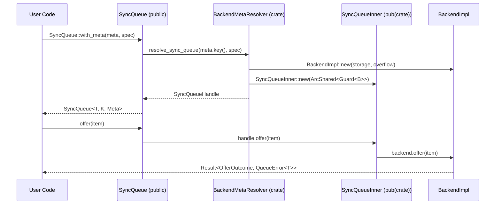
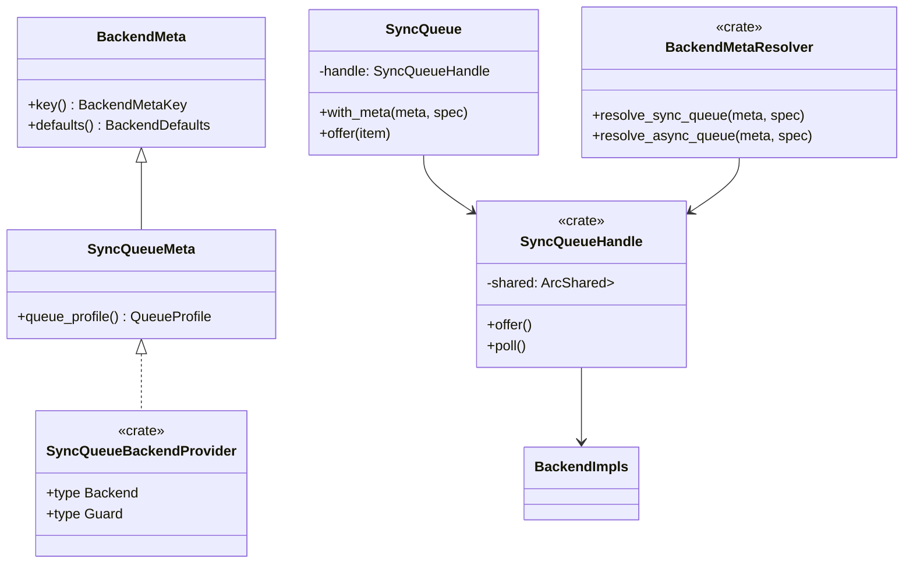
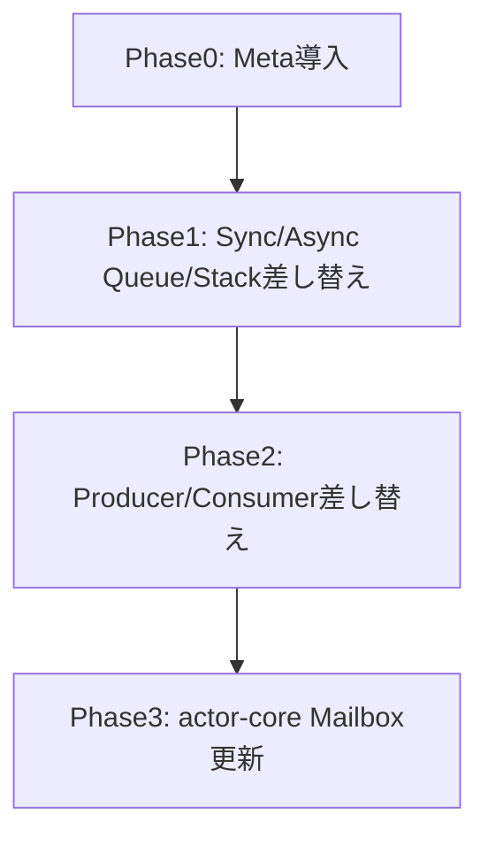

# 概要
`utils-core` が公開しているキュー／スタック API は Backend 実装をジェネリック型として露出しており、Mailbox 等の利用側が `VecRingBackend` など内部型へ直接依存している。本設計では公開 API を `BackendMeta` ベースに再編し、利用者はメタ情報のみで同期／非同期 Queue/Stack を生成する。`BackendMetaResolver` は crate 内部に閉じ込め、Backend 生成と Mutex 構成を一元化する。

**Users**: Runtime/アクター開発者、AI エージェント、外部利用者。`BackendMeta` を指定するだけでキュー／スタックを安全に構築できるため、内部実装への誤依存を防ぎ API 学習コストを下げる。

**Impact**: `modules/utils-core` 全体の公開シグネチャが Meta 化され、`actor-core` Mailbox や tests/examples の初期化コードが刷新される。Backend 実装ファイルは `pub(crate)` 化され、lint ルールを満たす `meta` 階層が新設される。

### 目標 (Goals)
- Backend 型・trait・実装をすべて `pub(crate)` 以下に隠蔽し、公開 API では `BackendMeta` のみを受け付ける。
- `Sync/Async Queue` と `Sync/Async Stack`、および全 Producer/Consumer を Meta ベースの署名へ差し替え、`BackendMetaResolver` で一貫して生成する。
- rustdoc／examples／tests を `BackendMeta` 使用例へ更新し、AI や IDE が Backend 名を補完しない状態を保証する。

### 非目標 (Non-Goals)
- 新規 Backend 実装の追加（VecRing/VecStack/BinaryHeap/Tokio/Heapless 既存実装のみ対象）。
- Mailbox 以外の `actor-core` 既存 API を書き換えること（必要最小限の差し替えのみ）。
- OverflowPolicy や WaitQueue の挙動変更。既存仕様を Meta 経由で選択可能にするだけとする。

## アーキテクチャ

### 既存アーキテクチャの把握
- `SyncQueue<T, K, B, M>` や `AsyncQueue<T, K, B, A>` が backend ジェネリック `B` を公開し、利用者は `ArcShared<Mutex<B>>` を直接注入する。
- `Sync/Async` Producer/Consumer も `B: SyncQueueBackend` / `B: AsyncQueueBackend` をシグネチャに含み、Backend へのアクセスが可能。
- Backend 実装（Ring/Stack/Priority など）は `pub` で再エクスポートされ、`actor-core` Mailbox を含む利用側が `::new_with_storage` を直接呼び出している。
- Lint (`type-per-file-lint`, `module-wiring-lint`) 上は 1 ファイル 1 型を維持しているが、Meta 概念が存在しないため backend を別階層へ押し込む仕組みがない。

### ハイレベルアーキテクチャ
```mermaid
graph TD
    UserCode -->|BackendMetaParam| SyncQueuePublic
    UserCode -->|BackendMetaParam| AsyncQueuePublic
    UserCode -->|BackendMetaParam| SyncStackPublic
    SyncQueuePublic --> BackendMetaResolver
    AsyncQueuePublic --> BackendMetaResolver
    SyncStackPublic --> BackendMetaResolver
    BackendMetaResolver -->|pub(crate)| InnerHandle
    InnerHandle --> BackendImpls
    BackendMetaResolver --> GuardSelector
    GuardSelector --> ArcSharedGuards
    ArcSharedGuards --> InnerHandle
    InnerHandle --> ProducersConsumers
    actor_core_mailbox --> SyncQueuePublic
```
- 公開 API (`Sync/Async Queue`, `Sync/Async Stack`, Producers/Consumers) は `BackendMetaParam` を保持する薄い façade となり、操作はすべて内部 `InnerHandle` へ委譲する。
- `BackendMetaResolver` は crate-private で `match meta.key()` を行い、`BackendMetaKey` を enum 化して網羅性検査を効かせつつ Backend 実装型と `SyncMutexFamily`/`AsyncMutexFamily` を確定して `ArcShared` を構築する。Resolver には trait object を持たせず、Meta ごとに monomorphized された専用関数（`resolve_vec_deque_mpsc` 等）を呼び出して型安全性を確保する。
- `Meta` から公開可能な情報（QueueKind, OverflowPolicy, CapacityProfile, GuardFamily）だけを取り出し、backend 生成式や `VecRingStorage` 等は `resolver` 内部に閉じ込める。GuardFamily は `QueueSpecGuard<G>` によって静的に表現し、RuntimeToolbox 依存の mutex family は `GuardFrom<TB>` で型化する。

### 技術スタック / 設計判断
- `BackendMeta` は `pub trait BackendMeta: sealed::Sealed + Copy + 'static` とし、`SyncQueueMeta`, `AsyncQueueMeta`, `SyncStackMeta`, `AsyncStackMeta` のサブ trait で用途を分離。ZST 実装を `backend_meta/<name>.rs` に配置し `pub use meta::{...};` で再輸出する。
- `BackendMetaResolver` は `pub(crate)` モジュール。`SyncQueueBackendProvider` (crate-private) traitを定義し、`type Backend<T>` と `type Guard<T>` の関連型のみを保持する。実際の生成処理は resolver 内の `fn resolve_vec_deque_mpsc<T, K, G>(meta, spec) -> SyncQueueHandle<_, _>` のような関数群へ切り出し、`BackendMetaKey`（`enum BackendMetaKey { VecDequeMpsc, VecDequeSpsc, PriorityBinaryHeap, ... }`）で静的に dispatch する。これにより Meta ↔ Backend の紐付けがコンパイル時に保証され、`match` での網羅性チェックも働く。
- `QueueSpec` / `StackSpec` 構造体を導入し、容量・OverflowPolicy・GuardFamily を `BackendMeta` が提示するデフォルトに対して上書きできる。Guard 上書きは `spec = QueueSpec::default().with_guard_family::<TB>()` のように RuntimeToolbox を指定可能にし、必要なら `storage_hint` 等も加える。Builder ではなく `SyncQueue::with_meta(meta, spec)` 形式で生成する。

#### 主要設計判断
- **Decision**: `SyncQueueBackendProvider` を crate-private marker traitとして定義し、関連型のみを提供させた上で resolver 関数群が monomorphized されるようにする。
  **Context**: 公開 `BackendMeta` で Backend 型を見せられない一方、実行時ディスパッチや `match` の default で型安全性を損ないたくない。
  **Alternatives**: a) すべて enum による実行時ディスパッチ、b) TypeId ベースの HashMap factory。
  **Selected Approach**: `SyncQueueBackendProvider` が関連型だけを保持し、`match meta.key()` で専用 resolver 関数（`resolve_vec_deque_mpsc` 等）を呼び出す。
  **Rationale**: 関連型を通じて静的 dispatch を維持しつつ、生成ロジックを resolver に集中できる。
  **Trade-offs**: resolver に meta-key ごとの関数を追加する必要があり、Meta 種類が増えるたびにコードが増加する。

- **Decision**: `QueueSpec`/`StackSpec` を `#[non_exhaustive]` struct として公開し、メタが提供するデフォルトをユーザが部分的に上書きできる。
  **Context**: 既存の `VecRingBackend::new_with_storage` では容量等を自由に設定できたが、Meta 化で柔軟性が低下する懸念。
  **Alternatives**: Meta ごとに固有の builder を提供、またはオプション enum を列挙。
  **Selected Approach**: 共通 spec struct + `Option` で override。
  **Rationale**: API 表面を単純化しつつ、既存利用者の要件を満たせる。
  **Trade-offs**: Spec 変更時に `SyncQueue` コンストラクタのバージョン管理が必要。

- **Decision**: Producer/Consumer を `Meta` ベースの型 alias へ差し替え、`SyncQueueHandle` から取得する only-path とする。
  **Context**: 既存 `SyncMpscProducer<T,B,M>` が backend を公開し、直接生成が可能だった。
  **Alternatives**: 旧 API を残し `#[deprecated]`。
  **Selected Approach**: `pub struct SyncMpscProducer<T, Meta = meta::VecDequeSyncQueueMeta>` で公開し、`SyncQueue::into_mpsc_pair` のみで生成。
  **Rationale**: Backend 名露出を完全に排除し、タイプセーフなハンドルを保証。
  **Trade-offs**: 既存コードは一度に大きく書き換える必要がある。

## システムフロー


## API ブループリント

- **型・トレイト一覧**
- `pub trait BackendMeta: sealed::Sealed + Copy + 'static` — 公開メタ基底。
- `pub trait SyncQueueMeta: BackendMeta` — 同期キュー専用メタ。`fn queue_profile(&self) -> QueueProfile` 等を公開。
- `pub(crate) trait SyncQueueBackendProvider: SyncQueueMeta` — crate-private。`type Backend<T>: SyncQueueBackend<T>` と `type Guard<T>: SyncMutexLike<Self::Backend<T>>` を関連型として保持する marker。
- `pub struct QueueProfile` — `type_key: TypeKeyId`, `capability: QueueCapabilitySet`, `default_overflow: OverflowPolicy` などの公開メタ情報。
- `pub struct QueueSpec<G = DefaultSyncGuard>` — ユーザが override 可能な `capacity`, `overflow`, `storage_hint` を `Option` で保持し、`G` で Guard 実装を示す。`QueueSpecGuard<G>` のような phantom 型で Guard family を静的に保持する。
- `pub struct SyncQueue<T, K, Meta = meta::VecDequeMpscMeta, G = DefaultSyncGuard>` — 公開 façade。`Meta: SyncQueueMeta` を露出し、Guard 型は `QueueSpec` から推論される。
- `pub struct AsyncQueue<T, K, Meta = meta::VecDequeAsyncMpscMeta, Guard = DefaultAsyncGuard>` — 非同期版。
- `pub struct SyncStack<T, Meta = meta::VecStackMeta, Guard = DefaultSyncGuard>` / `AsyncStack` — スタック API。
- `pub struct BackendMetaKey(pub(crate) &'static str)` — Resolver 内で使用する識別子。
- `pub(crate) struct SyncQueueHandle<T, K, Impl, Guard>` — 旧 `SyncQueue` 実装を移動した内部型。
- `pub struct SyncMpscProducer<T, Meta = meta::VecDequeMpscMeta>` — Meta 化された Producer。`pub fn offer(&self, item: T)`。
- `pub struct AsyncMpscProducer<T, Meta = meta::VecDequeAsyncMeta>` — 非同期版。
- `pub enum BackendMetaResolverError` — Meta と Spec の矛盾や Guard 未対応を表す内部エラー。

### シグネチャ スケッチ
```rust
pub trait BackendMeta {
  fn key(&self) -> BackendMetaKey;
  fn defaults(&self) -> BackendDefaults;
}

pub trait SyncQueueMeta: BackendMeta {
  fn queue_profile(&self) -> QueueProfile;
}

pub(crate) trait SyncQueueBackendProvider: SyncQueueMeta {
  type Backend<T>: SyncQueueBackend<T>;
  type Guard<T>: SyncMutexLike<Self::Backend<T>>;
}

pub struct QueueSpec<G = DefaultSyncGuard> {
  pub capacity: Option<NonZeroUsize>;
  pub overflow: Option<OverflowPolicy>;
  pub storage_hint: Option<StorageHint>;
  guard: QueueSpecGuard<G>;
}

pub struct QueueSpecGuard<G> {
  _pd: PhantomData<G>,
}

pub struct GuardFrom<TB: RuntimeToolbox> {
  _pd: PhantomData<TB>,
}

impl<TB: RuntimeToolbox> GuardFrom<TB> {
  pub type Mutex<T> = <TB::MutexFamily as SyncMutexFamily>::Mutex<T>;
}

impl QueueSpec<DefaultSyncGuard> {
  pub fn with_guard_family<TB: RuntimeToolbox>(self) -> QueueSpec<GuardFrom<TB>> {
    QueueSpec { guard: QueueSpecGuard { _pd: PhantomData }, ..self }
  }
}
impl<G> QueueSpec<G> {
  pub fn with_storage_hint(mut self, hint: StorageHint) -> Self {
    self.storage_hint = Some(hint);
    self
  }
}

// GuardFrom<TB> は `SyncMutexFamily` から生成される Guard 型を静的に表現する marker。


impl<T, K, Meta, G> SyncQueue<T, K, Meta, G>
where
  K: TypeKey,
  Meta: SyncQueueMeta,
{
  pub fn with_meta(meta: Meta, spec: QueueSpec<G>) -> Result<Self, QueueInitError>;
  pub fn offer(&self, item: T) -> Result<OfferOutcome, QueueError<T>>;
  pub fn producer_clone(&self) -> SyncMpscProducer<T, Meta> where K: MultiProducer + SingleConsumer;
}

pub struct VecDequeMpscMeta;
impl BackendMeta for VecDequeMpscMeta {
  fn key(&self) -> BackendMetaKey { BackendMetaKey::VecDequeMpsc }
  fn defaults(&self) -> BackendDefaults { BackendDefaults::mpsc_fifo() }
}
impl SyncQueueMeta for VecDequeMpscMeta {
  fn queue_profile(&self) -> QueueProfile { QueueProfile::mpsc_fifo(OverflowPolicy::DropOldest) }
}
impl SyncQueueBackendProvider for VecDequeMpscMeta {
  type Backend<T> = VecRingBackend<T>;
  type Guard<T> = SpinSyncMutex<VecRingBackend<T>>;
}

pub(crate) fn resolve_sync_queue<T, K, Meta, G>(
  meta: Meta,
  spec: &QueueSpec<G>,
) -> Result<SyncQueueHandle<T, K, MetaBackend<T>, MetaGuard<T>>, BackendMetaResolverError>
where
  Meta: SyncQueueBackendProvider,
{
  match meta.key() {
    BackendMetaKey::VecDequeMpsc => resolve_vec_deque_mpsc(meta, spec),
    BackendMetaKey::VecDequeSpsc => resolve_vec_deque_spsc(meta, spec),
    BackendMetaKey::PriorityBinaryHeap => resolve_priority_binary_heap(meta, spec),
  }
}
```

## クラス／モジュール図


## クイックスタート / 利用例
```rust
use fraktor_utils_core_rs::collections::queue::{
    meta::VecDequeMpscMeta,
    QueueSpec, OverflowPolicy, SyncQueue, type_keys::MpscKey,
};

fn mailbox_user_queue() {
    let meta = VecDequeMpscMeta;
    let spec = QueueSpec::bounded(NonZeroUsize::new(1024).unwrap())
        .with_overflow(OverflowPolicy::DropOldest);
    let queue: SyncQueue<SystemMessage, MpscKey, VecDequeMpscMeta> =
        SyncQueue::with_meta(meta, spec).expect("queue init");
    queue.offer(SystemMessage::new()).unwrap();
}
```

## 旧→新 API 対応表
| 旧 API / 型 | 新 API / 型 | 置換手順 | 備考 |
| --- | --- | --- | --- |
| Backend 実装の `::new_with_storage` 直接呼び出し | `QueueSpec::bounded(cap).with_overflow(policy)` + `SyncQueue::with_meta(meta, spec)` | Storage 初期化を Resolver へ委譲 | OverflowPolicy/容量は Spec で指定 |
| `SyncQueue<T, K, Backend, Guard>::new(shared_backend)` | `SyncQueue<T, K, Meta>::with_meta(meta, QueueSpec::default())` | `ArcShared` 構築ロジックを削除 | Guard は Meta 既定 or QueueSpec override |
| 直接生成した `SyncMpscProducer<T, Backend, Guard>` | `SyncMpscProducer<T, Meta>::offer()` | `queue.into_mpsc_pair()` で取得し Meta 型を注釈 | 直接 new は禁止 |
| Priority backend (`BinaryHeapPriorityBackend::new_*`) | `PriorityQueue<T, PriorityKey, PriorityMeta>::with_meta(meta, spec)` | Meta で優先度レイアウトを選択 | `peek_min` は Meta 経由で維持 |
| Stack backend (`VecStackBackend::new_with_storage`) | `SyncStack::with_meta(VecStackMeta, StackSpec::default())` | 既存 Stack 初期化コードを Meta へ置換 | OverflowPolicy は Spec override |

## 要件トレーサビリティ
| 要件ID | 要約 | 実装コンポーネント | インターフェイス | 参照フロー |
| --- | --- | --- | --- | --- |
| 1 | Backend 型の完全隠蔽 | `queue::meta`, `queue::backend_meta_resolver`, `stack::meta` | `SyncQueue::with_meta`, `StackSpec` | アーキテクチャ図, 旧→新表 |
| 2 | BackendMeta 公開と Backend 分離 | `BackendMeta`, `QueueProfile`, `StackProfile` | `meta::{VecDequeMpscMeta,...}` | API ブループリント |
| 3 | AI 誤用防止 | `pub use meta::*`, `doc` 更新 | rustdoc サンプル, Quickstart | クイックスタート |
| 4 | ドキュメント・例整備 | `examples/queue_backend_meta.rs`, `docs/guides/backend_meta_migration.md` | - | Quickstart, 旧→新 |
| 5 | テスト整合 | `queue/tests.rs` (Meta 経路), `actor-core` Mailbox tests | `SyncQueue::with_meta`, Resolver mock | テスト戦略 |
| 6 | Lint遵守 | `meta/` 階層, `pub use` 再編 | - | コンポーネント節 |

## コンポーネント & インターフェイス

### Meta レイヤ (`collections::queue::meta`, `collections::stack::meta`)
- **責務**: 公開 `BackendMeta` 実装を 1 ファイル 1 型で提供し、Queue/Stack の種別・容量・Overflow 既定値・Mutex 戦略など公開してよい情報のみ保持する。
- **入出力**: ユーザコードから `Meta` を受け取り、`QueueProfile` / `StackProfile` を返す。内部では `SyncQueueBackendProvider` / `SyncStackBackendProvider` を実装して resolver へ関連型情報のみを提供し、生成処理は resolver 側に任せる。Guard や storage hint の推奨値を `BackendDefaults` として渡す。
- **依存**: `type_keys`, `capabilities`, `OverflowPolicy`, Guard family 定義。`VecRingStorage` など backend 実装へは直接依存しない。
- **契約**:
```rust
pub trait SyncQueueMeta: BackendMeta {
  fn queue_profile(&self) -> QueueProfile;
}

pub(crate) trait SyncQueueBackendProvider: SyncQueueMeta {
  type Backend<T>: SyncQueueBackend<T>;
  type Guard<T>: SyncMutexLike<Self::Backend<T>>;
}
```

- **依存**: `SyncQueueBackendProvider`, `VecRingBackend`, `BinaryHeapPriorityBackend`, `VecStackBackend`, `SyncMutexFamily`。
- **エラー**: `BackendMetaResolverError::UnsupportedGuard`, `::CapacityOutOfRange`, `::IncompatibleKey`。

### 公開 Queue/Stack API (`collections::queue::sync_queue`, `async_queue`, `stack::sync_stack`, etc.)
- **責務**: `Meta` と Spec から Resolver を呼び出し、`SyncQueueHandle` へ委譲。`offer/poll` 等は既存実装を `inner` モジュールへ移動して再利用。
- **入出力**: `Meta`, `QueueSpec`, `QueueError`, `OfferOutcome`。`shared()` は `ArcShared<OpaqueHandle>` を返さず、`SyncQueueHandle` 経由の操作のみ許す。
- **依存**: `BackendMeta`, `QueueSpec`, `QueueCapability`, `SharedAccess`。

### Producer/Consumer (`sync_mpsc_producer`, `sync_spsc_consumer`, `async_mpsc_*`, etc.)
- **責務**: `SyncQueue`/`AsyncQueue` からしか生成できない Meta ベースのハンドルとし、Backend 型を完全に隠蔽。
- **入出力**: `Meta`、`QueueError`。`shared()` アクセサを `pub(crate)` に制限し、公開メソッドは `offer/poll/close` のみ。
- **依存**: `QueueHandle` 内部 API。

### Actor-core 統合 (`modules/actor-core/src/mailbox/*.rs`)
- **責務**: Mailbox キュー生成を `VecRingBackend` 直呼び出しから `SyncQueue::with_meta(VecDequeMpscMeta, spec)` へ差し替える。`QueueHandles` では `QueueSpec` 生成と `SyncQueue::into_mpsc_pair` のみ行う。
- **注意**: `RuntimeToolbox` から取得する `SyncMutexFamily` を `QueueSpec::with_guard_family::<TB>()` で指定し、必要に応じて `storage_hint` で初期容量を調整する。

## データモデル

### 論理データモデル
- **QueueProfile**: `{ type_key: QueueTypeKey (Fifo/Mpsc/Spsc/Priority), capability: QueueCapabilitySet, default_overflow: OverflowPolicy, default_capacity: NonZeroUsize, wait_strategy: WaitStrategy }`。
- **QueueSpec / StackSpec**: `capacity`, `overflow`, `storage_hint` を `Option` で保持し、型パラメータ `G` により Guard 実装を静的に決定する（`QueueSpec<DefaultSyncGuard>` → `QueueSpec<TB::MutexGuard>` への遷移を許容）。

### 物理データモデル
- **BackendMetaKey**: `enum BackendMetaKey { VecDequeMpsc, VecDequeSpsc, PriorityBinaryHeap, ... }`。`match` の網羅性チェックを利用し、Meta ↔ Backend の整合性をコンパイル時に保証。

## エラーハンドリング
- `SyncQueue::with_meta` は `Result<Self, QueueInitError>` を返し、Resolver エラーを `QueueInitError` にラップ。`QueueInitError` は `UnsupportedCombination`, `GuardUnavailable`, `CapacityInvalid` を含む。
- `Sync/Async` 操作メソッドは現行どおり `QueueError` / `StackError` を返す。Meta 化で失敗パターンが増えるのは初期化時のみ。
- Resolver 内部で `WaitQueue` 登録失敗や `SharedError` は `QueueInitError::GuardPoisoned` へ変換。`tracing` で `error!` を出し、再初期化可能にする。

## テスト戦略
- **ユニット**: `meta/tests.rs` で `QueueProfile` がメタ期待値を返すか検証。`backend_meta_resolver/tests.rs` で key-to-backend マッピングを assert。`SyncQueue::with_meta` で各 Meta + Spec パターンを生成し `offer/poll` を走らせる。
- **統合**: `actor-core` Mailbox テストを `VecDequeMpscMeta` で初期化し、System/User queue の動作を検証。`BackendMetaResolver` を差し替えるモック（`cfg(test)`）を導入し、Meta→Backend を自由に切替可能にする。
- **doc/example**: Quickstart サンプルを doctest 化し、`cargo test --doc` で backend 名が露出しないことを `rg` チェックと合わせて CI に組み込む。

## パフォーマンス & スケーラビリティ
- Resolver は `const fn` で key を返す ZST Meta と `match` するため実行時コストはゼロ。`SyncQueueBackendProvider` の関連型と meta-key 別関数で monomorphization を維持し、静的 dispatch を崩さない。
- `QueueSpec` override による容量拡張は既存 `VecRingStorage::try_grow` を再利用。Guard family を `with_guard_family::<TB>()` で切り替えても `SyncMutexFamily` の抽象を介して同じコードパスを辿るため regression はない。

## 移行戦略

- **Phase0**: `meta/`・`resolver/` モジュールを追加し、新 API を `backend_meta_preview` feature で有効化。旧 Backend API は `pub` のまま `#[deprecated]` を付与し、CI では `backend_meta_preview` を常時 ON にする。並走期間中は `rg VecRingBackend modules/utils-core/src/collections/public` が 0 件であること、`rg VecRingBackend modules/actor-core/src --and --not 'mailbox'` が 0 件であることを lint (dylint) で強制し、旧 API への新規追加を禁止する。
- **Phase1**: `actor-core` Mailbox の System/User queue を Meta API へ先行移行。RuntimeToolbox 起因の Guard 指定を `QueueSpec::with_guard_family` で置換し、`scripts/ci-check.sh all` を通す。CI には `rg VecRingBackend modules/actor-core/src/mailbox` のチェックを追加。
- **Phase2**: `Sync/Async Queue/Stack` の公開シグネチャを Meta 版へ正式切替。旧シグネチャは `pub(crate)` に落とし、`Producer/Consumer` も Meta 型へ差し替える。
- **Phase3**: 旧 Backend API を削除し、`rg VecRingBackend` が `utils-core`/`actor-core` 公開コードから消えたことを確認。同時に Dispatcher/EventStream 等の周辺モジュールも Meta API で再テストし、feature flag を削除して `backend_meta_preview` を常時有効にする。
