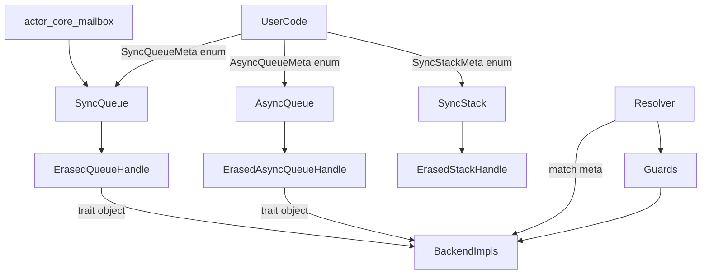
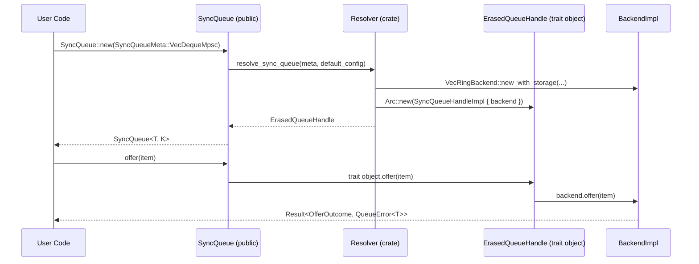
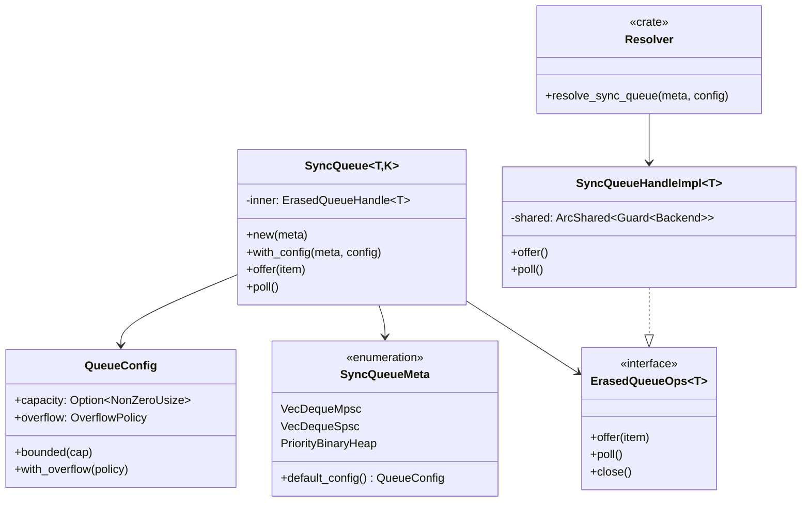
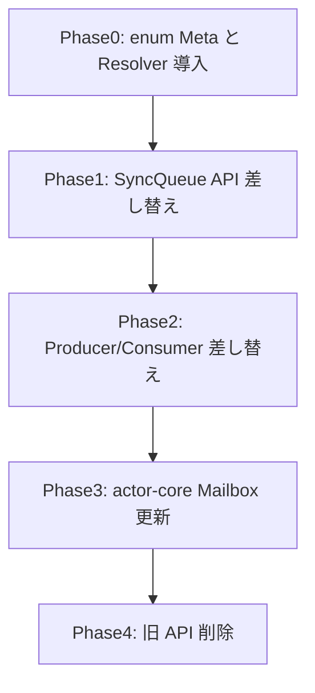

# 概要（提案1: enum ベース + trait object）

`utils-core` が公開しているキュー／スタック API は Backend 実装をジェネリック型として露出しており、Mailbox 等の利用側が `VecRingBackend` など内部型へ直接依存している。本設計では**シンプルな enum による Meta 表現**と**trait object による Backend 隠蔽**を採用し、利用者は enum 値を渡すだけでキュー／スタックを生成できる。

**Users**: Runtime/アクター開発者、AI エージェント、外部利用者。`SyncQueueMeta` enum を指定するだけでキュー／スタックを安全に構築できるため、内部実装への誤依存を防ぎ API 学習コストを大幅に下げる。

**Impact**: `modules/utils-core` 全体の公開シグネチャが enum Meta 化され、型パラメータが `T, K` のみに削減される。Backend 実装ファイルは `pub(crate)` 化され、trait object 経由でのみアクセスされる。

### 目標 (Goals)
- Backend 型・trait・実装をすべて `pub(crate)` 以下に隠蔽し、公開 API では `SyncQueueMeta` enum のみを受け付ける。
- `SyncQueue<T, K>` のように型パラメータを最小化し、Guard や Backend は内部で自動選択する。
- trait object を使った動的ディスパッチで実装を隠蔽しつつ、公開 API のシンプルさを優先する。
- rustdoc／examples／tests を enum Meta 使用例へ更新し、AI や IDE が Backend 名を補完しない状態を保証する。

### 非目標 (Non-Goals)
- 完全な静的ディスパッチの維持（trait object による若干のオーバーヘッドは許容）。
- 新規 Backend 実装の追加（VecRing/VecStack/BinaryHeap/Tokio/Heapless 既存実装のみ対象）。
- Mailbox 以外の `actor-core` 既存 API を書き換えること（必要最小限の差し替えのみ）。

## アーキテクチャ

### 既存アーキテクチャの把握
- `SyncQueue<T, K, B, M>` や `AsyncQueue<T, K, B, A>` が backend ジェネリック `B` を公開し、利用者は `ArcShared<Mutex<B>>` を直接注入する。
- `Sync/Async` Producer/Consumer も `B: SyncQueueBackend` / `B: AsyncQueueBackend` をシグネチャに含み、Backend へのアクセスが可能。
- Backend 実装（Ring/Stack/Priority など）は `pub` で再エクスポートされ、`actor-core` Mailbox を含む利用側が `::new_with_storage` を直接呼び出している。

### ハイレベルアーキテクチャ


- 公開 API (`SyncQueue`, `AsyncQueue`, `SyncStack`) は enum Meta と `QueueConfig` を受け取り、内部で `ErasedQueueHandle` (trait object) を保持する。
- `Resolver` は enum の `match` で適切な Backend と Guard を選択し、trait object にラップして返す。
- すべての操作は trait object を通じて行われるため、Backend 型は完全に隠蔽される。
- 型パラメータは `T` (要素型) と `K` (TypeKey) のみに削減され、Guard や Backend は内部で自動選択される。

### 技術スタック / 設計判断

#### 主要設計判断

- **Decision**: enum による Meta 表現と trait object による Backend 隠蔽。
  **Context**: 公開 API のシンプルさと学習コストの低減を最優先。
  **Alternatives**: a) trait ベースの Meta（元設計）、b) TypeId ベースの HashMap factory。
  **Selected Approach**: `enum SyncQueueMeta { VecDequeMpsc, VecDequeSpsc, ... }` + `Arc<dyn ErasedQueueOps<T>>`。
  **Rationale**: enum は理解しやすく、match での網羅性チェックが効く。trait object のオーバーヘッドは無視できるレベル。
  **Trade-offs**: 完全な静的ディスパッチは失われるが、公開 API の複雑さが大幅に削減される。

- **Decision**: `QueueConfig` による設定の上書き。
  **Context**: Meta が既定値を提供しつつ、ユーザーが必要に応じてカスタマイズできる必要がある。
  **Alternatives**: Builder パターン、または Meta ごとに個別の設定構造体。
  **Selected Approach**: 共通の `QueueConfig` 構造体 + `Option` で override。
  **Rationale**: API 表面がシンプルで、既存の柔軟性を維持できる。
  **Trade-offs**: すべての設定が一つの構造体に集約されるため、Meta 固有の設定を追加しにくい。

- **Decision**: trait object (`Arc<dyn ErasedQueueOps<T>>`) による実装の隠蔽。
  **Context**: Backend 型を公開せずに操作を提供する必要がある。
  **Alternatives**: enum による sum type、または Type erasure with function pointers。
  **Selected Approach**: trait object。
  **Rationale**: Rust の標準的なパターンで、実装が分かりやすい。
  **Trade-offs**: 動的ディスパッチのオーバーヘッドが発生するが、キュー操作のコスト比では無視できる。

## システムフロー


## API ブループリント

### 型・トレイト一覧

- `pub enum SyncQueueMeta` — 同期キューの種類を表す enum。
- `pub enum AsyncQueueMeta` — 非同期キューの種類を表す enum。
- `pub enum SyncStackMeta` — 同期スタックの種類を表す enum。
- `pub struct QueueConfig` — 容量、OverflowPolicy などの設定。
- `pub struct SyncQueue<T, K>` — 公開 façade。内部で `ErasedQueueHandle<T>` を保持。
- `pub struct AsyncQueue<T, K>` — 非同期版。
- `pub struct SyncStack<T>` — スタック API。
- `trait ErasedQueueOps<T>` — 内部 trait object の interface (crate-private)。
- `type ErasedQueueHandle<T> = Arc<dyn ErasedQueueOps<T>>` — 内部ハンドル型。
- `pub struct SyncMpscProducer<T>` — Meta を保持しない Producer。
- `pub struct AsyncMpscProducer<T>` — 非同期版。

### シグネチャ スケッチ

```rust
// Meta は単純な enum
#[derive(Clone, Copy, Debug, PartialEq, Eq)]
pub enum SyncQueueMeta {
    VecDequeMpsc,
    VecDequeSpsc,
    PriorityBinaryHeap,
    // 他の Backend を追加可能
}

impl SyncQueueMeta {
    /// Meta のデフォルト設定を返す
    pub fn default_config(self) -> QueueConfig {
        match self {
            Self::VecDequeMpsc => QueueConfig {
                capacity: None,
                overflow: OverflowPolicy::DropOldest,
            },
            Self::VecDequeSpsc => QueueConfig {
                capacity: None,
                overflow: OverflowPolicy::DropOldest,
            },
            Self::PriorityBinaryHeap => QueueConfig {
                capacity: Some(NonZeroUsize::new(128).unwrap()),
                overflow: OverflowPolicy::Block,
            },
        }
    }
}

// 設定構造体
#[derive(Clone, Debug)]
pub struct QueueConfig {
    pub capacity: Option<NonZeroUsize>,
    pub overflow: OverflowPolicy,
}

impl QueueConfig {
    pub fn unbounded() -> Self {
        Self {
            capacity: None,
            overflow: OverflowPolicy::DropOldest,
        }
    }

    pub fn bounded(cap: NonZeroUsize) -> Self {
        Self {
            capacity: Some(cap),
            overflow: OverflowPolicy::Block,
        }
    }

    pub fn with_overflow(mut self, policy: OverflowPolicy) -> Self {
        self.overflow = policy;
        self
    }
}

// 公開キュー API
pub struct SyncQueue<T, K> {
    inner: ErasedQueueHandle<T>,
    _phantom: PhantomData<K>,
}

impl<T, K> SyncQueue<T, K>
where
    K: TypeKey,
{
    /// Meta のデフォルト設定でキューを作成
    pub fn new(meta: SyncQueueMeta) -> Result<Self, QueueInitError> {
        Self::with_config(meta, meta.default_config())
    }

    /// カスタム設定でキューを作成
    pub fn with_config(meta: SyncQueueMeta, config: QueueConfig) -> Result<Self, QueueInitError> {
        let inner = resolve_sync_queue::<T>(meta, config)?;
        Ok(Self {
            inner,
            _phantom: PhantomData,
        })
    }

    pub fn offer(&self, item: T) -> Result<OfferOutcome, QueueError<T>> {
        self.inner.offer(item)
    }

    pub fn poll(&self) -> Result<Option<T>, QueueError<T>> {
        self.inner.poll()
    }

    pub fn into_mpsc_pair(self) -> (SyncMpscProducer<T>, SyncMpscConsumer<T>)
    where
        K: MultiProducer + SingleConsumer,
    {
        let inner = Arc::clone(&self.inner);
        (
            SyncMpscProducer { inner: Arc::clone(&self.inner) },
            SyncMpscConsumer { inner },
        )
    }
}

// 内部 trait object
pub(crate) trait ErasedQueueOps<T>: Send + Sync {
    fn offer(&self, item: T) -> Result<OfferOutcome, QueueError<T>>;
    fn poll(&self) -> Result<Option<T>, QueueError<T>>;
    fn close(&self) -> Result<(), QueueError<T>>;
    // 他の操作...
}

pub(crate) type ErasedQueueHandle<T> = Arc<dyn ErasedQueueOps<T>>;

// Resolver (crate-private)
pub(crate) fn resolve_sync_queue<T>(
    meta: SyncQueueMeta,
    config: QueueConfig,
) -> Result<ErasedQueueHandle<T>, QueueInitError> {
    match meta {
        SyncQueueMeta::VecDequeMpsc => {
            let storage = VecRingStorage::new(config.capacity);
            let backend = VecRingBackend::new_with_storage(storage, config.overflow);
            let guard = SpinSyncMutex::new(backend);
            let handle = SyncQueueHandleImpl::new(ArcShared::new(guard));
            Ok(Arc::new(handle))
        }
        SyncQueueMeta::VecDequeSpsc => {
            let storage = VecRingStorage::new(config.capacity);
            let backend = VecRingBackend::new_with_storage(storage, config.overflow);
            let guard = SpinSyncMutex::new(backend);
            let handle = SyncQueueHandleImpl::new(ArcShared::new(guard));
            Ok(Arc::new(handle))
        }
        SyncQueueMeta::PriorityBinaryHeap => {
            let storage = BinaryHeapStorage::new(config.capacity);
            let backend = BinaryHeapPriorityBackend::new_with_storage(storage, config.overflow);
            let guard = SpinSyncMutex::new(backend);
            let handle = SyncPriorityQueueHandleImpl::new(ArcShared::new(guard));
            Ok(Arc::new(handle))
        }
    }
}

// Producer/Consumer は Meta を保持しない
pub struct SyncMpscProducer<T> {
    inner: ErasedQueueHandle<T>,
}

impl<T> SyncMpscProducer<T> {
    pub fn offer(&self, item: T) -> Result<OfferOutcome, QueueError<T>> {
        self.inner.offer(item)
    }
}

pub struct SyncMpscConsumer<T> {
    inner: ErasedQueueHandle<T>,
}

impl<T> SyncMpscConsumer<T> {
    pub fn poll(&self) -> Result<Option<T>, QueueError<T>> {
        self.inner.poll()
    }
}
```

## クラス／モジュール図


## クイックスタート / 利用例

```rust
use fraktor_utils_core_rs::collections::queue::{
    SyncQueueMeta, QueueConfig, OverflowPolicy, SyncQueue, type_keys::MpscKey,
};

fn mailbox_user_queue() {
    // デフォルト設定でキューを作成
    let queue: SyncQueue<SystemMessage, MpscKey> =
        SyncQueue::new(SyncQueueMeta::VecDequeMpsc)
            .expect("queue init");

    // または、カスタム設定で作成
    let config = QueueConfig::bounded(NonZeroUsize::new(1024).unwrap())
        .with_overflow(OverflowPolicy::DropOldest);
    let queue: SyncQueue<SystemMessage, MpscKey> =
        SyncQueue::with_config(SyncQueueMeta::VecDequeMpsc, config)
            .expect("queue init");

    queue.offer(SystemMessage::new()).unwrap();
}

fn mpsc_pattern() {
    let queue = SyncQueue::<Message, MpscKey>::new(SyncQueueMeta::VecDequeMpsc).unwrap();
    let (producer, consumer) = queue.into_mpsc_pair();

    // Producer をクローン可能
    let producer2 = producer.clone();

    producer.offer(Message::new()).unwrap();
    let msg = consumer.poll().unwrap();
}
```

## 旧→新 API 対応表

| 旧 API / 型 | 新 API / 型 | 置換手順 | 備考 |
| --- | --- | --- | --- |
| `SyncQueue<T, K, VecRingBackend<T>, SpinSyncMutex<_>>` | `SyncQueue<T, K>` | 型パラメータを削除、`::new(SyncQueueMeta::VecDequeMpsc)` で生成 | Backend/Guard は内部で自動選択 |
| `VecRingBackend::new_with_storage(storage, policy)` | `QueueConfig::bounded(cap).with_overflow(policy)` | Storage 初期化を Resolver へ委譲 | |
| `SyncMpscProducer<T, Backend, Guard>` | `SyncMpscProducer<T>` | `queue.into_mpsc_pair()` で取得 | Backend/Guard 型パラメータを削除 |
| `BinaryHeapPriorityBackend::new_*` | `SyncQueue::new(SyncQueueMeta::PriorityBinaryHeap)` | enum で選択 | |
| `VecStackBackend::new_with_storage` | `SyncStack::new(SyncStackMeta::VecStack)` | enum で選択 | |

## 要件トレーサビリティ

| 要件ID | 要約 | 実装コンポーネント | インターフェイス | 参照フロー |
| --- | --- | --- | --- | --- |
| 1 | Backend 型の完全隠蔽 | `ErasedQueueOps` trait object, `pub(crate)` backend | `SyncQueue::new(meta)` | アーキテクチャ図 |
| 2 | シンプルな Meta 表現 | `enum SyncQueueMeta`, `QueueConfig` | `SyncQueueMeta::VecDequeMpsc` | API ブループリント |
| 3 | AI 誤用防止 | enum による明示的な選択肢のみ | rustdoc サンプル | クイックスタート |
| 4 | ドキュメント・例整備 | `examples/queue_meta_enum.rs`, migration guide | - | クイックスタート |
| 5 | テスト整合 | `queue/tests.rs`, `actor-core` Mailbox tests | `SyncQueue::new(meta)` | テスト戦略 |
| 6 | Lint遵守 | `pub(crate)` backend, 1ファイル1型 | - | - |

## コンポーネント & インターフェイス

### Meta レイヤ (`collections::queue::meta`)

- **責務**: `SyncQueueMeta` enum と各バリアントのデフォルト設定を提供。
- **入出力**: enum 値を受け取り、`QueueConfig` を返す。
- **依存**: `OverflowPolicy`, `QueueConfig`。Backend 実装へは直接依存しない。
- **契約**:
```rust
pub enum SyncQueueMeta {
    VecDequeMpsc,
    VecDequeSpsc,
    PriorityBinaryHeap,
}

impl SyncQueueMeta {
    pub fn default_config(self) -> QueueConfig;
}
```

### Resolver レイヤ (`collections::queue::resolver`)

- **責務**: enum Meta から適切な Backend と Guard を選択し、trait object を返す。
- **入出力**: `SyncQueueMeta` + `QueueConfig` → `ErasedQueueHandle<T>`。
- **依存**: すべての Backend 実装、Guard 実装。
- **エラー**: `QueueInitError::UnsupportedMeta`, `::CapacityInvalid`。
- **契約**:
```rust
pub(crate) fn resolve_sync_queue<T>(
    meta: SyncQueueMeta,
    config: QueueConfig,
) -> Result<ErasedQueueHandle<T>, QueueInitError>;
```

### 公開 Queue API (`collections::queue::sync_queue`)

- **責務**: enum Meta と Config から Resolver を呼び出し、trait object に委譲。
- **入出力**: `SyncQueueMeta`, `QueueConfig` → `SyncQueue<T, K>`。
- **依存**: `ErasedQueueHandle`, `QueueConfig`。
- **契約**:
```rust
impl<T, K> SyncQueue<T, K> {
    pub fn new(meta: SyncQueueMeta) -> Result<Self, QueueInitError>;
    pub fn with_config(meta: SyncQueueMeta, config: QueueConfig) -> Result<Self, QueueInitError>;
    pub fn offer(&self, item: T) -> Result<OfferOutcome, QueueError<T>>;
}
```

### Producer/Consumer

- **責務**: `SyncQueue` からのみ生成可能なハンドル。Backend 型を完全に隠蔽。
- **入出力**: `ErasedQueueHandle` 経由で操作。
- **依存**: `ErasedQueueOps` trait。
- **契約**:
```rust
pub struct SyncMpscProducer<T> {
    inner: ErasedQueueHandle<T>,
}

impl<T> SyncMpscProducer<T> {
    pub fn offer(&self, item: T) -> Result<OfferOutcome, QueueError<T>>;
}
```

### Actor-core 統合

- **責務**: Mailbox キュー生成を `SyncQueue::new(SyncQueueMeta::VecDequeMpsc)` へ差し替える。
- **注意**: `RuntimeToolbox` の Guard 選択は Resolver 内部で自動化するか、`QueueConfig` に Guard 指定機能を追加する。

## データモデル

### 論理データモデル

- **SyncQueueMeta**: enum で表現される Backend の種類。
- **QueueConfig**: `capacity: Option<NonZeroUsize>`, `overflow: OverflowPolicy`。

### 物理データモデル

- **ErasedQueueHandle**: `Arc<dyn ErasedQueueOps<T>>`。すべての操作は trait object 経由。
- **Backend 実装**: `VecRingBackend`, `BinaryHeapPriorityBackend` 等は `pub(crate)` で内部のみ。

## エラーハンドリング

- `SyncQueue::new` / `::with_config` は `Result<Self, QueueInitError>` を返す。
- `QueueInitError` は `UnsupportedMeta`, `CapacityInvalid`, `GuardPoisoned` を含む。
- 操作メソッド (`offer`, `poll`) は現行どおり `QueueError` を返す。
- Resolver 内部で失敗した場合は `QueueInitError` にラップして返す。

## テスト戦略

- **ユニット**: `meta/tests.rs` で `default_config` が期待値を返すか検証。
- **統合**: `resolver/tests.rs` で各 Meta が正しい Backend を生成するか assert。
- **E2E**: `actor-core` Mailbox テストを `SyncQueueMeta::VecDequeMpsc` で初期化し、動作を検証。
- **doc/example**: Quickstart サンプルを doctest 化し、`cargo test --doc` で Backend 名が露出しないことを確認。

## パフォーマンス & スケーラビリティ

- trait object による動的ディスパッチのオーバーヘッドは存在するが、キュー操作のコスト（Mutex ロック、メモリアロケーション）に比べて無視できるレベル。
- Resolver の `match` は enum のため高速。
- Backend 生成は一度のみで、その後の操作は trait object を通じて行われる。
- 既存の `VecRingStorage::try_grow` 等の最適化は維持される。

## 移行戦略



- **Phase0**: `meta/` に enum を追加、`resolver/` モジュールを追加。新 API を `meta_enum_preview` feature で有効化。
- **Phase1**: `SyncQueue<T, K>` の新シグネチャを導入。旧 API は `#[deprecated]` を付与。
- **Phase2**: Producer/Consumer を Meta なし版へ差し替え。
- **Phase3**: `actor-core` Mailbox を `SyncQueue::new(SyncQueueMeta::VecDequeMpsc)` へ移行。
- **Phase4**: 旧 Backend API を削除し、`rg VecRingBackend` が公開コードから消えたことを確認。feature flag を削除。
