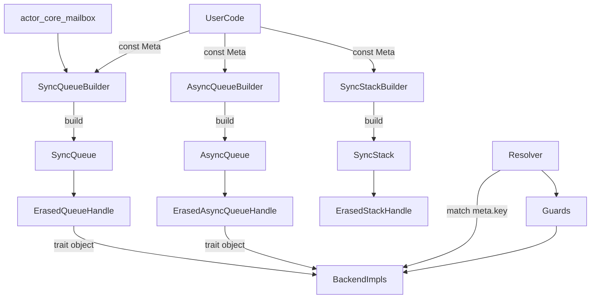
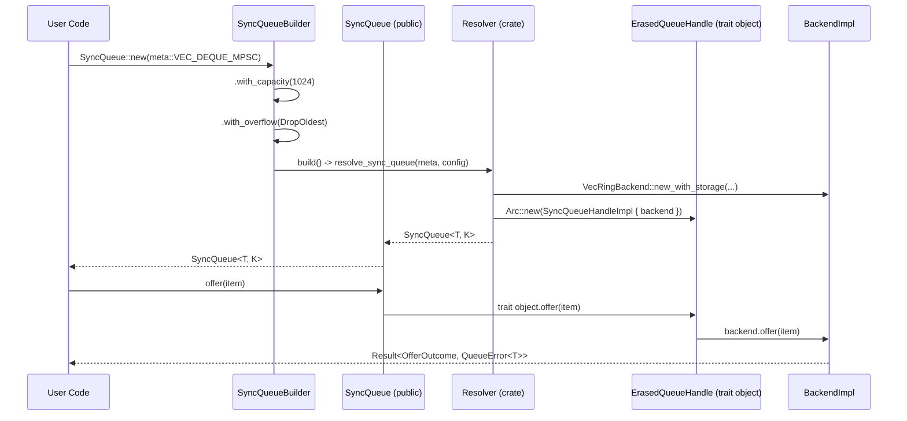
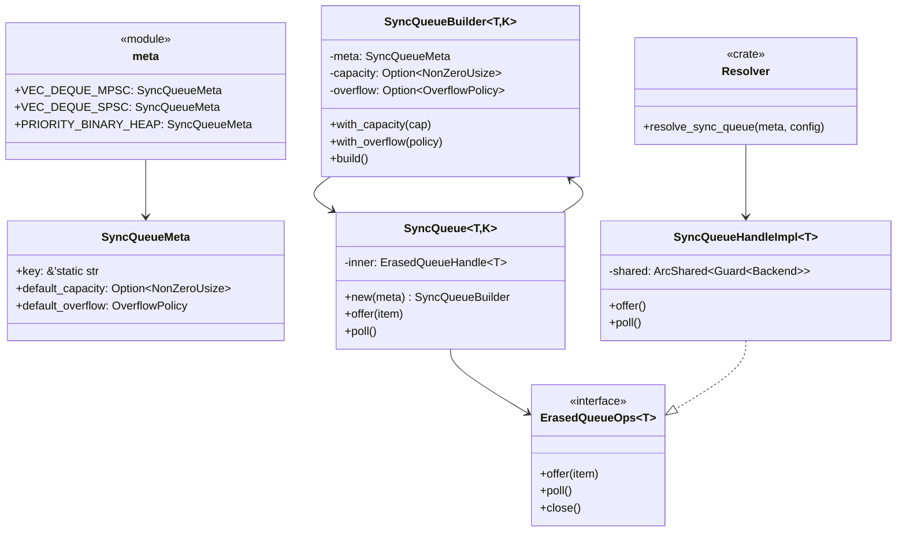
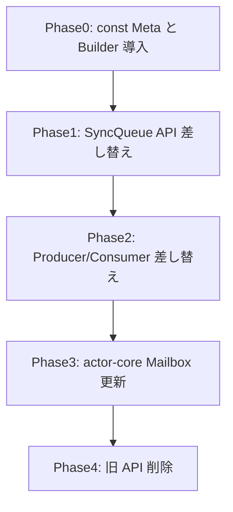

# 概要（提案2: const Meta + 最小構造）

`utils-core` が公開しているキュー／スタック API は Backend 実装をジェネリック型として露出しており、Mailbox 等の利用側が `VecRingBackend` など内部型へ直接依存している。本設計では**const による Meta 定義**と**Builder パターンによる設定**を採用し、最もシンプルで直感的な API を提供する。

**Users**: Runtime/アクター開発者、AI エージェント、外部利用者。`meta::VEC_DEQUE_MPSC` のような定数を渡すだけでキュー／スタックを安全に構築でき、学習コストが最小化される。

**Impact**: `modules/utils-core` 全体の公開シグネチャが const Meta 化され、型パラメータが `T, K` のみに削減される。Backend 実装ファイルは `pub(crate)` 化され、Meta 定数と Builder のみが公開される。

### 目標 (Goals)
- Backend 型・trait・実装をすべて `pub(crate)` 以下に隠蔽し、公開 API では const Meta のみを受け付ける。
- `SyncQueue<T, K>` のように型パラメータを最小化し、Guard や Backend は内部で自動選択する。
- Builder パターンで設定をチェーン可能にし、直感的な API を提供する。
- rustdoc／examples／tests を const Meta 使用例へ更新し、AI や IDE が Backend 名を補完しない状態を保証する。

### 非目標 (Non-Goals)
- 完全な静的ディスパッチの維持（trait object による若干のオーバーヘッドは許容）。
- 新規 Backend 実装の追加（VecRing/VecStack/BinaryHeap/Tokio/Heapless 既存実装のみ対象）。
- Mailbox 以外の `actor-core` 既存 API を書き換えること（必要最小限の差し替えのみ）。

## アーキテクチャ

### 既存アーキテクチャの把握
- `SyncQueue<T, K, B, M>` や `AsyncQueue<T, K, B, A>` が backend ジェネリック `B` を公開し、利用者は `ArcShared<Mutex<B>>` を直接注入する。
- `Sync/Async` Producer/Consumer も `B: SyncQueueBackend` / `B: AsyncQueueBackend` をシグネチャに含み、Backend へのアクセスが可能。
- Backend 実装（Ring/Stack/Priority など）は `pub` で再エクスポートされ、`actor-core` Mailbox を含む利用側が `::new_with_storage` を直接呼び出している。

### ハイレベルアーキテクチャ


- 公開 API は const Meta を受け取る Builder を返し、Builder で設定をチェーンして `build()` で `SyncQueue` を生成。
- 内部で `ErasedQueueHandle` (trait object) を保持し、すべての操作を trait object 経由で行う。
- `Resolver` は Meta の `key` フィールドで適切な Backend と Guard を選択し、trait object にラップして返す。
- 型パラメータは `T` (要素型) と `K` (TypeKey) のみに削減され、Guard や Backend は内部で自動選択される。

### 技術スタック / 設計判断

#### 主要設計判断

- **Decision**: const による Meta 定義と Builder パターン。
  **Context**: API のシンプルさと直感性を最優先。学習コストを最小化。
  **Alternatives**: a) enum Meta、b) trait ベースの Meta（元設計）。
  **Selected Approach**: `pub const VEC_DEQUE_MPSC: SyncQueueMeta = SyncQueueMeta { ... }` + Builder。
  **Rationale**: 定数は最も分かりやすく、Builder は Rust コミュニティで標準的なパターン。
  **Trade-offs**: Meta に対するパターンマッチングができない（`key` フィールドで代替）。

- **Decision**: trait object (`Arc<dyn ErasedQueueOps<T>>`) による実装の隠蔽。
  **Context**: Backend 型を公開せずに操作を提供する必要がある。
  **Alternatives**: enum による sum type、または Type erasure with function pointers。
  **Selected Approach**: trait object。
  **Rationale**: Rust の標準的なパターンで、実装が分かりやすい。
  **Trade-offs**: 動的ディスパッチのオーバーヘッドが発生するが、キュー操作のコスト比では無視できる。

- **Decision**: Builder パターンによる設定のチェーン。
  **Context**: Meta のデフォルト設定を上書きしつつ、API を直感的に保つ。
  **Alternatives**: 引数での設定、または `QueueConfig` 構造体。
  **Selected Approach**: `SyncQueue::new(meta).with_capacity(1024).with_overflow(...).build()`。
  **Rationale**: Rust で一般的なパターンで、自己文書化された API。
  **Trade-offs**: Builder の状態管理が必要だが、型状態パターンで解決可能。

## システムフロー


## API ブループリント

### 型・トレイト一覧

- `pub struct SyncQueueMeta` — 同期キューの Meta 情報（const で定義）。
- `pub struct AsyncQueueMeta` — 非同期キューの Meta 情報。
- `pub struct SyncStackMeta` — 同期スタックの Meta 情報。
- `pub struct SyncQueueBuilder<T, K>` — Builder パターンの実装。
- `pub struct SyncQueue<T, K>` — 公開 façade。内部で `ErasedQueueHandle<T>` を保持。
- `pub struct AsyncQueue<T, K>` — 非同期版。
- `pub struct SyncStack<T>` — スタック API。
- `trait ErasedQueueOps<T>` — 内部 trait object の interface (crate-private)。
- `type ErasedQueueHandle<T> = Arc<dyn ErasedQueueOps<T>>` — 内部ハンドル型。
- `pub struct SyncMpscProducer<T>` — Meta を保持しない Producer。
- `pub struct AsyncMpscProducer<T>` — 非同期版。

### シグネチャ スケッチ

```rust
// Meta は単純な構造体（const で定義）
#[derive(Clone, Copy, Debug)]
pub struct SyncQueueMeta {
    key: &'static str,
    default_capacity: Option<NonZeroUsize>,
    default_overflow: OverflowPolicy,
}

// const で定義された Meta
pub mod meta {
    use super::*;

    pub const VEC_DEQUE_MPSC: SyncQueueMeta = SyncQueueMeta {
        key: "vec_deque_mpsc",
        default_capacity: None,
        default_overflow: OverflowPolicy::DropOldest,
    };

    pub const VEC_DEQUE_SPSC: SyncQueueMeta = SyncQueueMeta {
        key: "vec_deque_spsc",
        default_capacity: None,
        default_overflow: OverflowPolicy::DropOldest,
    };

    pub const PRIORITY_BINARY_HEAP: SyncQueueMeta = SyncQueueMeta {
        key: "priority_binary_heap",
        default_capacity: Some(unsafe { NonZeroUsize::new_unchecked(128) }),
        default_overflow: OverflowPolicy::Block,
    };
}

// Builder パターン
pub struct SyncQueueBuilder<T, K> {
    meta: SyncQueueMeta,
    capacity: Option<NonZeroUsize>,
    overflow: Option<OverflowPolicy>,
    _phantom: PhantomData<(T, K)>,
}

impl<T, K> SyncQueueBuilder<T, K>
where
    K: TypeKey,
{
    pub fn with_capacity(mut self, cap: NonZeroUsize) -> Self {
        self.capacity = Some(cap);
        self
    }

    pub fn with_overflow(mut self, policy: OverflowPolicy) -> Self {
        self.overflow = Some(policy);
        self
    }

    pub fn build(self) -> Result<SyncQueue<T, K>, QueueInitError> {
        let capacity = self.capacity.or(self.meta.default_capacity);
        let overflow = self.overflow.unwrap_or(self.meta.default_overflow);

        let config = QueueConfig { capacity, overflow };
        let inner = resolve_sync_queue::<T>(self.meta, config)?;

        Ok(SyncQueue {
            inner,
            _phantom: PhantomData,
        })
    }
}

// 公開キュー API
pub struct SyncQueue<T, K> {
    inner: ErasedQueueHandle<T>,
    _phantom: PhantomData<K>,
}

impl<T, K> SyncQueue<T, K>
where
    K: TypeKey,
{
    /// Builder を返す（デフォルト設定）
    pub fn new(meta: SyncQueueMeta) -> SyncQueueBuilder<T, K> {
        SyncQueueBuilder {
            meta,
            capacity: None,
            overflow: None,
            _phantom: PhantomData,
        }
    }

    pub fn offer(&self, item: T) -> Result<OfferOutcome, QueueError<T>> {
        self.inner.offer(item)
    }

    pub fn poll(&self) -> Result<Option<T>, QueueError<T>> {
        self.inner.poll()
    }

    pub fn into_mpsc_pair(self) -> (SyncMpscProducer<T>, SyncMpscConsumer<T>)
    where
        K: MultiProducer + SingleConsumer,
    {
        let inner = Arc::clone(&self.inner);
        (
            SyncMpscProducer { inner: Arc::clone(&self.inner) },
            SyncMpscConsumer { inner },
        )
    }
}

// 内部 trait object（提案1と同じ）
pub(crate) trait ErasedQueueOps<T>: Send + Sync {
    fn offer(&self, item: T) -> Result<OfferOutcome, QueueError<T>>;
    fn poll(&self) -> Result<Option<T>, QueueError<T>>;
    fn close(&self) -> Result<(), QueueError<T>>;
}

pub(crate) type ErasedQueueHandle<T> = Arc<dyn ErasedQueueOps<T>>;

// 内部設定構造体
struct QueueConfig {
    capacity: Option<NonZeroUsize>,
    overflow: OverflowPolicy,
}

// Resolver (crate-private)
pub(crate) fn resolve_sync_queue<T>(
    meta: SyncQueueMeta,
    config: QueueConfig,
) -> Result<ErasedQueueHandle<T>, QueueInitError> {
    match meta.key {
        "vec_deque_mpsc" => {
            let storage = VecRingStorage::new(config.capacity);
            let backend = VecRingBackend::new_with_storage(storage, config.overflow);
            let guard = SpinSyncMutex::new(backend);
            let handle = SyncQueueHandleImpl::new(ArcShared::new(guard));
            Ok(Arc::new(handle))
        }
        "vec_deque_spsc" => {
            let storage = VecRingStorage::new(config.capacity);
            let backend = VecRingBackend::new_with_storage(storage, config.overflow);
            let guard = SpinSyncMutex::new(backend);
            let handle = SyncQueueHandleImpl::new(ArcShared::new(guard));
            Ok(Arc::new(handle))
        }
        "priority_binary_heap" => {
            let storage = BinaryHeapStorage::new(config.capacity);
            let backend = BinaryHeapPriorityBackend::new_with_storage(storage, config.overflow);
            let guard = SpinSyncMutex::new(backend);
            let handle = SyncPriorityQueueHandleImpl::new(ArcShared::new(guard));
            Ok(Arc::new(handle))
        }
        _ => Err(QueueInitError::UnsupportedMeta),
    }
}

// Producer/Consumer（提案1と同じ）
pub struct SyncMpscProducer<T> {
    inner: ErasedQueueHandle<T>,
}

impl<T> SyncMpscProducer<T> {
    pub fn offer(&self, item: T) -> Result<OfferOutcome, QueueError<T>> {
        self.inner.offer(item)
    }
}

pub struct SyncMpscConsumer<T> {
    inner: ErasedQueueHandle<T>,
}

impl<T> SyncMpscConsumer<T> {
    pub fn poll(&self) -> Result<Option<T>, QueueError<T>> {
        self.inner.poll()
    }
}
```

## クラス／モジュール図


## クイックスタート / 利用例

```rust
use fraktor_utils_core_rs::collections::queue::{
    meta, OverflowPolicy, SyncQueue, type_keys::MpscKey,
};

fn mailbox_user_queue() {
    // デフォルト設定でキューを作成（最もシンプル）
    let queue: SyncQueue<SystemMessage, MpscKey> =
        SyncQueue::new(meta::VEC_DEQUE_MPSC)
            .build()
            .expect("queue init");

    // Builder パターンでカスタマイズ
    let queue: SyncQueue<SystemMessage, MpscKey> =
        SyncQueue::new(meta::VEC_DEQUE_MPSC)
            .with_capacity(NonZeroUsize::new(1024).unwrap())
            .with_overflow(OverflowPolicy::DropOldest)
            .build()
            .expect("queue init");

    queue.offer(SystemMessage::new()).unwrap();
}

fn mpsc_pattern() {
    let queue = SyncQueue::<Message, MpscKey>::new(meta::VEC_DEQUE_MPSC)
        .build()
        .unwrap();
    let (producer, consumer) = queue.into_mpsc_pair();

    // Producer をクローン可能
    let producer2 = producer.clone();

    producer.offer(Message::new()).unwrap();
    let msg = consumer.poll().unwrap();
}

fn priority_queue_example() {
    // Priority queue も同じパターン
    let queue = SyncQueue::<Task, PriorityKey>::new(meta::PRIORITY_BINARY_HEAP)
        .with_capacity(NonZeroUsize::new(256).unwrap())
        .build()
        .unwrap();

    queue.offer(Task::with_priority(10)).unwrap();
}
```

## 旧→新 API 対応表

| 旧 API / 型 | 新 API / 型 | 置換手順 | 備考 |
| --- | --- | --- | --- |
| `SyncQueue<T, K, VecRingBackend<T>, SpinSyncMutex<_>>` | `SyncQueue<T, K>` | 型パラメータを削除、`::new(meta::VEC_DEQUE_MPSC).build()` で生成 | Backend/Guard は内部で自動選択 |
| `VecRingBackend::new_with_storage(storage, policy)` | `SyncQueue::new(meta).with_capacity(...).with_overflow(...)` | Builder で設定 | |
| `SyncMpscProducer<T, Backend, Guard>` | `SyncMpscProducer<T>` | `queue.into_mpsc_pair()` で取得 | Backend/Guard 型パラメータを削除 |
| `BinaryHeapPriorityBackend::new_*` | `SyncQueue::new(meta::PRIORITY_BINARY_HEAP)` | const で選択 | |
| `VecStackBackend::new_with_storage` | `SyncStack::new(meta::VEC_STACK)` | const で選択 | |

## 要件トレーサビリティ

| 要件ID | 要約 | 実装コンポーネント | インターフェイス | 参照フロー |
| --- | --- | --- | --- | --- |
| 1 | Backend 型の完全隠蔽 | `ErasedQueueOps` trait object, `pub(crate)` backend | `SyncQueue::new(meta).build()` | アーキテクチャ図 |
| 2 | 最もシンプルな Meta 表現 | const `SyncQueueMeta`, Builder | `meta::VEC_DEQUE_MPSC` | API ブループリント |
| 3 | AI 誤用防止 | const による明示的な定数のみ | rustdoc サンプル | クイックスタート |
| 4 | ドキュメント・例整備 | `examples/queue_meta_const.rs`, migration guide | - | クイックスタート |
| 5 | テスト整合 | `queue/tests.rs`, `actor-core` Mailbox tests | `SyncQueue::new(meta).build()` | テスト戦略 |
| 6 | Lint遵守 | `pub(crate)` backend, 1ファイル1型 | - | - |

## コンポーネント & インターフェイス

### Meta レイヤ (`collections::queue::meta`)

- **責務**: const による `SyncQueueMeta` 定義と各バリアントのデフォルト設定を提供。
- **入出力**: const 値として公開される。
- **依存**: `OverflowPolicy`。Backend 実装へは直接依存しない。
- **契約**:
```rust
pub struct SyncQueueMeta {
    key: &'static str,
    default_capacity: Option<NonZeroUsize>,
    default_overflow: OverflowPolicy,
}

pub mod meta {
    pub const VEC_DEQUE_MPSC: SyncQueueMeta = /* ... */;
    pub const VEC_DEQUE_SPSC: SyncQueueMeta = /* ... */;
    pub const PRIORITY_BINARY_HEAP: SyncQueueMeta = /* ... */;
}
```

### Builder レイヤ (`collections::queue::builder`)

- **責務**: Meta と設定から Queue を構築する Builder パターン。
- **入出力**: `SyncQueueMeta` → Builder → `SyncQueue<T, K>`。
- **依存**: `Resolver`, `ErasedQueueHandle`。
- **契約**:
```rust
impl<T, K> SyncQueueBuilder<T, K> {
    pub fn with_capacity(self, cap: NonZeroUsize) -> Self;
    pub fn with_overflow(self, policy: OverflowPolicy) -> Self;
    pub fn build(self) -> Result<SyncQueue<T, K>, QueueInitError>;
}
```

### Resolver レイヤ (`collections::queue::resolver`)

- **責務**: Meta の `key` から適切な Backend と Guard を選択し、trait object を返す。
- **入出力**: `SyncQueueMeta` + internal `QueueConfig` → `ErasedQueueHandle<T>`。
- **依存**: すべての Backend 実装、Guard 実装。
- **エラー**: `QueueInitError::UnsupportedMeta`, `::CapacityInvalid`。
- **契約**:
```rust
pub(crate) fn resolve_sync_queue<T>(
    meta: SyncQueueMeta,
    config: QueueConfig,
) -> Result<ErasedQueueHandle<T>, QueueInitError>;
```

### 公開 Queue API (`collections::queue::sync_queue`)

- **責務**: const Meta から Builder を返し、Builder で設定後に trait object ベースの Queue を生成。
- **入出力**: `SyncQueueMeta` → `SyncQueueBuilder` → `SyncQueue<T, K>`。
- **依存**: `ErasedQueueHandle`, `SyncQueueBuilder`。
- **契約**:
```rust
impl<T, K> SyncQueue<T, K> {
    pub fn new(meta: SyncQueueMeta) -> SyncQueueBuilder<T, K>;
    pub fn offer(&self, item: T) -> Result<OfferOutcome, QueueError<T>>;
}
```

### Producer/Consumer

- **責務**: `SyncQueue` からのみ生成可能なハンドル。Backend 型を完全に隠蔽。
- **入出力**: `ErasedQueueHandle` 経由で操作。
- **依存**: `ErasedQueueOps` trait。

### Actor-core 統合

- **責務**: Mailbox キュー生成を `SyncQueue::new(meta::VEC_DEQUE_MPSC).build()` へ差し替える。
- **注意**: RuntimeToolbox の Guard 選択は Resolver 内部で自動化するか、Builder に Guard 指定メソッドを追加する。

## データモデル

### 論理データモデル

- **SyncQueueMeta**: const で定義される構造体。`key`, `default_capacity`, `default_overflow` を保持。
- **Builder 状態**: `capacity`, `overflow` の override を `Option` で保持。

### 物理データモデル

- **ErasedQueueHandle**: `Arc<dyn ErasedQueueOps<T>>`。すべての操作は trait object 経由。
- **Backend 実装**: `VecRingBackend`, `BinaryHeapPriorityBackend` 等は `pub(crate)` で内部のみ。

## エラーハンドリング

- `SyncQueueBuilder::build()` は `Result<SyncQueue<T, K>, QueueInitError>` を返す。
- `QueueInitError` は `UnsupportedMeta`, `CapacityInvalid`, `GuardPoisoned` を含む。
- 操作メソッド (`offer`, `poll`) は現行どおり `QueueError` を返す。
- Resolver 内部で失敗した場合は `QueueInitError` にラップして返す。

## テスト戦略

- **ユニット**: `meta/tests.rs` で各 const Meta のフィールド値を検証。
- **統合**: `builder/tests.rs` で Builder の各メソッドが正しく設定を上書きするか assert。
- **E2E**: `actor-core` Mailbox テストを `meta::VEC_DEQUE_MPSC` で初期化し、動作を検証。
- **doc/example**: Quickstart サンプルを doctest 化し、`cargo test --doc` で Backend 名が露出しないことを確認。

## パフォーマンス & スケーラビリティ

- trait object による動的ディスパッチのオーバーヘッドは存在するが、キュー操作のコスト（Mutex ロック、メモリアロケーション）に比べて無視できるレベル。
- Resolver の `match meta.key` は文字列比較だが、分岐数が少なく高速。
- Backend 生成は一度のみで、その後の操作は trait object を通じて行われる。
- 既存の `VecRingStorage::try_grow` 等の最適化は維持される。
- Builder パターンによるオーバーヘッドはコンパイル時に最適化される。

## 移行戦略



- **Phase0**: `meta/` に const を追加、`builder/` モジュールと `resolver/` モジュールを追加。新 API を `meta_const_preview` feature で有効化。
- **Phase1**: `SyncQueue<T, K>` の新シグネチャと Builder を導入。旧 API は `#[deprecated]` を付与。
- **Phase2**: Producer/Consumer を Meta なし版へ差し替え。
- **Phase3**: `actor-core` Mailbox を `SyncQueue::new(meta::VEC_DEQUE_MPSC).build()` へ移行。
- **Phase4**: 旧 Backend API を削除し、`rg VecRingBackend` が公開コードから消えたことを確認。feature flag を削除。

## 提案2の利点

1. **最高のシンプルさ**: const 定数は最も理解しやすい。
2. **Builder パターン**: Rust コミュニティで標準的で、自己文書化された API。
3. **最小の学習コスト**: `meta::VEC_DEQUE_MPSC` を渡すだけ。
4. **拡張性**: 新しい Meta を const で追加するだけ。
5. **IDE サポート**: 定数の補完とドキュメントが自然に表示される。
