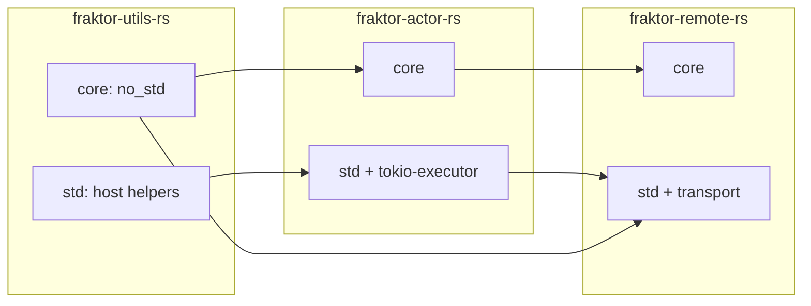

# fraktor-rs

[](https://github.com/j5ik2o/fraktor-rs/actions/workflows/ci.yml)
[](https://crates.io/crates/fraktor-rs)
[](https://docs.rs/fraktor-rs)
[](https://renovatebot.com)
[](https://deps.rs/repo/github/j5ik2o/fraktor-rs)
[](https://opensource.org/licenses/MIT)
[](https://opensource.org/licenses/apache-2-0)
[](https://github.com/j5ik2o/fraktor-rs)

> See [README.ja.md](README.ja.md) for the Japanese edition.

fraktor-rs is a specification-driven actor runtime that mirrors Akka/Pekko and protoactor-go semantics across `no_std` boards and host environments such as Tokio. The workspace now ships three crates—`fraktor-utils-rs`, `fraktor-actor-rs`, and `fraktor-remote-rs`—each exposing `core` (#![no_std]) and `std` modules behind features instead of maintaining legacy `*-core` / `*-std` sibling crates.

## Key Capabilities
- **Lifecycle-first ActorSystem** – `modules/actor/src/core/lifecycle/*` and `system/*` prioritize `SystemMessage::{Create,Recreate,Failure}` in the system mailbox, combine deterministic SupervisorStrategy flows, and surface DeathWatch decisions immediately through the guardian hierarchy.
- **Typed/Untyped protocol bridge** – `typed/*` APIs provide `Behavior` + `TypedActorRef` ergonomics while `into_untyped`/`as_untyped` shims keep reply semantics explicit without depending on global sender state, preserving the Proto.Actor-inspired `reply_to` discipline.
- **Observability & diagnostics** – EventStream, DeadLetter, LoggerSubscriber, and `tick_driver_snapshot` expose lifecycle/remoting/tick driver metrics with the same payloads on RTT/UART and tracing subscribers, making it easy to probe `RemoteAuthorityManagerGeneric` state or scheduler drift.
- **Remoting stack** – `fraktor-remote-rs::core` adds `RemoteActorRefProvider`, `RemoteWatcherDaemon`, `EndpointManager`, deferred envelopes, flight recorder buffers, and quarantine tracking so actor trees can extend across nodes without leaking Pekko compatibility rules.
- **Transport adapters & failure detection** – Loopback routing ships in `core::loopback_router` while `std::transport::tokio_tcp` provides handshake, backpressure, and `failure_detector` hooks for TCP environments; adapters are pluggable through `transport::factory`.
- **Toolbox & allocator-agnostic primitives** – `fraktor-utils-rs` delivers `RuntimeToolbox`, portable atomics, spin-based mutexes, timers, and Arc replacements so the upper layers stay interrupt-safe on `thumbv6/v8` MCUs yet reuse the same API on hosts.

## Architecture


Each crate exports the same API surface across `core` and `std`: `core` stays allocator-agnostic for embedded builds, `std` layers Tokio/logging adapters, and `fraktor-remote-rs` composes the other two crates to provide remoting extensions, endpoint registries, remote watchers, and transport plumbing.

## Getting Started
1. **Install prerequisites**
   - Rust nightly toolchain (`rustup toolchain install nightly`)
   - `cargo-dylint`, `rustc-dev`, and `llvm-tools-preview` for custom lints
   - Optional embedded targets: `thumbv6m-none-eabi`, `thumbv8m.main-none-eabi`
2. **Clone the repo**
   ```bash
   git clone git@github.com:j5ik2o/fraktor-rs.git
   cd fraktor-rs
   ```
3. **Run the core checks**
   ```bash
   cargo fmt --check
   cargo test -p fraktor-utils-rs
   cargo test -p fraktor-actor-rs --features test-support
   cargo test -p fraktor-remote-rs quickstart --features test-support
   scripts/ci-check.sh all   # lint + dylint + no_std/std/embedded + docs
   ```

## Repository Layout
| Path | Description |
| --- | --- |
| `modules/utils/` | `fraktor-utils-rs`: `RuntimeToolbox`, portable atomics, timer families, Arc replacements, and interrupts-safe primitives split into `core`/`std`. |
| `modules/actor/` | `fraktor-actor-rs`: ActorSystem, mailboxes, supervision, typed APIs, scheduler/tick driver, EventStream, and Pekko-compatible ActorPath handling. |
| `modules/remote/` | `fraktor-remote-rs`: remoting extension, remote actor ref provider, endpoint managers/readers/writers, remote watcher daemon, loopback + Tokio TCP transport. |
| `modules/*/examples/` | Feature-complete samples (no_std ping-pong, Tokio supervisors, remoting loopback/tcp quickstarts). |
| `docs/guides/` | Operational guides such as actor-system bootstrapping, DeathWatch migration, and tick-driver quickstarts. |
| `.kiro/steering/` | Project-wide steering policies (architecture, tech, structure) enforced by custom dylint rules. |
| `.kiro/specs/` | Specification folders following the requirements → design → tasks → implementation workflow. |
| `references/` | Upstream Pekko and protoactor-go snapshots referenced when porting semantics. |
| `scripts/` | Repeatable CI entry points (`ci-check.sh`, formatter/lint wrappers, embedded runners). |

## Specification-Driven Development
- Use `/prompts:kiro-spec-init`, `-requirements`, `-design`, and `-tasks` to capture every feature’s intent before touching code.
- Implementation happens through `/prompts:kiro-spec-impl` and is validated by `/prompts:kiro-validate-*`, ensuring traceability between specs, tasks, and automated tests.
- Steering documents (`.kiro/steering/*.md`) define global rules: 2018 modules only, 1 public type per file, rustdoc in English, other docs in Japanese, and no `#[cfg(feature = "std")]` inside runtime core modules.

## Roadmap
- Harden the `fraktor-remote-rs` endpoint manager state machine (quarantine expiry, deferred envelope replay, and remote watcher daemons).
- Publish transport cookbooks for loopback and Tokio TCP remoting flows under `docs/guides/remote-*`.
- Expand scheduler/tick-driver guides to include watchdog metrics emitted from `EventStreamEvent::TickDriver`.
- Integrate the remoting failure detector with EventStream probes so Pekko-compatible InvalidAssociation events stay observable across transports.

## Contributing
1. Fork and create a feature branch linked to a spec under `.kiro/specs/<feature>/`.
2. Follow the spec lifecycle (requirements → design → tasks → implementation) before writing Rust code.
3. Run `scripts/ci-check.sh all` locally so lint/dylint/no_std/std/embedded/doc jobs pass.
4. Submit a PR that references the spec/task IDs and describe any remoting or runtime impacts.

## License
Dual-licensed under Apache-2.0 and MIT. See `LICENSE-APACHE` and `LICENSE-MIT` for details.
