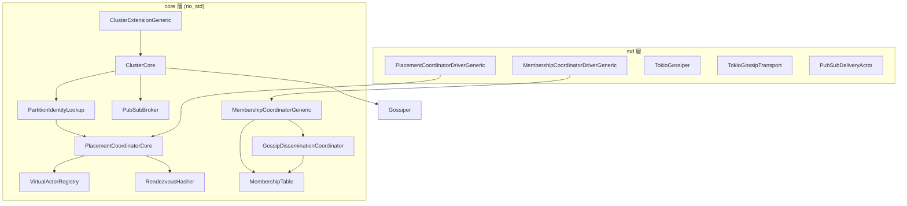
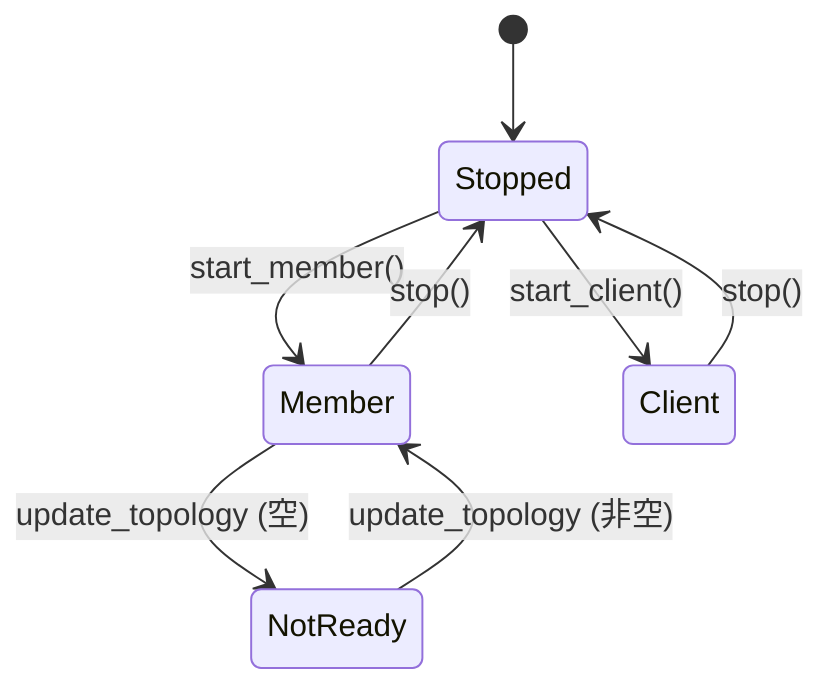
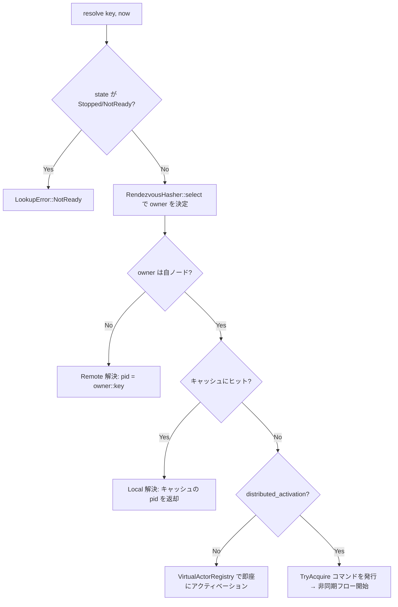
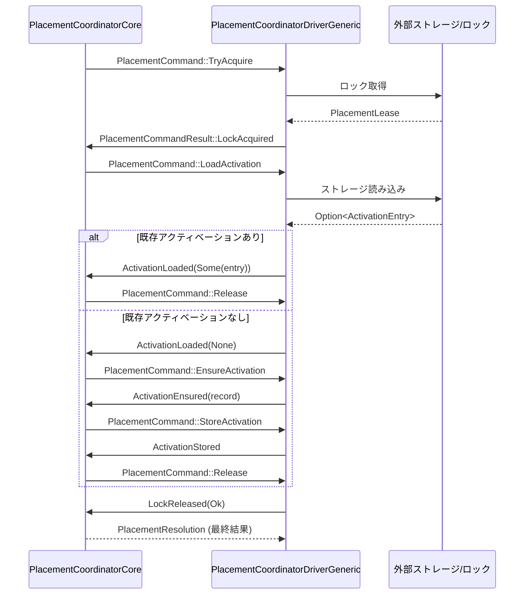
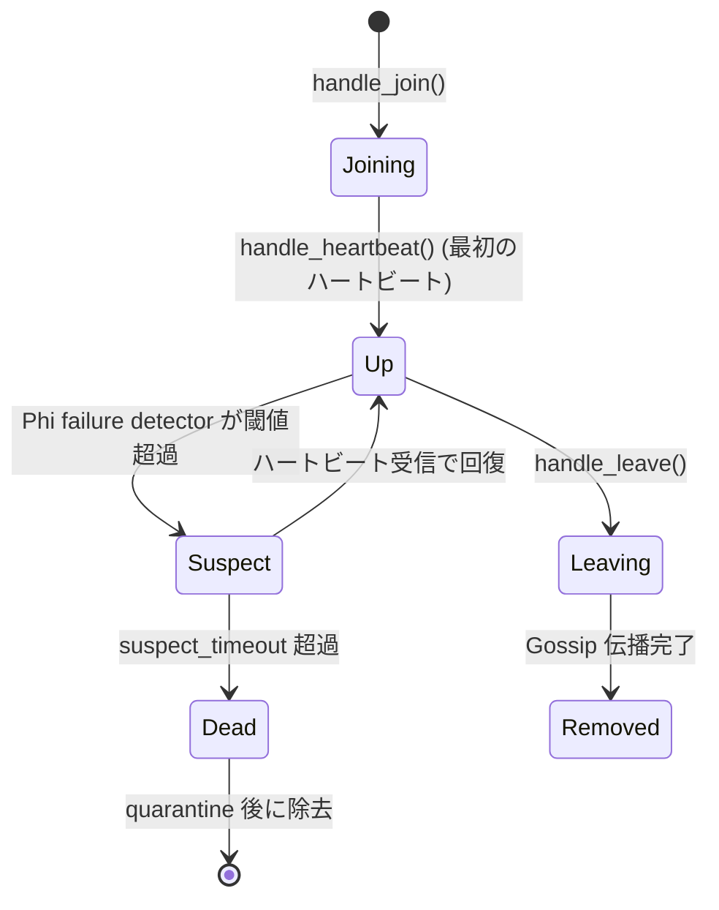
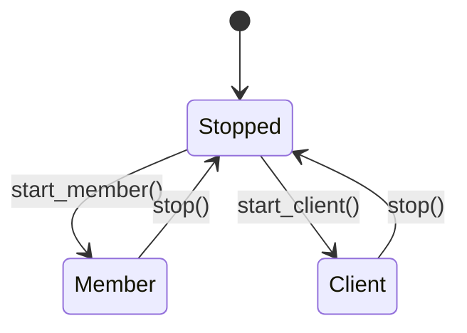
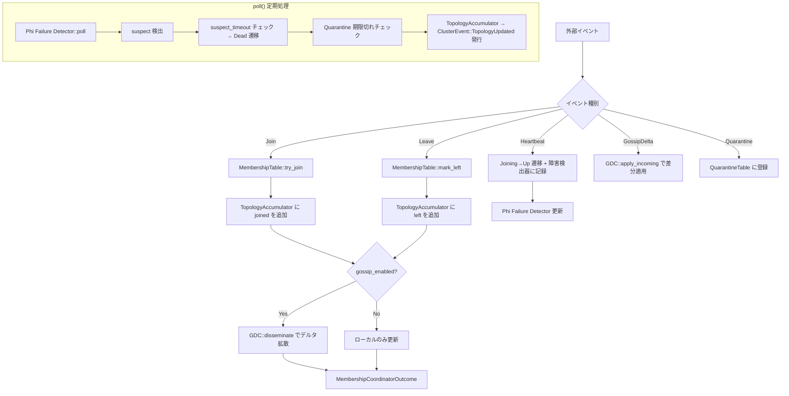
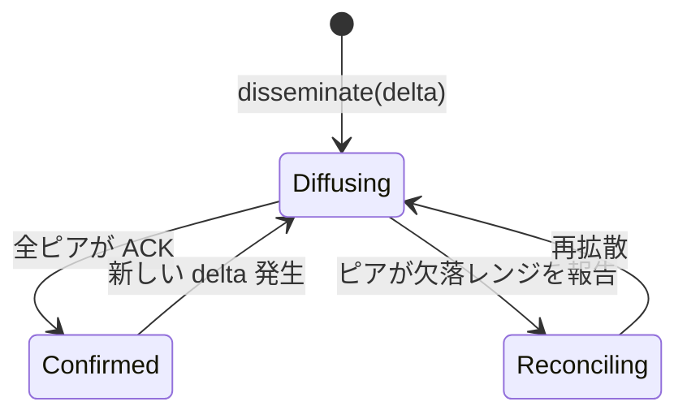
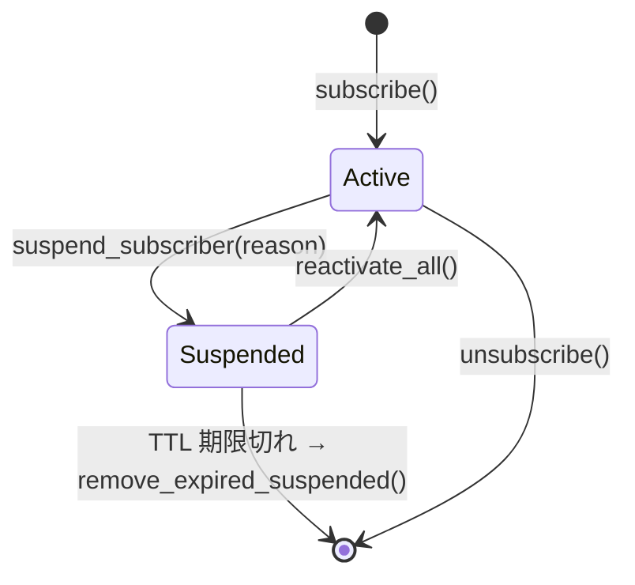
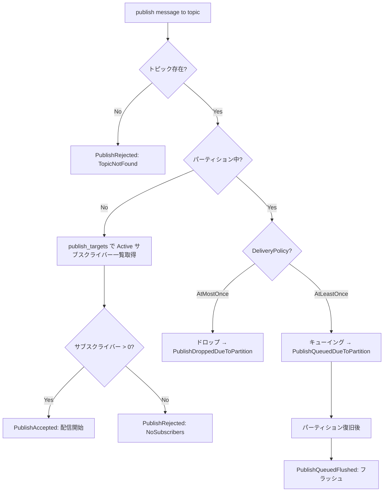

# Cluster モジュール アーキテクチャガイド

fraktor-rs の cluster モジュールは、複数ノード上で Virtual Actor（Grain）を透過的に配置・管理するためのフレームワークである。protoactor-go の cluster パッケージを参照実装とし、Rust の所有権モデルと no_std 対応を前提に再設計されている。

## 1. 全体構造

cluster モジュールは `core`（no_std / alloc 依存）と `std`（Tokio 連携）の 2 層に分かれる。

```
modules/cluster/src/
  core/                  # no_std ロジック本体
    placement_coordinator.rs     # Grain 配置の調停
    membership_coordinator.rs    # メンバーシップ管理
    gossip_dissemination_coordinator.rs  # Gossip 伝播
    pub_sub_broker.rs            # Pub/Sub ブローカー
    cluster_core.rs              # 統合コア
    cluster_extension.rs         # ActorSystem Extension
    ...
  std/                   # Tokio / ネットワーク統合
    membership_coordinator_driver.rs  # Membership の非同期ドライバー
    tokio_gossiper.rs                 # Tokio ベースの Gossiper
    tokio_gossip_transport.rs         # UDP/TCP Gossip トランスポート
    pub_sub_delivery_actor.rs         # Pub/Sub 配信アクター
    ...
```

### コンポーネント関係図



## 2. Placement ステートマシン

Grain の配置（どのノードでアクターを起動するか）を管理するサブシステム。

### 主要型

| 型 | 責務 |
|----|------|
| `PlacementCoordinatorCore` | 配置ロジック本体。状態遷移・Rendezvous ハッシュ・ローカル/リモート判定 |
| `PlacementCoordinatorDriverGeneric<TB>` | 非同期コマンド実行と EventStream パブリッシュ |
| `PartitionIdentityLookup` | `IdentityLookup` trait 実装。Coordinator を内包 |
| `VirtualActorRegistry` | アクティベーションのキャッシュと管理 |
| `RendezvousHasher` | Rendezvous hashing によるオーナーノード選択 |

### PlacementCoordinatorState



- **Stopped**: 初期状態。resolve 不可。
- **Member**: クラスタメンバーとして動作。ローカルアクティベーション可能。
- **Client**: クライアントモード。リモートへの配置要求のみ。
- **NotReady**: トポロジ未確定。resolve は `LookupError::NotReady` を返す。

### Resolve フロー

`PlacementCoordinatorCore::resolve()` は以下の分岐で配置先を決定する。



### 分散アクティベーション（Command/Result パターン）

`distributed_activation = true` の場合、Coordinator はコマンドを発行し、Driver がそれを非同期で実行する。結果を `handle_command_result()` で受け取り、次のコマンドまたは最終解決を返す。



### PlacementCommand 一覧

| コマンド | 目的 |
|----------|------|
| `TryAcquire` | Grain Key の排他ロックを取得 |
| `LoadActivation` | ストレージからアクティベーションエントリを読み込み |
| `EnsureActivation` | Grain をアクティベート（アクター起動） |
| `StoreActivation` | アクティベーション情報をストレージに永続化 |
| `Release` | 取得したロックを解放 |

## 3. Membership Coordinator フロー

### 主要型

| 型 | 責務 |
|----|------|
| `MembershipCoordinatorGeneric<TB>` | メンバーシップロジック本体（障害検出・Gossip 統合・トポロジ構築） |
| `MembershipCoordinatorDriverGeneric<TB, TTransport>` | 非同期ドライバー。Transport と EventStream を接続 |
| `GossipDisseminationCoordinator` | Gossip デルタの拡散と収束管理 |
| `MembershipTable` | ノードレコードの保持と状態遷移 |

### NodeStatus 遷移



### MembershipCoordinatorState



- **Member**: Join/Leave/Heartbeat の処理が可能。Gossip 伝播を実行。
- **Client**: Gossip デルタの受信のみ。Join/Leave は `InvalidState` エラー。

### メンバーシップ管理フロー



### Gossip プロトコル

`GossipDisseminationCoordinator` は 3 つの収束フェーズを持つ。



- **Diffusing**: 新しいデルタをピアに送信中。
- **Reconciling**: ピア間のバージョン差異を解消中。
- **Confirmed**: 全ピアが最新バージョンを確認済み。

`MembershipCoordinatorOutcome` の `gossip_outbound: Vec<GossipOutbound>` にデルタが格納され、Driver が `GossipTransport::send()` で実際に送信する。

## 4. Pub/Sub 配信保証

### 主要型

| 型 | 責務 |
|----|------|
| `PubSubBroker<TB>` | トピック管理・サブスクライバー追跡・配信先計算 |
| `PubSubPublisherGeneric<TB>` | メッセージのシリアライズとパブリッシュ |
| `PubSubSubscriber<TB>` | サブスクライバー種別（`ActorRef` or `ClusterIdentity`） |
| `ClusterPubSub` trait | Pub/Sub インターフェース |
| `PubSubDeliveryActor`（std） | 実際の非同期配信を行うアクター |

### DeliveryPolicy

| ポリシー | 説明 | パーティション時の挙動 |
|----------|------|------------------------|
| `AtMostOnce` | リトライなし。ベストエフォート配信 | メッセージはドロップ |
| `AtLeastOnce`（デフォルト） | リトライあり。パーティション中はキューイング | 復旧後にフラッシュ |

### SubscriberState 遷移



### パブリッシュフロー



### 配信ステータス

| `DeliveryStatus` | 意味 |
|-------------------|------|
| `Delivered` | 配信成功 |
| `Timeout` | タイムアウト |
| `SubscriberUnreachable` | サブスクライバーに到達不可 |
| `OtherError` | その他のエラー |

## 5. protoactor-go との対応

### コア概念の対応表

| protoactor-go | fraktor-rs | 備考 |
|---------------|------------|------|
| `Cluster` struct | `ClusterCore` / `ClusterExtensionGeneric<TB>` | Extension パターンで ActorSystem に統合 |
| `MemberList` | `MembershipCoordinatorGeneric<TB>` | Gossip と障害検出を統合 |
| `Gossip` / `GossipActor` | `GossipDisseminationCoordinator` + `TokioGossiper` | core/std 分離 |
| `IdentityLookup` interface | `IdentityLookup` trait | `PartitionIdentityLookup` が主実装 |
| `GetPid` / `PidResult` | `PlacementCoordinatorCore::resolve()` → `PlacementResolution` | Command/Result パターンに抽象化 |
| `SpawnLock` | `PlacementLock` / `PlacementLease` | 排他制御 |
| `StoredActivation` / `StorageLookup` | `ActivationEntry` / `ActivationStorage` | ストレージ抽象 |
| `ClusterProvider` interface | `ClusterProvider` trait | `LocalClusterProvider`, `StaticClusterProvider` |
| `PubSub` struct | `PubSubBroker<TB>` + `ClusterPubSub` trait | ブローカーパターンに再設計 |
| `PubSubConfig` | `PubSubConfig` | 設定 |
| `BatchingProducer` | `BatchingProducerGeneric<TB>` | バッチ最適化 |
| Member status (`Alive`, `Leaving`, `Down`) | `NodeStatus` (`Joining`, `Up`, `Suspect`, `Leaving`, `Removed`, `Dead`) | より細かい状態遷移 |
| `Rendezvous` | `RendezvousHasher` | 一貫性ハッシュ |
| `GrainContext` | `GrainContextGeneric<TB>` | Grain ライフサイクル |
| `Kind` registry | `KindRegistry` | Grain 種別の登録 |

### 設計方針の違い

| 観点 | protoactor-go | fraktor-rs |
|------|---------------|------------|
| **内部可変性** | Go の mutex で直接保護 | `&mut self` 原則。共有時は `AShared` パターン |
| **非同期モデル** | goroutine + channel | Command/Result パターン + async Driver |
| **no_std 対応** | なし | core 層は完全 no_std（alloc 依存） |
| **状態遷移** | 暗黙的 | `PlacementCoordinatorState` / `MembershipCoordinatorState` で明示 |
| **障害検出** | SWIM ベース | Phi Accrual Failure Detector |
| **型安全性** | `interface{}` 多用 | ジェネリクス `<TB: RuntimeToolbox>` |
| **Gossip** | Actor ベース（`GossipActor`） | 純粋ロジック（`GossipDisseminationCoordinator`）+ Driver 分離 |
| **Pub/Sub** | PID ベース配信 | `PubSubSubscriber` enum（`ActorRef` or `ClusterIdentity`） |

## 6. 用語集

| 用語 | 説明 |
|------|------|
| **Grain** | Virtual Actor。クラスタ上で自動的に配置・アクティベートされるアクター |
| **Authority** | ノードのネットワークアドレス。Rendezvous hashing のキーとして使用 |
| **Placement** | Grain Key からオーナーノードを決定し、アクティベーションを管理するプロセス |
| **Topology** | クラスタメンバーの現在のビュー。`ClusterTopology` で表現 |
| **Gossip Delta** | `MembershipDelta` として表現されるメンバーシップ変更差分 |
| **Quarantine** | 障害ノードを一定期間再参加禁止にする仕組み |
